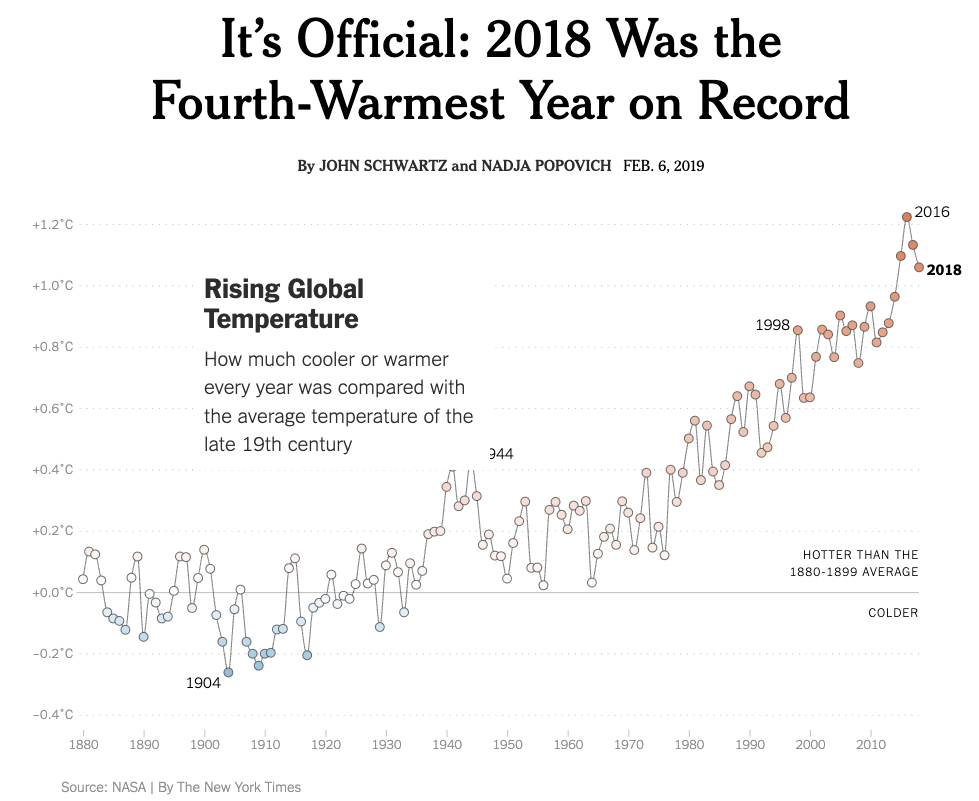

For this assignment we will ask you to conduct a replication attempt of 
various graphics that display global temperature anomalies. This topic 
is related to Sep-16th lecture [Case Study: Global Temperature](../../lectures/09-global-temp/09-global-temp-slides.html)


## Motivation

This project is motivated by the following article published in The New York Times (NYT)

- Title: **It's Official: 2018 Was the Fourth-Warmest Year on Record**
- Authors: John Schwartz and Nadja Popovich
- Date: Feb 6, 2019
- URL: <https://www.nytimes.com/interactive/2019/02/06/climate/fourth-hottest-year.html>

This article contains the following line chart:



::: {.callout-tip title="Motivation"}
Can this graphic be replicated? 
:::


## Graphics to Replicate

The main goal behind this project is to replicate the four graphics listed below.
The source of the data is the **GISS Surface Temperature Analysis (GISTEMP v4)**, 
curated by NASA's Goddard Institute for Space Studies:
<https://data.giss.nasa.gov/gistemp/data_v4.html>


**Graphic 1: Temperature Anomalies over Land and over Ocean** <br>
- Image: <https://data.giss.nasa.gov/gistemp/graphs_v4/graph_data/Temperature_Anomalies_over_Land_and_over_Ocean/graph.html>
- Data (CSV): <https://data.giss.nasa.gov/gistemp/graphs_v4/graph_data/Temperature_Anomalies_over_Land_and_over_Ocean/graph.csv>


**Graphic 2: GISTEMP Seasonal Cycle since 1880** <br>
- Image: <https://data.giss.nasa.gov/gistemp/graphs_v4/graph_data/GISTEMP_Seasonal_Cycle_since_1880/graph.html>
- Data (CSV): <https://data.giss.nasa.gov/gistemp/graphs_v4/graph_data/GISTEMP_Seasonal_Cycle_since_1880/graph.csv>


**Graphic 3: Global Annual Mean Surface Air Temperature Change** <br>
- Image: <https://data.giss.nasa.gov/gistemp/graphs_v4/graph_data/Global_Mean_Estimates_based_on_Land_and_Ocean_Data/graph.html>
- Data (CSV): <https://data.giss.nasa.gov/gistemp/graphs_v4/graph_data/Global_Mean_Estimates_based_on_Land_and_Ocean_Data/graph.csv>


**Graphic 4: The chart line from The New York Times** <br>
- Image: <https://www.nytimes.com/interactive/2019/02/06/climate/fourth-hottest-year.html> <br>

::: {.callout-warning title="Comment"}
Notice that the NYT's graphic is a modified version of Graphic 3
:::


## Deliverables

For this assignment, you will have a single GitHub repository (**individual submission**). 
Your repository should contain the following:

- One script file with code to download raw data files to `data/` folder.
  
  ::: {.callout-important title="Note"}
  We are asking you to download and push data for practice and 
  learning purposes, even though in real life most data files 
  don't tend to be pushed to remote repositories.
  :::

- One notebook (i.e. `ipynb` or `qmd` notebook) **per graphic** that includes code 
to create the plot. 
    + These notebooks should be saved in a `scripts/` folder. 
    + Please remember to use markdown headings for each section/subsection so the entire 
notebook document is readable. 
    + All figures should be both rendered in the notebook, 
and saved in PNG and PDF formats in a separate folder called `outputs/`.
    + __Suggestion:__ If you use `qmd` files, you can choose `format: gfm` in the yaml 
    header to nicely render your document in GitHub.

- One report document, saved in a `report/` folder, that provides an executive summary
of the project, and the four replicated figures---including a brief description for 
each of them.

- An optional `ai_documentation.txt` file where you will put any prompts and 
output from AI companions that you use to complete the project.

- At least one `README.md` file (at the top-level). Optionally, you can use other
`README` files inside subdirectories if you consider them appropriate. Make sure the
content of this file is clear and detailed.

- Use at least one branch in addition to the `main` branch.


### Project Structure

In this assignment we are going to evaluate your overall workflow using git and GitHub. 
Be sure that you repository includes clear commit messages as you make progress on 
the project, and not include any other file or folder than those needed for the project.

Likewise, we will assess how you put in practice all the concepts covered so far:
naming files, use of file paths, project organization, comments, documentation, etc.

To ensure that extraneous files are ignored by git, add a `.gitignore` file where you 
can either specify single files, or all files with a particular file extension. 

Additionally, the code in each notebook must be well organized. Use different cells 
for different operations and functions and markdown cells to explain the analysis. 
You can also use different branches or make a fork of the main repository 
(and then a pull request) in order to work collaboratively on the same notebook.

Here's a diagram that depicts the overall file structure of your project:

```
your-project/
   README.md
   data/
   scripts/
   outputs/
   report/
   ai_documentation.txt
   .gitignore
```


