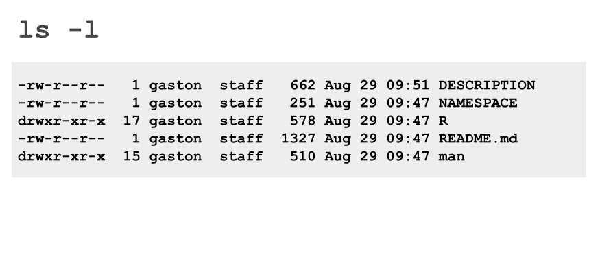
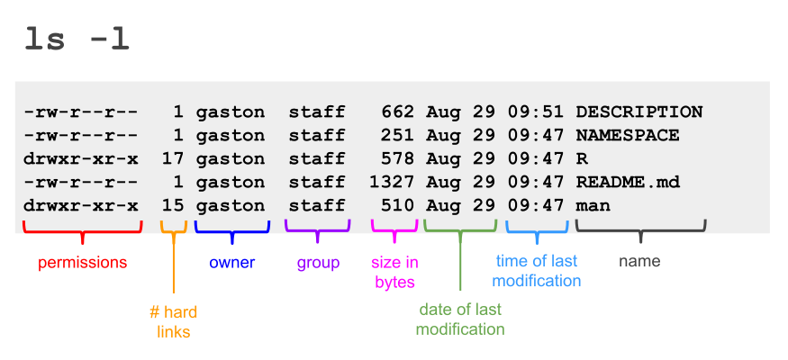

# Introductions

## Meet your GSI

::: {.notes}
Introduce yourself to the clasas. You can talk about your:

- Name
- Major or Degree
- Experience
- Fun fact
:::


## With the people around you ...

. . .

Take a few minutes to share your:

::: {.columns}
::: {.column width="45%"}
::: {.nonincremental}
- Name
- Major / Degree
- Year
- Hometown
- Which dog mood are you today?
:::
:::

::: {.column width="55%"}
{width="85%"}
:::
:::

```{r}
#| echo: false
countdown::countdown(5, top = 0)
```


## Ice Breakers


# CLI (Terminal)

## Terminal

Mac Users: Terminal

\

Windows users‼️: Install Git <br>
<https://git-scm.com/>


# Shell Commands

## Working with Files and Directories

- Creating Files
- Moving Files
- Renaming Files
- Copying Files
- Deleting Files
- Inspecting Files


## Creating Files

3 main ways to create files:

- Using a text editor
- Direct output (from command) to a file
- Using the command `touch` (creates empty file)


## Reading (inspecting) Files

- `cat`: concatenate (good for short files)

- `less`: paginated output, scrolls backwards;

- `head`: displays lines from beginning of a file

- `tail`: displays lines from end of a file


## Keys for `less`

- [b]{.bold-hilit} or **page up**: move back one page

- **space** or **page down**: move forward one page

- [G]{.bold-hilit}: go to the end of the file

- [1G]{.bold-hilit} or [g]{.bold-hilit}: go to the beginning of the file

- [/character]{.bold-hilit}: search forward for an occurrence of _character_

- [n]{.bold-hilit}: repeat the previous search (_next_)

- [h]{.bold-hilit}: display list of **less** commands and options

- [q]{.bold-hilit}: quit (exit)


## Commands for directories

- `pwd`: print working directory (tells you where you are)

- `ls`: list contents of a directory (what's in it)

- `cd`: change directory (allows you to move)

- `mkdir`: creates directory

- `rmdir`: deletes directory


## Creating directories

```bash
mkdir testdir
```

\

. . .

```bash
mkdir testdir/test1
```

\

. . .

```bash
mkdir -p figures/histograms/histogram-weight.png
```

`-p` is the option to create parent directories


## Listing the contents of a directory

- `ls`: list files and dirs in current directory

- `ls /`: list files and dirs in the roor directory

- `ls -l`: list contents in **long format**

- `ls -a`: list **all** files and dirs in currenty directory

- `ls -r`: list contents in *reverse** order

- `ls -t`: list contents by modification **time**

- `ls -lh`: list contents in (long) display size in human readable

- `ls -la`: list all files in long format


##



##




## Changing Directories

- `cd`: (default) change to home directory

- `cd ~`: change to home directory

- `cd /`: change to root directory

- `cd -`: change to previous directory

- `cd .`: change to current directory (i.e. does nothing)

- `cd ..`: change to parent directory


## Manipulating Files

- `cp`: copy file(s)

- `mv`: move and rename file(s)

- `rm`: delete file(s)

- `ln`: create link

