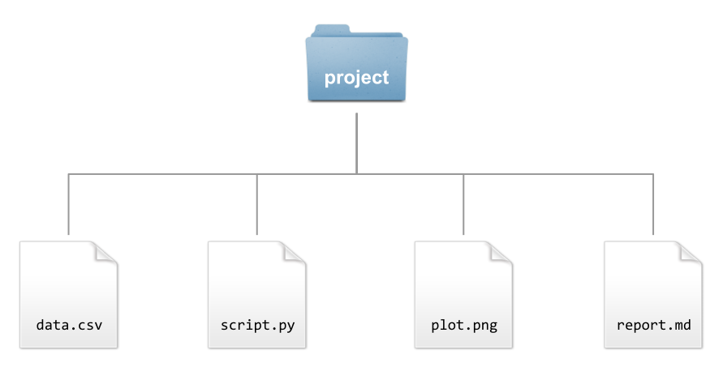
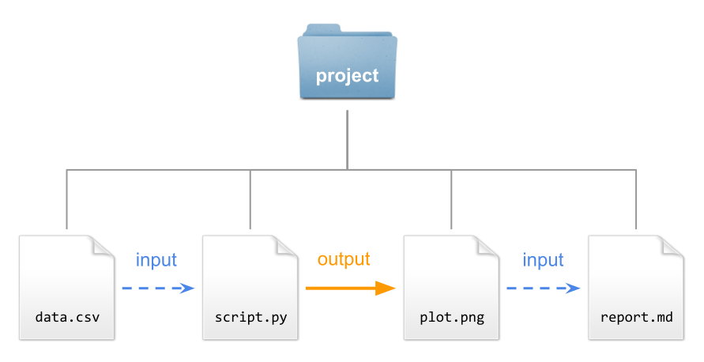
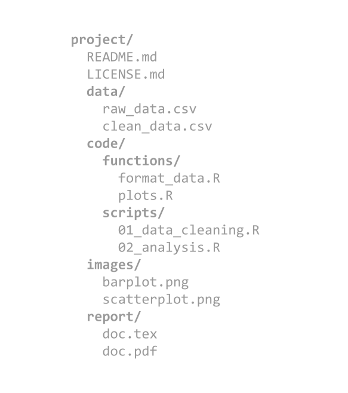
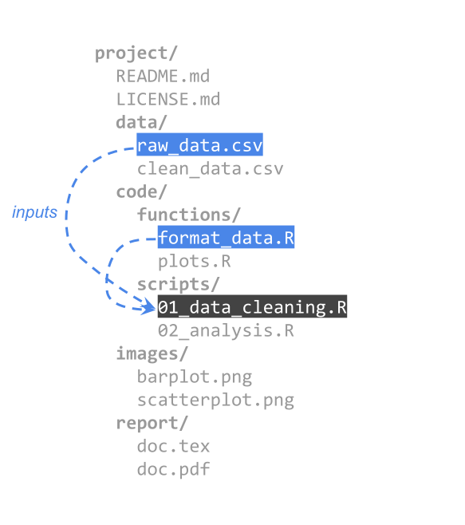
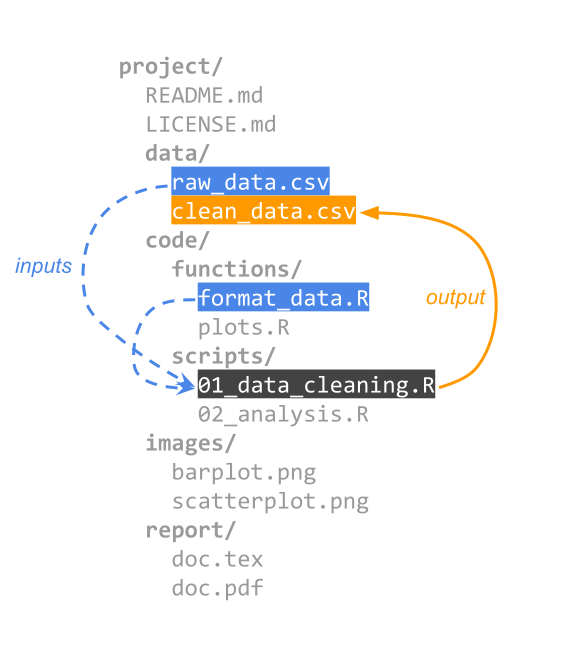
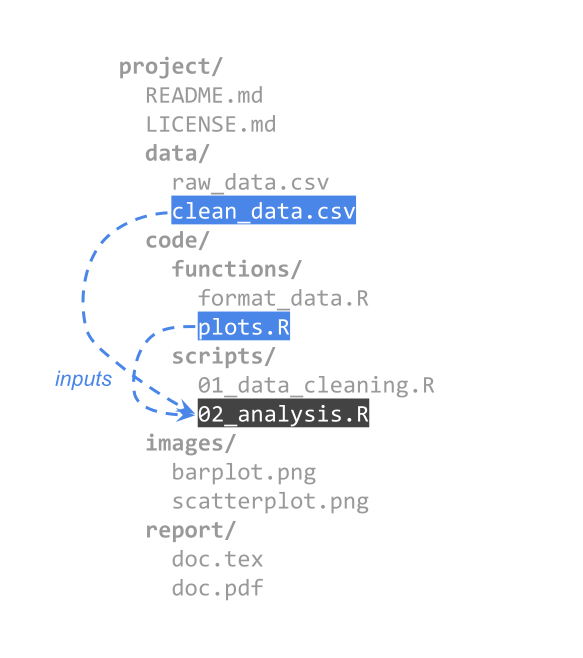
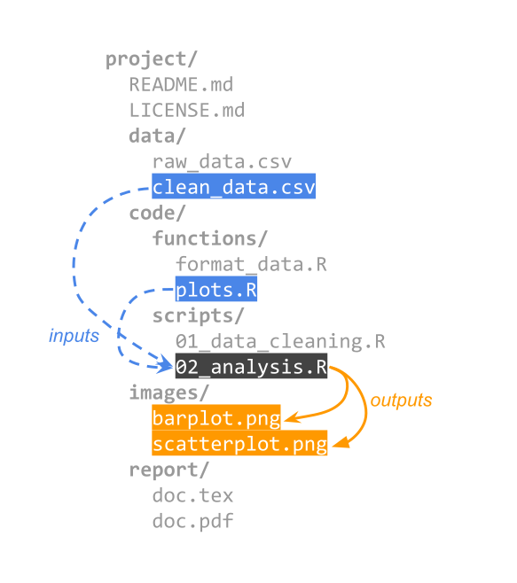
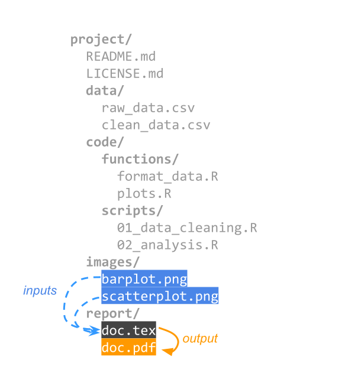
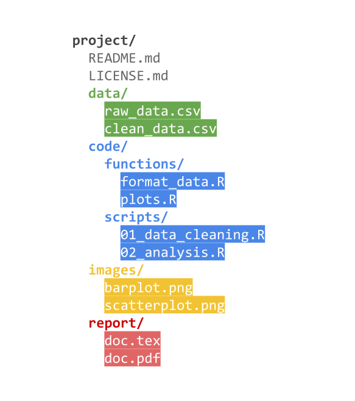
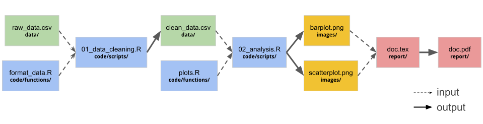

# Project Files

## So Far

Many of you are used to work on projects with a very simple file structure, e.g.

. . .

:::: {.columns}
::: {.column}
Python

```{.markdown code-line-numbers="false"}
project/
  document.ipynb
  document.html
```
:::
::: {.column}
R

```{.markdown code-line-numbers="false"}
project/
  document.qmd
  document.html
```
:::
::::

. . .

\

If there is some data file:

:::: {.columns}
::: {.column}
```{.markdown code-line-numbers="false"}
project/
  data.json
  document.ipynb
  document.html
```
:::
::: {.column}
```{.markdown code-line-numbers="false"}
project/
  data.json
  document.qmd
  document.html
```
:::
::::


##

### How does a data analysis project look like from the files standpoint?

## Basic Project Example

{fig-align="center"}

## Basic Project Example

{fig-align="center"}


# A less basic project


##  {auto-animate="true"}

{fig-align="center"}

##  {auto-animate="true"}

::::: columns
::: {.column width="50%"}

:::

::: {.column width="50%"}

:::
:::::

##

::::: columns
::: {.column width="45%"}
{width=100%}
:::

::: {.column width="55%"}
\

- This is the typical view we have of a project's file structure.

\

- But there's another way to look at a project's files.
:::
:::::

##

{fig-align="center"}

##

{fig-align="center"}

##

{fig-align="center"}

##

{fig-align="center"}

##

{fig-align="center"}

##

{fig-align="center"}

##

{fig-align="center"}

##

::::: columns
::: {.column width="50%"}

:::

::: {.column width="50%"}

:::
:::::


## Network of inputs and outputs

\

\

{fig-align="center"}


## Remember

- You'll be working with files.
- Some files will be inputs.
- Some files will be outputs.
- Some will play both roles.

. . .

\

::: {.bigadage}
Let's now talk about Naming Files
:::


# Naming Files

## Don't! 👎

- `myreport.qmd`

- `John's filename uses spaces and punctuation.txt`

- `figure I.png`

- `fig 2.png`

- `plot 3.png`

- `amazingmachinelearningscript.ipynb`


## Do 👍

- `2026-08-28_sales-report.qmd`

- `john-filename-looks-better.txt`

- `fig01_histogram-height.png`

- `fig02_histogram-weight.png`

- `fig03_scatterplot-height-weight.png`

- `regularization-models-script.ipynb`


## Three Principles for file names

\

1) Machine readable

\

2) Human readable

\

3) Plays well with default ordering


## Nice file names 😀

```{.markdown code-line-numbers="false"}
2026-05-06_collisions_Berkeley.csv
2026-05-06_collisions_Oakland.csv
2026-05-06_collisions_San-Francisco.csv
2026-05-06_collisions_San-Jose.csv
2026-05-06_stop-data_Berkeley.csv
2026-05-06_stop-data_Oakland.csv
2026-05-06_stop-data_San-Francisco.csv
2026-05-06_stop-data_San-Jose.csv
```


# Machine readable

## Machine readable

- Regular expression and globbing friendly

- Avoid: 
    + spaces
    + punctuation
    + accented characters
    + case sensitivity

- Easy to compute on
    + deliberate use of delimiters: `-` and `_`


## Example of globbing

```{.markdown code-line-numbers="false"}
2026-05-06_collisions_Berkeley.csv
2026-05-06_collisions_Oakland.csv
2026-05-06_collisions_San-Francisco.csv
2026-05-06_collisions_San-Jose.csv
2026-05-06_stop-data_Berkeley.csv
2026-05-06_stop-data_Oakland.csv
2026-05-06_stop-data_San-Francisco.csv
2026-05-06_stop-data_San-Jose.csv
```

\

. . .

```bash
ls *collisions*
```

\

. . .

```bash
ls *Berkeley.csv
```


## Deliberate use of delimeters

Deliberate use of `_` and `-` allows us to recover metadata from the filenames.

```{.markdown code-line-numbers="false"}
2026-05-06_collisions_Berkeley.csv
2026-05-06_collisions_Oakland.csv
2026-05-06_collisions_San-Francisco.csv
2026-05-06_collisions_San-Jose.csv
2026-05-06_stop-data_Berkeley.csv
2026-05-06_stop-data_Oakland.csv
2026-05-06_stop-data_San-Francisco.csv
2026-05-06_stop-data_San-Jose.csv
```

\

. . .

```r
list.files(pattern = "2026-05")
```

. . .

```r
list.files(pattern = "stop-data")
```

. . .

```r
list.files(pattern = "\\w+(_\\w+)\\.csv$")
```


## Machine readable

- easy to search for files later
- easy to narrow file lists based on names
- easy to extract info from file names, e.g. by splitting
- avoid:
    + spaces in file names
    + punctuation
    + accented characters
    + different files named `foo` and `Foo`


# Human readable

## Human readable

. . .

Name contains info on [content]{.bold-hilit}

\

. . .

Connects to concept of a [slug](https://www.semrush.com/blog/what-is-a-url-slug/) from semantic URLs

- `01_download-data.qmd`

- `02_clean-data.qmd`

- `03_univariate-eda.qmd`

- `04_run-simulation.qmd`

- `helper01_data-parsers.R`

- `helper02_summary-functions.R`


## Human readable

\

. . .

::: {.bigadage}
Easy to figure out what the heck something is, based on its name
:::


# Plays well with default ordering

## Order matters

- Put something numeric first

- Use the ISO 8601 standard for dates: `YYYY-MM-DD`

- Left pad other numbers with zeros


## Chronological order

. . .

```{.markdown code-line-numbers="false"}
2026-05-01_collisions_Berkeley.csv
2026-05-02_collisions_Berkeley.csv
2026-05-03_collisions_Berkeley.csv
2026-05-04_collisions_Berkeley.csv
2026-05-05_collisions_Berkeley.csv
...
2026-05-30_collisions_Berkeley.csv
2026-05-31_collisions_Berkeley.csv
```


## Logical order

. . .

```{.markdown code-line-numbers="false"}
01_download-data.qmd
02_clean-data.qmd
03_univariate-eda.qmd
04_run-simulation.qmd
helper01_data-parsers.R
helper02_summary-functions.R
helper03_association-coefficients.R
```


## Use the ISO 8601 standard for dates

. . .

::: {.bigadage}
YYYY-MM-DD
:::

. . .

\

```{.markdown code-line-numbers="false"}
2026-05-01_collisions_Berkeley.csv
2026-05-02_collisions_Berkeley.csv
2026-05-03_collisions_Berkeley.csv
2026-05-04_collisions_Berkeley.csv
...
2026-05-30_collisions_Berkeley.csv
2026-05-31_collisions_Berkeley.csv
```


## Three Principles for file names

- Machine readable

- Human readable

- Plays well with default ordering

. . .

\

Easy to implement [NOW]{.hilit}

. . .

\

Dividends multiply as your skills evolve and projects get more complex.


## Unix file naming

- Maximum of 255 characters
- Avoid most symbols: `\ / * & % ? $ | ^ ~ < >`
- Use A-Z, a-z, 0-9, period, underscore, hyphen
- Don't use a hyphen `-` as the first character
- Prefer lower case letters:  `MyFile` vs `myfile`
  + _because of case sensitivity_
- More important: be consistent and stick to a naming style.
- Good idea to use file extensions
    + e.g. `.txt`, `.csv`, `.html`, `.md`, `.pdf`, `.jpg`


## Checklist

- Spend time planning out both folder hierarchy and file naming conventions in the beginning of a project. 
- Consider how you or others will look for and access files at a later date. 
- Do you think about them by type, location, study or something else?
- Establish a folder hierarchy that aligns with the project. 
- Consider all aspects of the project and develop a file naming scheme that includes important metadata. 

## Checklist (cont'd)

- Consider sorting when deciding what element of the file name will go first. 
- File names starting with `YYYYMM` will sort differently than files starting with the `MMDDYYYY` format.
- Provide a method for easy adoption. 
- Consider a readme file in onboarding documentation for new contributors.
- Check for established file naming conventions. Many disciplines have recommendations


# Filenames Metadata

## 1) What information (metadata) is important?

- Ideally, pick three pieces of metadata; use no more than five. 

- This metadata should be enough for you to visually scan the file names and easily understand what's in each one.

- Example: For my images, I want to know date, sample ID, and image number for that sample on that date.


## 2) Do you need to abbreviate any of the metadata or encode it?

- If any of the metadata from step 1 is described by lots of text, decide what shortened information to keep. 

- If any of the metadata from step 1 has regular categories, standardize the categories and/or replace them with 2- or 3-letter codes;
be sure to document these codes.

- Example: Sample ID will use a code made up of: a 2-letter project abbreviation (project 1 = P1, project 2 = P2); a 3-letter
species abbreviation (mouse = “MUS”, fruit fly = “DRS”); and 3-digit sample ID (assigned in my notebook).


## 3) What is the order for the metadata in the file name?

- Think about how you want to sort and search for your files to decide what metadata should appear at the beginning of the file name. 

- If date is important, use ISO 8601-formatted dates (`YYYYMMDD` or `YYYY-MM-DD`) at the beginning of the file names so dates sort chronologically.

- Example 1: My sample ID is most important so I will list it first, followed by date, then image number


## 4) What characters will you use to separate each piece of metadata in the file name?

- Many computer systems cannot handle spaces in file names. 

- To make file names both computer- and human-readable,
use dashes (`-`), underscores (`_`), and/or capitalize the first letter of each word in the file names.

- Example: I will use underscores to separate metadata and dashes between parts of my sample ID.


## 5) Will you need to track different versions of each file?

- You can track versions of a file by appending version information to end of the file name. 

- Consider using a version number (e.g. `v01`) or the version date (use ISO 8601 format: `YYYYMMDD` or `YYYY-MM-DD`).

- Example: As each image goes through my analysis workflow, I will append the version type to the end of the file name
(e.g. `_raw`, `_processed`, and `_composite`)


## 6) Write down your naming convention pattern.

- Make sure the convention only uses alphanumeric characters, dashes, and underscores. Ideally, file names will be 32
characters or less.

- Example: my file naming convention is 

    + `SA-MPL-EID_YYYYMMDD_###_status.tif` 

- Examples are `P1-MUS023_20200229_051_raw.tif` and `P2-DRS-285_20191031_062_composite.tif`


