# Last Time

##  {auto-animate="true"}

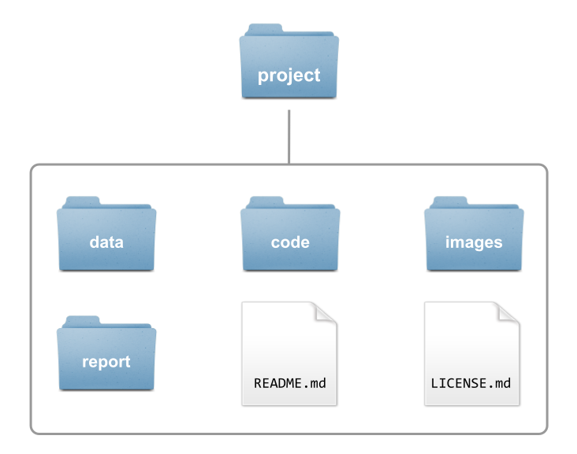{fig-align="center"}

##  {auto-animate="true"}

::::: columns
::: {.column width="50%"}

:::

::: {.column width="50%"}
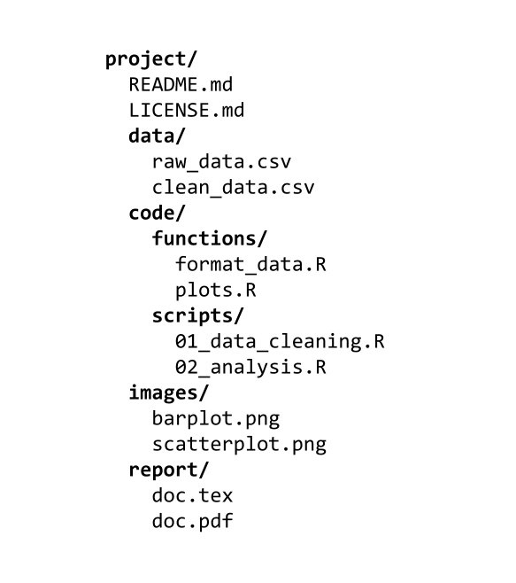
:::
:::::

## 

Data science projects involve dealing with multiple files:

-   some files will be inputs
-   some files will be outputs
-   some files will be data files
-   some files will be image files
-   some files will be script files (code)
-   some files will be reports
-   some files will play auxiliary roles


# File System Basics

##

{fig-align="center"}

\

::: {.bigadage}
Lesson 1: Learn how to refer to project files
:::


# File System (under UNIX-like Operating Systems)

## File System

-   The file system is a hierarchy (of directories & files)
-   Files organized in a [tree structure]{.bold-hilit} ("inverted tree")

::: fragment
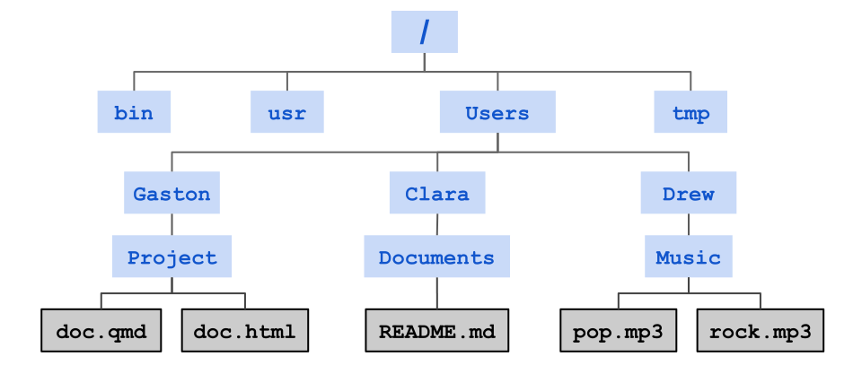{width="80%" fig-align="center"}
:::

## Important File Concepts

-   Everything is a File (including directories)
-   Folder = Directory
-   No concept of "disk"
-   At any given time we are inside a directory
-   The current directory is the working directory
-   From that directory we can move up or down

##  {.nostretch}

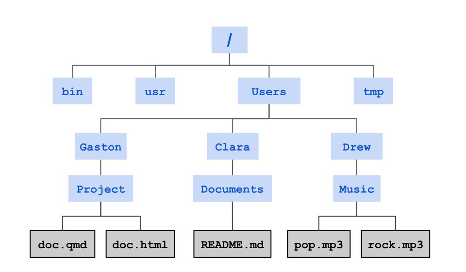{width="90%" fig-align="center"}

##  {.nostretch}

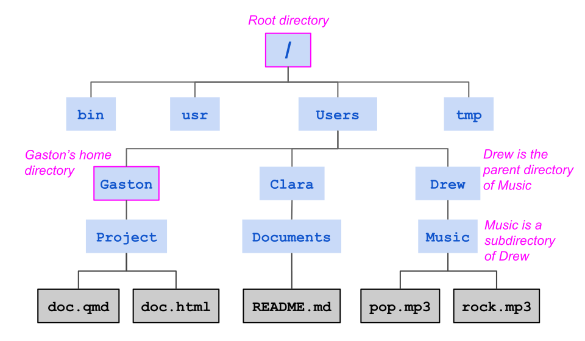{width="90%" fig-align="center"}

## Special Directories

[Root directory:]{.hilit} the top-level folder in a computer's file system, 
acting as the main starting point from which all other directories and files 
branch out, similar to the trunk of a tree.

\

[Home directory:]{.hilit} a user's personal folder in a multi-user operating 
system that holds their private files, settings, and data, acting as their 
default workspace upon login.

\

[Working directory:]{.hilit} the specific folder in a computer's file system 
where a user is currently working or where a process is executing commands.


# File Paths

## File Paths

Each file and directory has a unique name in the filesystem called a [path]{.bold-hilit}.

. . .

\

File paths can be specified in 2 ways:

1)  [Absolute Paths:]{.mdlit} always from the root directory.

2)  [Relative Paths:]{.mdlit} location relative to a working directory.


## Special Symbols

\

| Symbol | Meaning                             |
|--------|-------------------------------------|
| `/`    | root directory (1st slash)          |
| `A/B`  | A contains B (intermediate slash)   |
| `~`    | user's home directory (i.e. `/home/user/`) |
| `.`    | current directory                   |
| `..`   | parent directory                    |


## File System Example {.nostretch}

{width="80%" fig-align="center"}

##  {.nostretch}

Example of absolute path

{width="70%" fig-align="center"}

Absolute path to `Music/`

. . .

```{.markdown code-line-numbers="false"}      
/Users/Drew/Music/
```

##  {.nostretch}

Example of absolute path

{width="70%" fig-align="center"}

Absolute path to `Music/`, assuming `Drew/` is the home directory 

. . .

```{.markdown code-line-numbers="false"}       
~/Music/
```

##  {.nostretch}

Example of absolute path

{width="70%" fig-align="center"}

Absolute path to `pop.mp3`

. . .

```{.markdown code-line-numbers="false"}       
/Users/Drew/Music/pop.mp3
```

##  {.nostretch}

Your Turn

{width="70%" fig-align="center"}

Absolute path to `README.md`

```{r}
#| echo: false
countdown::countdown(0.5, bottom = 0)
```

. . .

```{.markdown code-line-numbers="false"}     
/Users/Clara/Documents/README.md
```

##  {.nostretch}

Example of relative path

{width="70%" fig-align="center"}

Relative path to `README.md`, assuming working directory is `Clara/`

. . .

```{.markdown code-line-numbers="false"}      
Documents/README.md
```

##  {.nostretch}

Example of relative path

{width="70%" fig-align="center"}

Relative path to `README.md`, assuming working directory is `Drew/`

. . .

```{.markdown code-line-numbers="false"}      
../Clara/Documents/README.md
```

##  {.nostretch}

Example of relative path

{width="70%" fig-align="center"}

Relative path to `pop.mp3`, assuming working directory is `Project/`

. . .

```{.markdown code-line-numbers="false"}      
../../Drew/Music/pop.mp3
```

##  {.nostretch}

Your Turn

{width="70%" fig-align="center"}

Relative path to `doc.qmd`, assuming working directory is `Documents/`

```{r}
#| echo: false
countdown::countdown(0.5, bottom = 0)
```

. . .

```{.markdown code-line-numbers="false"}       
../../Gaston/Project/doc.qmd
```


## Advantages of Relative Paths

. . .

[Portability:]{.bold-hilit} Your code works anywhere (your machine, 
a colleague's, a web server) without changing paths, as long as the 
file structure within the project remains consistent.

\

. . .

[Flexibility:]{.bold-hilit} You can restructure folders within your project.

\

. . .

[Self-Contained Projects:]{.bold-hilit} Keeps everything needed for the 
project bundled together.

\

. . .

[Simpler References:]{.bold-hilit} Shorter paths are quicker to type and 
less prone to errors than long absolute paths.


# Why should we care?

## 

Let's consider 3 different file structures

:::::: columns
::: {.column .fragment width="33%"}
Scenario A

```{.markdown code-line-numbers="false"}
project/
  report.qmd
  data.csv
```
:::

::: {.column .fragment width="33%"}
Scenario B

```{.markdown code-line-numbers="false"}
project/
  report.qmd
  data/
    data.csv
```
:::

::: {.column .fragment width="33%"}
Scenario C

```{.markdown code-line-numbers="false"}
project/
  docs/
    report.qmd
  data/
    data.csv
```
:::
::::::

. . .

\

In `report.qmd` we need to import (read in) `data.csv`. This involves specifying the correct file path.

## Scenario A {.nostretch}

::::: columns
::: {.column .fragment width="30%"}
File structure

```{.markdown code-line-numbers="false"}
project/
  report.qmd
  data.csv
```
:::

::: {.column .fragment width="70%"}
Assume we are editing `report.qmd` to import `data.csv`

\

```r
library(readr)
records <- read_csv("___________")
```

\

What is the relative path to `data.csv`?
:::
:::::


## Scenario A {.nostretch}

::::: columns
::: {.column width="30%"}
File structure

```{.markdown code-line-numbers="false"}
project/
  report.qmd
  data.csv
```
:::

::: {.column width="70%"}
Assume we are editing `report.qmd` to import `data.csv`

\

```r
library(readr)
records <- read_csv("___________")
```

\

What is the relative path to `data.csv`?

\

```r
library(readr)
records <- read_csv("data.csv")
```
:::
:::::


## Scenario B {.nostretch}

::::: columns
::: {.column .fragment width="30%"}
File structure

```{.markdown code-line-numbers="false"}
project/
  report.qmd
  data/
    data.csv
```
:::

::: {.column .fragment width="70%"}
Assume we are editing `report.qmd` to import `data.csv`

\

```r
library(readr)
records <- read_csv("___________")
```

\

What is the relative path to `data.csv`?
:::
:::::


## Scenario B {.nostretch}

::::: columns
::: {.column width="30%"}
File structure

```{.markdown code-line-numbers="false"}
project/
  report.qmd
  data/
    data.csv
```
:::

::: {.column width="70%"}
Assume we are editing `report.qmd` to import `data.csv`

\

```r
library(readr)
records <- read_csv("___________")
```

\

What is the relative path to `data.csv`?

\

```r
library(readr)
records <- read_csv("data/data.csv")
```
:::
:::::


## Scenario C {.nostretch}

::::: columns
::: {.column .fragment width="30%"}
File structure

```{.markdown code-line-numbers="false"}
project/
  docs/
    report.qmd
  data/
    data.csv
```
:::

::: {.column .fragment width="70%"}
Assume we are editing `report.qmd` to import `data.csv`

\

```r
library(readr)
records <- read_csv("___________")
```

\

What is the relative path to `data.csv`?
:::
:::::


## Scenario C {.nostretch}

::::: columns
::: {.column width="30%"}
File structure

```{.markdown code-line-numbers="false"}
project/
  docs/
    report.qmd
  data/
    data.csv
```
:::

::: {.column width="70%"}
Assume we are editing `report.qmd` to import `data.csv`

\

```r
library(readr)
records <- read_csv("___________")
```

\

What is the relative path to `data.csv`?

\

```r
library(readr)
records <- read_csv("../data/data.csv")
```
:::
:::::


# In Summary

## 

- Everything is a __File__ (including directories).
- Files organized in a tree.
- The filesystem is a hierarchy (of folders & files).
- Folder = Directory
- No concept of "disk".
- File paths can be specified in 2 ways:
    + Absolute Paths: always from the root directory.
    + Relative Paths: location relative to a working directory.
- [Use relative file paths!]{.hilit} 


# GUI & CLI

## GUI

Most of us interact with our operating system through a
[Graphical User Interface]{.bold-hilit} or [GUI]{.bold-hilit} for short.

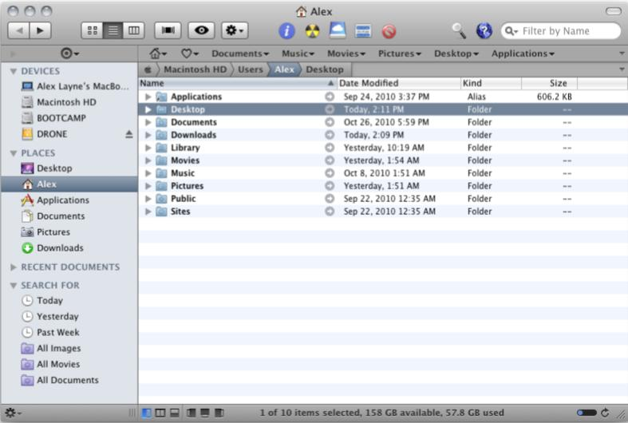


## About GUIs

- Easy to learn
- Rely on visual displays
- Have improved the friendliness and usability of computers
- Excellent for:
    + Photo editing
    + Document Layout
    + Browsing the web
    + Graphic design
    + Watching movies
    + Playing Games


## GUIs Trade-offs

- They are limiting
- They don't allow you to have more control over what your computer can do
- Some operations are labor intensive and repetitive
- You use clicking & dragging with the cursor, which reduces reproducibility
- Limit analyses on a cluster of computers

. . .

### Instead of a GUI, you can use a Command-Line Interface (CLI)

The command line is a text-based interface where you type commands and direct 
text-based input and output to the screen, to files, or to other programs.

##

{fig-align="center"}

\

::: {.bigadage}
Lesson 2: Learn how to interact with your computer via the CLI
:::


## Command Line Interface {.nostretch}

{width=60% fig-align="center"}


## CLIs

- CLI: Command Line Interface.
- Instead of using a GUI we can use a CLI.
- The command-line is a text-based interface.
- By typing commands we perform tasks on the computer.
- CLI's are one of the earliest ways of interacting with a computer.
- In Unix-like systems, the so-called [Terminal]{.bold-hilit} functions 
as a CLI.


## {.nostretch auto-animate=true}

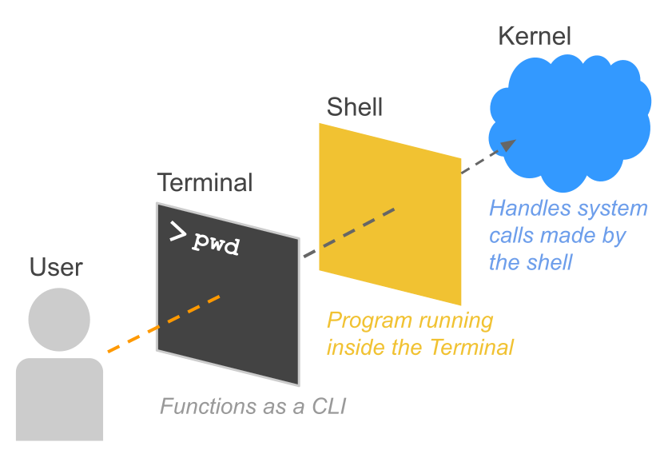{width=80% fig-align="center"}


## About the Terminal {auto-animate=true}

:::: {.columns}
::: {.column width="50%"}
{width="90%" fig-align="center"}
:::
::: {.column .fragment width="50%"}
The __Terminal__ provides a text-based 
environment that accepts your keyboard input and displays 
the text output on your screen.

- open windows and tabs
- manage shells
- resize windows
- change colors in windows
- handle copy-paste operations
:::
::::


## About the Shell

:::: {.columns}
::: {.column width="50%"}
{width="90%" fig-align="center"}
:::
::: {.column width="50%"}
- The **Shell** is the actual program running inside the terminal.
- It's the outer layer of the operating system.
- The shell does 4 simple things:
    + displays a prompt in the terminal window (waiting for commands)
    + reads your command
    + runs the command
    + prints the output, if any, to the Terminal window
:::
::::


## About the Kernel 

:::: {.columns}
::: {.column width="50%"}
{width="90%" fig-align="center"}
:::
::: {.column width="50%"}
- The Kernel is the inner core of the operating system in Unix.
- It takes care of allocating time and memory to programs.
- It does very fundamental root level management.
:::
::::


## Example: What happens when you create a folder?

Command like `mkdir Photos`

- __The Shell's Job__: You type `mkdir Photos` into your terminal. 
The shell reads this text, realizes you want to run the "make directory" program, 
and translates your request into a standard system request (a system call).

- __The Handshake__: The shell passes this request across the boundary to the kernel.

- __The Kernel's Job__: The kernel receives the request. 
It checks if you have permission to modify the storage. 
It then talks directly to your Hard Drive or SSD, physically carving out space 
on the disk to save your new "Photos" folder.


## Restaurant Analogy

- The Operating System is the entire restaurant.

- The Shell is the waiter. It takes your order (commands) and translates it.

- The Kernel is the kitchen staff. They actually handle the raw ingredients 
(hardware, memory) and cook the food.

- Notice: The waiter doesn't talk to "the restaurant"---the waiter talks to the kitchen.


# Shell Commands

## Commands

Interacting with the Shell requires using commands.


## General Command Syntax

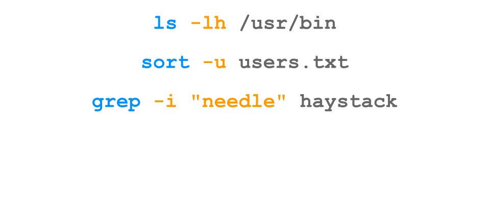

## General Command Syntax

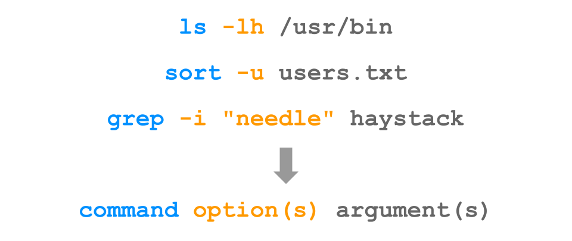

## General Command Syntax

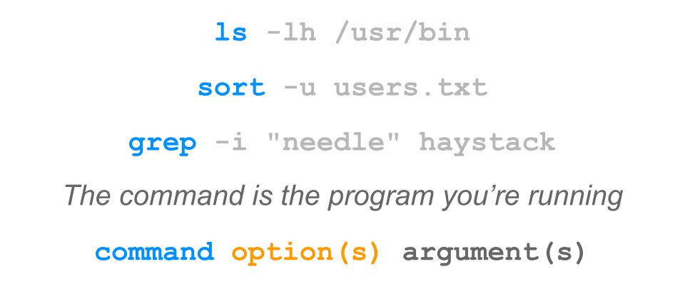

## General Command Syntax

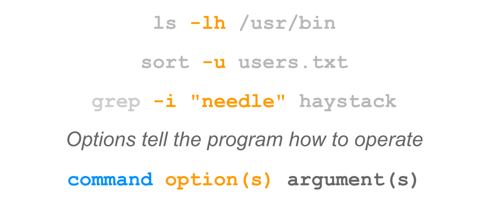

## General Command Syntax

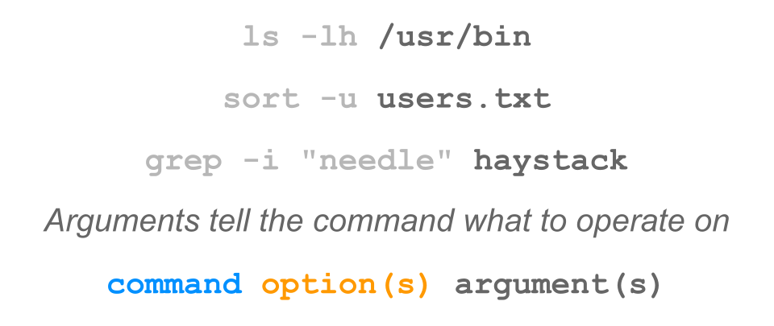

## Command Structure

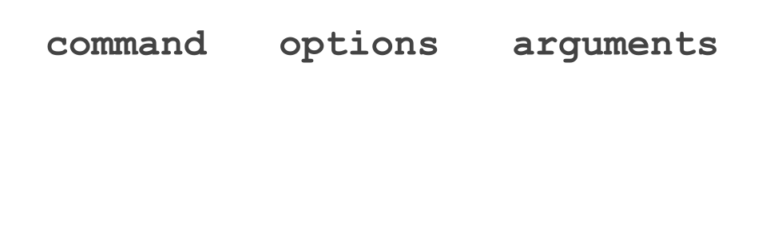

## Command Structure

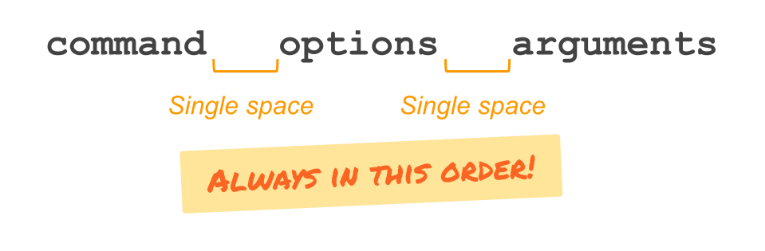

## Command Structure

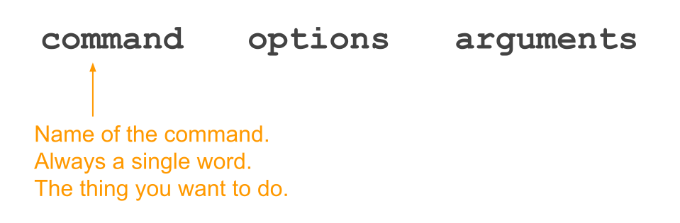

## Command Structure

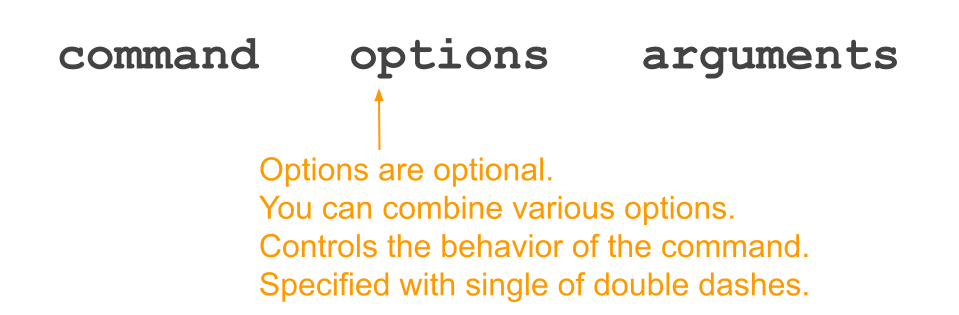

## Command Structure

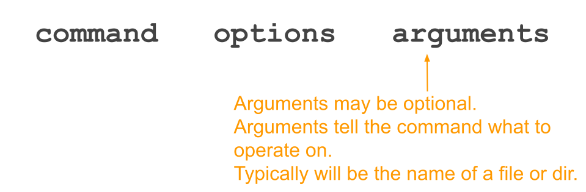


## Examples

```{.markdown filename="Example 1" code-line-numbers="false"}
# no options, no arguments
ls
```

. . .

```{.markdown filename="Example 2" code-line-numbers="false"}
# one option, no arguments
ls -l
```

. . .

```{.markdown filename="Example 3" code-line-numbers="false"}
# no options, one argument
ls Documents/
```

. . .

```{.markdown filename="Example 4" code-line-numbers="false"}
# one option, one argument
ls -l Documents/
```

. . .

```{.markdown filename="Example 5" code-line-numbers="false"}
# two options, one argument
ls -la Documents/
```


