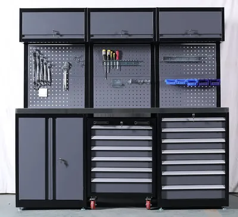
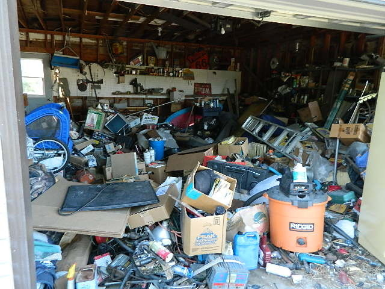

## 

### Yesterday's Lab

- Met your GSI: Sequoia & Larissa
- DataHub: Terminal
- Commands to navigate file system: `pwd`, `ls`, `cd`, `mkdir`, `rmdir`
- Commands to inspect files: `head`, `tail`, `less`, `cat`, `wc`
- Commands to manipulate files: `touch`, `open`, `cp`, `mv`, `rm`

::: {.fragment}
### 1st Reading

- Ten Simple Rules for Reproducible Computational Research
:::


<!--
## Folder for STAT 159

- You should have in your computer a dedicated directory (i.e. folder) `stat159/`

- You should use this directory for all the work done in this class.

- BTW: Your `Downloads/` folder is not a replacement for a `stat159/` folder.
-->


# Project Organization

##  {auto-animate="true"}

{fig-align="center"}

##  {auto-animate="true"}

::::: columns
::: {.column width="50%"}

:::

::: {.column width="50%"}

:::
:::::

## 

Data science projects involve dealing with multiple files:

-   some files will be inputs
-   some files will be outputs
-   some files will be data files
-   some files will be image files
-   some files will be script files (code)
-   some files will be reports
-   some files will play auxiliary roles

. . .

::: {.smalladage}
It's important to have a good organization of files
:::


## An Analogy {.nostretch}

::::: columns
::: {.column .fragment width="50%"}
{width="87%"}
:::

::: {.column .fragment width="50%"}
{width="93%"}
:::
:::::


## An Analogy {.nostretch}

::::: columns
::: {.column width="50%"}
Messy file system 😢

{width="87%"}
:::

::: {.column .fragment width="50%"}
Neat file system 😍

{width="93%"}
:::
:::::


# File and Directory Organization

## Project Organization

When starting a new project, it is worthwhile to spend some time thinking 
about how to best organize its content. 

. . . 

This means asking questions such as:

- What are my project inputs?
- What types of outputs do I expect to come out of this project?
- How does this project relate to other projects I am working on?


## When you begin a new project ...

- It is generally a good idea to store all of the files relevant to 
one project under a common root directory. 

- The exception to this rule is source code or scripts that are used 
in multiple projects. Each such program might have a project directory of its own.


## Golden rules

1) Raw data should never be changed. Save it into a `data/` folder and treat it as immutable.

2) The processed, clean version of your data will go into a dedicated file or directory, e.g., 
`clean_data.json` or `processed_data/`.

3) Anything that can be generated from code goes into its own folder. 
    + `output/`, `results/`, `images/`

4) If there are text documents, put them in their own folder:
    + `docs/`


## Golden rules (cont'd)

5) Code also has its own folder: `code/`. 
    + If you write a lot of functions, then create a `functions/` folder 
    + Or also a `src/` (for `source`) folder to save processing/analysis code.

6) If processing/analysis scripts are meant to be used in a certain order, 
you can number them:
    + e.g., `script1-data-prepration.R`, `script2-exploratory-analysis.R`, `script3-regression-model.R`, etc.

7) Sometimes the pipeline is not linear but branched, so numbering may not 
always make sense.

8) Modularize your code: split a giant script into 
short, single-purpose scripts with well-defined inputs and outputs.


## Golden rules (cont'd)

- A project directory should be a portable island.

- It can be zipped up, moved to a different folder, sent to a colleague, 
or cloned onto a remote server ...

- ... and every script still runs without modifying a single line of code.


# Documentation

## Documentation (README files)

- Each of your projects should always be accompanied by a [README]{.bold-hilit} file. 

- The [README]{.bold-hilit} should contain all the information an outsider would need to 
understand what the project is all about:
    + what are the inputs
    + what are the outputs,
    + where to find files within the project directory, etc.
    
- The [README]{.bold-hilit} is simply a text file, there's nothing special to 
it.
    + I like to write it in markdown syntax: `README.md`

- Writing down everything about a project in a `README.md` can be tedious, 
but it pays off. 


## README file(s)

- Record who the author/s is/are, 
- the date the project was started, 
- a description of what the project is for,
- describe important details
- (a `README` file is sort of a growing/living document)

. . .

Get in the habit of starting a project by creating a `README` file. 

Also, you can include README files inside the project's directories: 
e.g. a README for the `data/` folder, or for the `docs/` filder.


# Demo


## Some Comments

- How you define a project is largely up to you. 

- It could be all the work you do on a given dataset, 

- Or all the work you do for a thesis or dissertation, 

- Or each manuscript could be its own project even if it uses the same dataset 
as a different project.


## A Standard Project Template {.smaller}

```{.markdown filename="Example" code-line-numbers="false"}
project/
├── README.md             <- High-level summary & instructions
├── LICENSE               <- Data/code usage rights
│
├── data/
│   ├── raw/              <- IMMUTABLE raw data (read-only)
│   └── processed/        <- Cleaned, transformed datasets
│
├── code/
│   ├── 01_data-prep.R    <- Step 1: Clean raw data
│   ├── 02_analysis.R     <- Step 2: Fit statistical models
│   └── 03_figures.R      <- Step 3: Render visual output
│
├── output/
│   ├── tables/           <- Exported CSV/LaTeX summary tables
│   └── figures/          <- High-res PNG/PDF plots
│
└── docs/                 <- Paper drafts, reports, slide decks
```


## Example: How not to organize {.smaller}

```{.markdown filename="Example" code-line-numbers="false"}
traffic_project/
├── .RData
├── 01_clean_data_OLD.R
├── Data_traffic_2026_edited_v2.xlsx
├── Fig1.png
├── Script.R
├── Script2.R
├── Traffic Data Clean.csv
├── density_plot.png
├── my_script_final.R
├── temp_model.R
├── draft_august.docx
├── draft_final_comments.docx
└── traffic_2026.csv
```

\

Spot as many sins as you can fig01_density_by_hour

```{r}
#| echo: false
countdown::countdown(2, bottom = 0)
```


## Example {.smaller}

```{.markdown filename="Example" code-line-numbers="false"}
traffic_project/
├── README.md                 <- Step-by-step instructions
├── data/
│   ├── raw/                  <- Read-only original data
│   │   └── traffic_2026.csv
│   └── processed/            <- Script-generated clean data
│       └── 01_clean_traffic.rds
├── code/
│   ├── 01_clean_data.R
│   ├── 02_fit_models.R
│   └── 03_generate_figures.R
├── output/
│   └── figures/
│       └── fig01_density_by_hour.png
└── docs/
    └── report.qmd
```