# Tracking changes to files

## {background-image="images/phd-comics-final-doc.png" background-size="contain"}

## {background-image="images/diy-vs-git-1.svg" background-size="contain"}

## {background-image="images/diy-vs-git-2.svg" background-size="contain"}


# Sample Project

## {background-image="images/project-changes-1.svg" background-size="contain"}

## {background-image="images/project-changes-2.svg" background-size="contain"}

## {background-image="images/project-changes-3.svg" background-size="contain"}

## {background-image="images/project-changes-4.svg" background-size="contain"}

## {background-image="images/project-changes-5.svg" background-size="contain"}

## {background-image="images/project-changes-6.svg" background-size="contain"}

## {background-image="images/project-changes-7.svg" background-size="contain"}

## {background-image="images/project-changes-8.svg" background-size="contain"}

## {background-image="images/project-changes-9.svg" background-size="contain"}


# Idea 1) Project Snapshots

## {background-image="images/project-snapshots-1.svg" background-size="contain"}

## Saving versions as Snapshots

- A "version" is a set of changes.

- Saving full snapshots of the project rather than just tracking the 
individual changes.

- Snapshots have to be "efficient" (we'll clarify this later)

- Storage model is based on a **Directed Acyclic Graph** of Snapshots


# Idea 2) A Graph Model

##

[Graph]{.bold-hilit}: mathematical structure consisting of **Nodes**
(or vertices) connected by **Edges** (or lines).

##

[Graph]{.bold-hilit}: mathematical structure consisting of **Nodes**
(or vertices) connected by **Edges** (or lines).

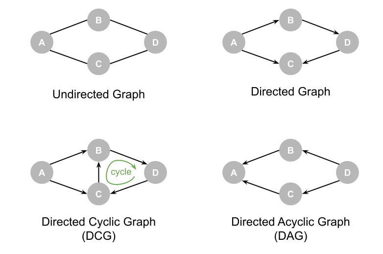{width=70% fig-align="center"}

##

[Graph]{.bold-hilit}: mathematical structure consisting of **Nodes**
(or vertices) connected by **Edges** (or lines).

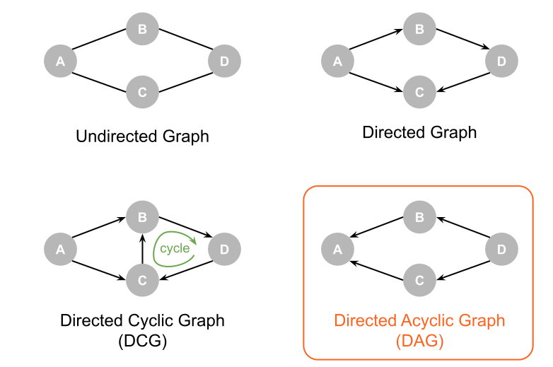{width=70% fig-align="center"}

## Directed Acyclic Graphs (DAG)

- [Directed]{.bold-hilit}: The edges have a specific direction, represented by arrows.

- [Acyclic]{.bold-hilit}: Contains no cycles. You cannot start at any node 
and follow a path back to the same node.

- **Common use cases**: They are used for showing one-way workflows, 
data processing pipelines, chronological or causal flows,
dependencies, and scheduling.


## DAG mental model

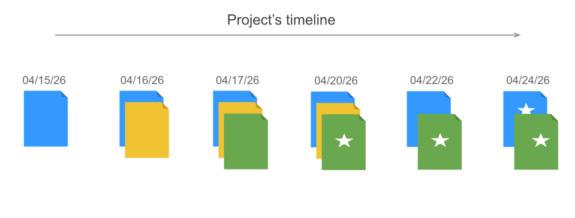{fig-align="center"}

## DAG mental model

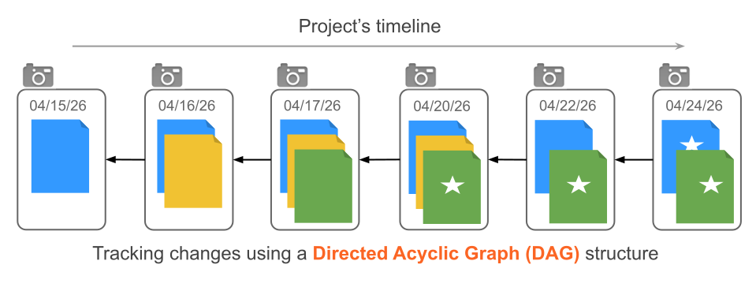{fig-align="center"}


# git

##

:::{.columns}

:::{.column width=40%}
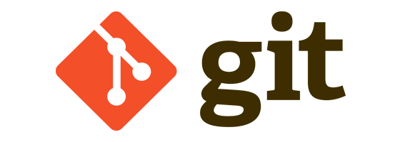
:::

:::{.column width=60%}
- Free and open-source command line tool

\

- Developed to help coordinate collaborative coding

\

- 99% of software projects use it

\

- Many scientific projects use it
:::
:::

## What does it do?

[git]{.hilit} allows you to:

- save your work,
- document your process,
- try new ideas/experiments,
- share it and,
- collaborate with others.


## Git commands to get started

. . .

Each command is called from the command line following `git` (e.g. `git init`).

- `init`: initialize a *repository* (repo)
- `add`: move a file into the *staging area*
- `commit`: take a snapshot of files in the staging area with a message (`-m`)
- `push`: send commits to another repo

:::{.notes}
Before showing these commands, open a terminal and type `git --help` to show the menu of commands.
:::

## {auto-animate=true}

:::{.columns}
:::{.column .smaller width=40%}
- `init`: invite the photographer (git) to the wedding (repo)
- `add`: move the bride and groom into the camera frame
- `commit`: take a picture of the bride and groom and caption it
- `push`: share the photos online
:::
:::{.column width=60%}

:::
:::


## {auto-animate=true}

:::{.columns}
:::{.column .nonincremental width=40%}
- `init`: invite the photographer (git) to the wedding (repo)
- `add`: move the bride and groom into the camera frame
- `commit`: take a picture of the bride and groom and caption it
- `push`: share the photos online
:::
:::{.column width=60%}

```bash
mkdir wedding
cd wedding
git init
git add bride groom
git commit -m "cutting the cake"
git push
```

:::
:::


# `git init`

## Initializing a repository

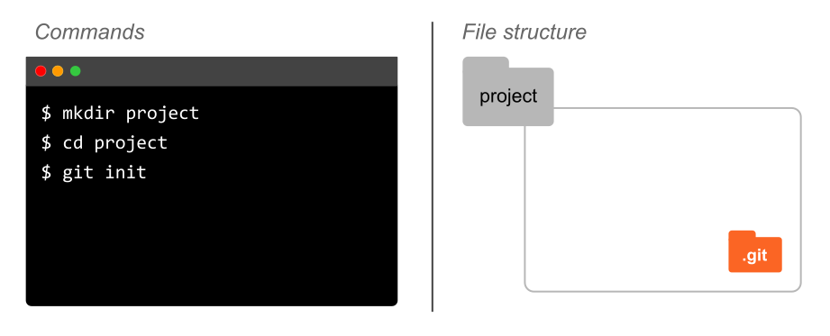{fig-align="center"}

## Initializing a repository

- `git init` initializes a git (local) repository
- Creates a directory `.git/`
- `.git/` is a hidden fodler containing git's database
- This is where git does its _magic_
- Don't touch this folder! (let git do its job)
- Once a repo is initialized, git will track changes to its content


# Primary Commands

## Primary git commands

- `git status`: what's going on with repo

- `git add`: **_stage_** changes (framing photo)

- `git commit -m "..."`: record changes in git's database (take a snapshot)


##

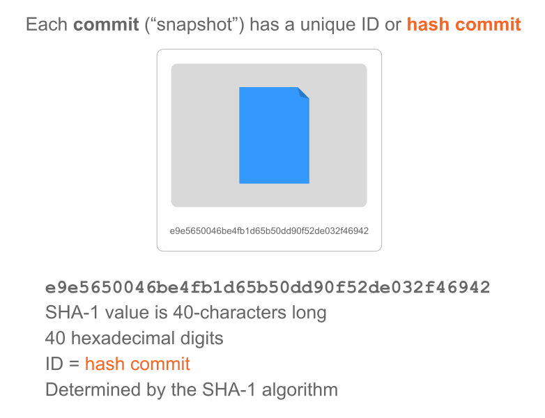{fig-align="center"}

## Elements of Commit

A commit consists of:

- author's name and email (who)
- timestamp (when)
- message (what / why)
- Hash ID (fingerprint)
- Parent pointer (who's the parent commit)
- File Snapshot

## Commit Messages

- Short message: < 50 characters

- Longer descriptions

- Examples:
    + Bug fix
    + Feature
    + Experiment
    + Merge

- What happened, and possibly why something happened


# The Full Picture

## {background-image="images/git-project-flow-1.svg" background-size="contain"}

## {background-image="images/git-project-flow-2.svg" background-size="contain"}

## {background-image="images/git-project-flow-2b.svg" background-size="contain"}

## {background-image="images/git-project-flow-3.svg" background-size="contain"}

## {background-image="images/git-project-flow-3b.svg" background-size="contain"}

## {background-image="images/git-project-flow-4.svg" background-size="contain"}

## {background-image="images/git-project-flow-5.svg" background-size="contain"}

## {background-image="images/git-project-flow-6.svg" background-size="contain"}

## {background-image="images/git-project-flow-7.svg" background-size="contain"}

## {background-image="images/git-project-flow-8.svg" background-size="contain"}


## What about git's DAG model?

- There's one root commit (initial commit)

- Arrows always point backward in time (from the child commit to its parent)

- Why? Because a parent commit cannot know its future children, but a child commit 
always knows exactly who its parent was.

- There are no loops or cycles (a child node cannot be the parent of its parent,
or the ancestor of its ancestors)

- Each commit has a HASH id (and other metadata)

- There are moving pointers (or labels) such as:
    + `HEAD`: "You are here" bookmark
    + `main`: name of default branch


# Keeping track of changes

## Key Ideas

{width=90% fig-align="center"}

## Key Ideas

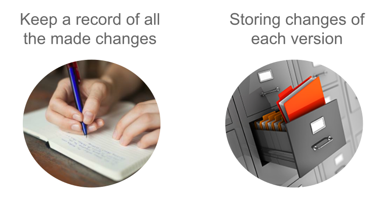{width=90% fig-align="center"}

##

How does git keep track of changes?

. . .

\

[Git]{.hilit} records the changes made on a project's files 
(not their versions)

##

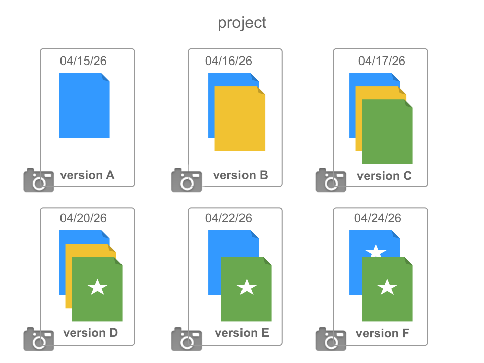{fig-align="center"}

##

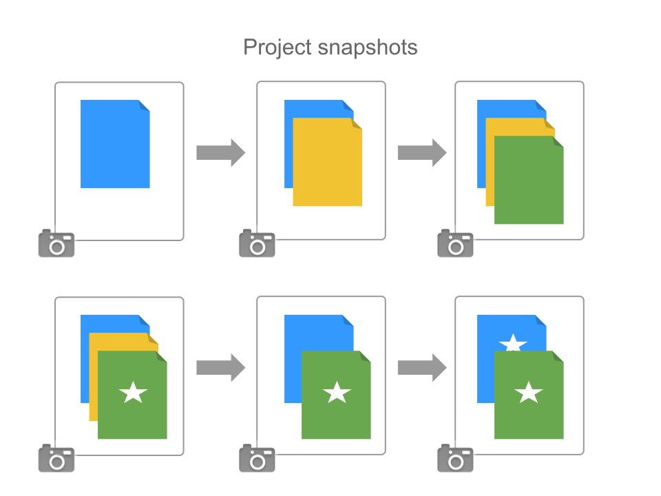{fig-align="center"}

##

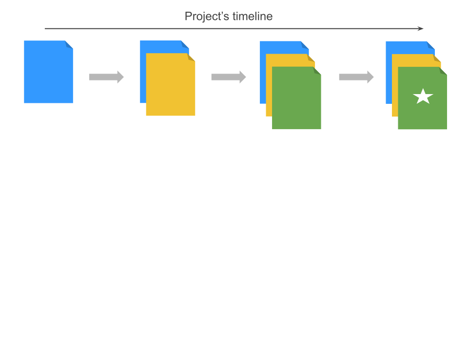{fig-align="center"}

##

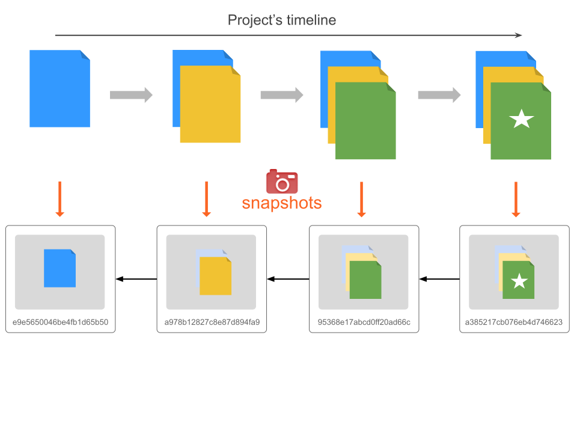{fig-align="center"}

##

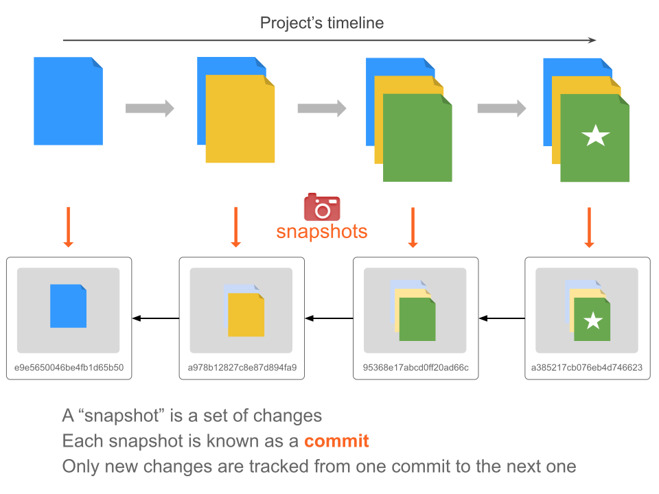{fig-align="center"}

##

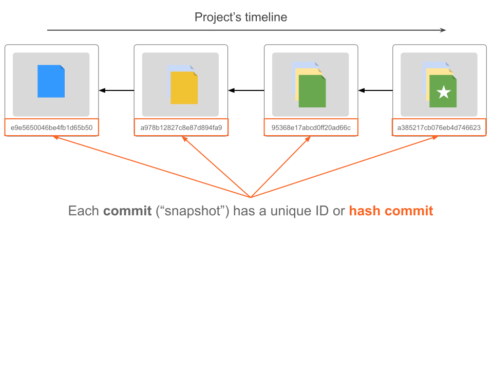{fig-align="center"}

