## Linear History so far {.nonstretch}

So far we've seen a linear history in a project, and how git's DAG looks like

\

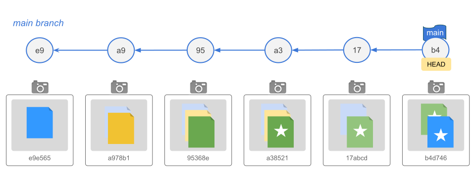{width=80% fig-align="center"}

## Recall that

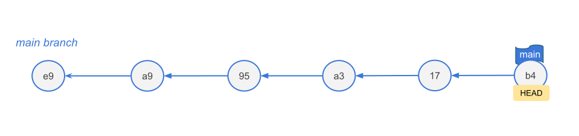{width=80% fig-align="center"}

- the default branch is called `main` (this is just a moving pointer)
- there is another moving pointer called `HEAD` ("You are here" label)
- `HEAD` is a special pointer that attaches itself to your current active 
branch pointer (which is `main` by default)


# Git Branches

## {background-image="images/one-branch-vs-two-branches.svg" background-size="contain"}

## Moving Beyond a Linear Timeline

In data science, you rarely work on a single feature or analysis at a time. 

::: {.columns}
::: {.column}
- Do experiments:
    + try out a new color scheme for your graphics
    + change simulation settings
- Implement new ideas: 
    + fit an alternative regression model,
    + use functions from a new package 
:::

::: {.column .fragment}
- Develop features:
    + add an interactive map to a dashboard
- Fix bugs
    + fix broken pipeline
:::
::::

. . .

[Branches allow you to isolate your work safely.]{.bold-hilit}


## Analogy

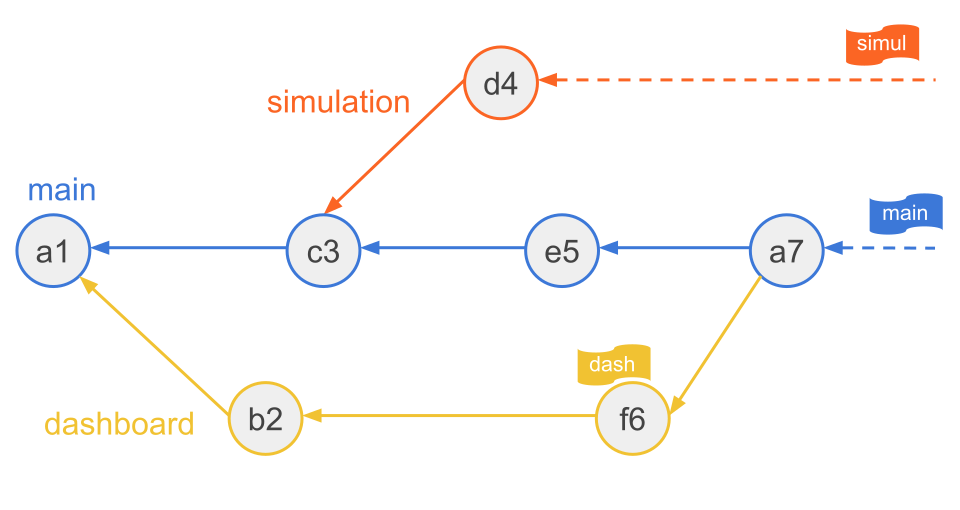{fig-align="center"}

Think of a branch as a parallel universe. You can test a risky new 
machine learning model in Universe B without destroying the clean, working code 
in Universe A.


## What Exactly is a Git Branch?

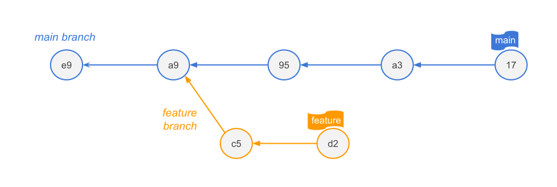{fig-align="center"}

- A branch is NOT a heavy folder containing copies of your files.

- A branch is simply a lightweight, [movable pointer]{.bold-hilit} to a 
specific commit in your history graph.

- Creating a branch is instantaneous and costs almost zero disk space. 
It just creates a 41-byte text file containing a commit hash.


## When to use branches?

- [Feature Development]{.bold-hilit}: Writing a new data cleaning function or 
engineering a new feature.

- [Experimentation]{.bold-hilit}: Testing a different model architecture 
(e.g., switching from a Random Forest to an XGBoost model).

- [Bug Fixes]{.bold-hilit}: Fixing an error in your data parsing script without 
pausing ongoing analysis.

- [Collaboration]{.bold-hilit}: Every team member works on their own branch, 
keeping the main branch stable, tested, and deployable at all times.


# Essential Branching Commands

## Create a branch

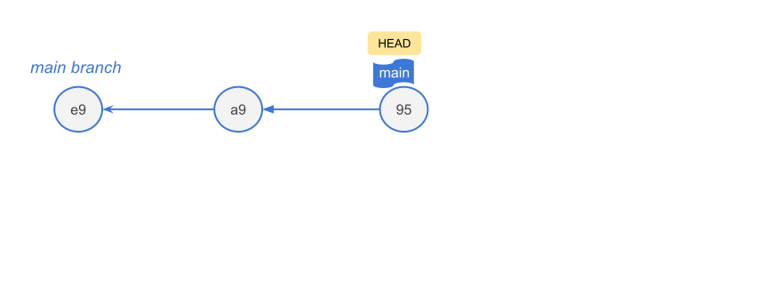{fig-align="center"}

## Create a branch (option 1)

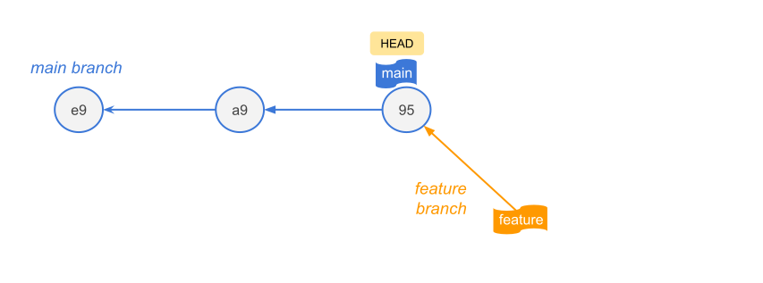{fig-align="center"}

```{.markdown code-line-numbers="false"}
git branch <branch-name>
```

Creates a branch: creates the pointer, does not switch you to it.

::: {.notes}
This command only creates a new pointer. It points to the exact same commit you 
are currently standing on, but your workspace does not move.
:::

## Create a branch (option 2a)

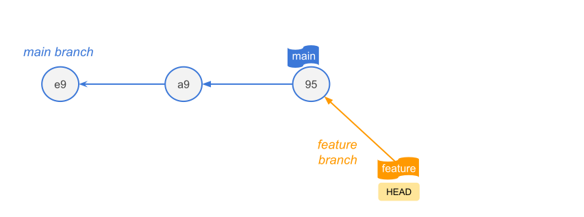{fig-align="center"}

```{.markdown code-line-numbers="false"}
git switch -c <branch-name>
```

Create and Switch in one go: creates the pointer, and switch you to it.

::: {.notes}
The feature pointer is created at commit-95, and HEAD instantly detaches from 
main and snaps onto feature. Your working directory is now tracking the new branch.
:::

## Create a branch (option 2b)

{fig-align="center"}

```{.markdown code-line-numbers="false"}
git checkout -b <branch-name>
```

Same as `git switch -c <branch-name>`


## Switching to existing branches

```{.markdown code-line-numbers="false"}
git switch <branch-name>

# equivalent
git checkout <branch-name>
```

. . .

\

Example: switch to `feature` (assuming we are in `main`)

```{.markdown code-line-numbers="false"}
# feature already exists
git switch feature
```


## Working on branches

```{.markdown code-line-numbers="false"}
# assume HEAD is on main
git switch feature

# add changes to feature branch
. . .
```

{fig-align="center"}


## Working on branches

```{.markdown code-line-numbers="false"}
# add changes to feature branch
. . .

# commit changes
git commit -m "..."
```

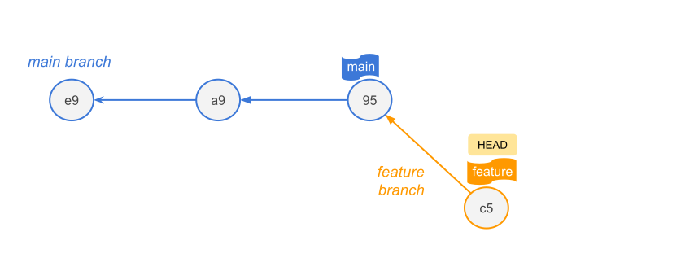{fig-align="center"}


## Working on branches

```{.markdown code-line-numbers="false"}
# switch back to main
git switch main

# add changes to main branch
. . .
```

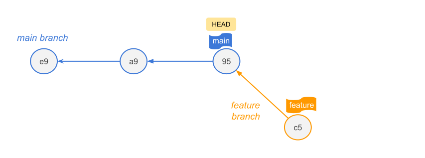{fig-align="center"}


## Working on branches

```{.markdown code-line-numbers="false"}
# add changes to main branch
. . .

# commit changes
git commit -m "..."
```

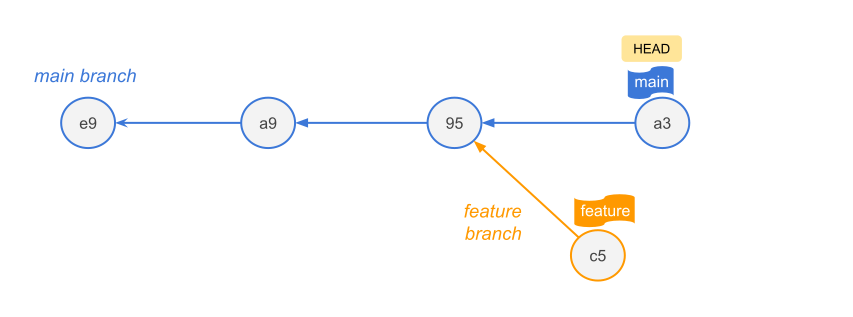{fig-align="center"}


## Working on branches

```{.markdown code-line-numbers="false"}
# switch back to feature
git switch feature

# add changes to feature branch
. . .
```

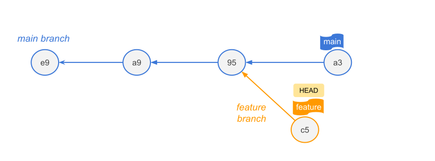{fig-align="center"}


## Working on branches

```{.markdown code-line-numbers="false"}
# add changes to feature branch
. . .

# commit changes
git commit -m "..."
```

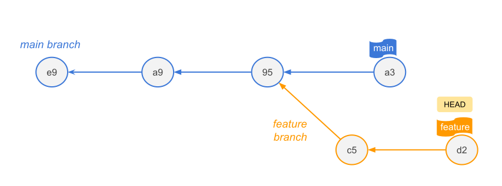{fig-align="center"}


## Other commands {auto-aniamte="true"}

```{.markdown code-line-numbers="false"}
# list all local branches
git branch
```

## Other commands {auto-aniamte="true"}

```{.markdown code-line-numbers="false"}
# list all local branches
git branch

# see the commit history
git log --graph --oneline --decorate --all
```

## Other commands {auto-aniamte="true"}

```{.markdown code-line-numbers="false"}
# list all local branches
git branch

# see the commit history
git log --graph --oneline --decorate --all

# comparing two branches
git diff branch1..branch2
```

## Other commands {auto-aniamte="true"}

```{.markdown code-line-numbers="false"}
# list all local branches
git branch

# see the commit history
git log --graph --oneline --decorate --all

# comparing two branches
git diff branch1..branch2

# diff with color-words option
git diff --color-words branch1..branch2
```


## Traps and Confusing Things to Avoid

- Trap: [Uncommitted changes]{.bold-hilit}

- Description: If you edit a file but do not commit it, 
and then switch branches, those uncommitted changes travel with you to the 
new branch. 

- Rule: Always run `git status` and **commit** or **stash**[^1] changes before 
switching branches.

[^1]: We'll cover stashing later.


## Traps and Confusing Things to Avoid

- Trap: [Brain-dead Branch Names]{.bold-hilit}

- Description: Avoid naming branches like `git branch test1`. 

- Rule: Use semantic naming <br>

. . .

```{.markdown code-line-numbers="false"}
git branch feature/xgboost-tuning
```

\

```{.markdown code-line-numbers="false"}
git branch bugfix/missing-values
```

## Traps and Confusing Things to Avoid

- Trap: [Losing Track of `HEAD`]{.bold-hilit}

- Description: If you checkout a specific commit hash instead 
of a branch name, you enter a **"Detached HEAD state"**. Commits made here do not 
belong to any branch and can easily be lost.


# Merging Branches

## Merging 

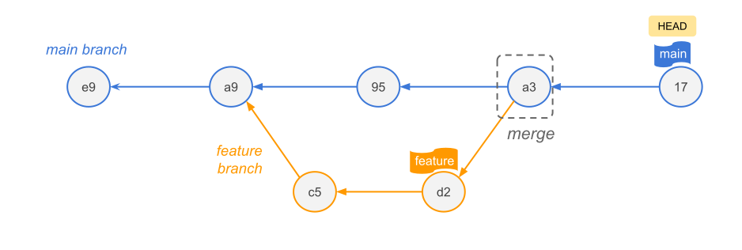{fig-align="center"}

You can integrate the changes of a branch into another branch by merging 
these branches. 

Afterwards, the commits of the new branch (e.g. "feature") are also part of 
the main branch's history.


## Types of Merges

2 main types of merges:

:::: {.columns}
::: {.column}
[Fast-Forward Merge]{.mdlit}

- Occurs if `main` hasn't changed since you branched off. 
- Git simply slides the main pointer forward to match your feature branch pointer. 
- No new commit is made.
:::

::: {.column .fragment}
[Three-Way Merge]{.hilit}

- Occurs if `main` has moved forward while you were working. 
- Git looks at the common ancestor, merges the differences.
- Git creates a new Merge Commit node with two parent pointers.
:::
::::


## {background-image="images/merge-fast-forward-example-1.svg" background-size="contain"}

## {background-image="images/merge-fast-forward-example-2.svg" background-size="contain"}

## Fast-Forward Merge

If the base branch (main) has not received any new commits since you created 
the feature branch, Git completes the merge by simply moving the branch pointer 
forward to the latest commit of the feature branch. 

No new "merge commit" is generated because there are no divergent changes to 
reconcile.


## Three-Way Merge

If both the feature branch and the main branch have moved forward independently 
with new commits, the history has diverged.

Git combines changes from two divergent branches and creates a special 
[Merge Commit]{.hilit} with **two parent pointers**.

The term "three-way" refers to the three snapshots Git compares to generate the 
merged file: 

1) The Common Ancestor (Merge Base): The point in history where the two branches 
originally split. It acts as the baseline.

2) The Target Branch (HEAD): The tip (most recent commit) of the branch you are 
currently on and merging into.

3) The Source Branch: The tip of the branch you are actively trying to merge.


## {background-image="images/merge-three-way-example-1.svg" background-size="contain"}

## {background-image="images/merge-three-way-example-2.svg" background-size="contain"}


# Merge Conflicts

## Merge Conflicts

- There can be conflicts when branches are merged.

- A conflict happens when two branches modify the exact same line of the 
exact same file, and you try to merge them. 

- Git doesn't know which version is the correct one.


## {background-image="images/merge-conflict-1.svg" background-size="contain"}

## {background-image="images/merge-conflict-2.svg" background-size="contain"}

## {background-image="images/merge-conflict-3.svg" background-size="contain"}

## {background-image="images/merge-conflict-4.svg" background-size="contain"}


## Resolving conflicts

The process of resolving a conflict is similar to the usual commit workflow:

- Modify: Resolve all conflicts.
- Add: Add all changes to the staging area via `git add`.
- Commit: Conclude the conflict resolution and the merge operation via `git commit`.


## Merge Conflicts

Git pauses the merge, alters your file to show the conflict markers 
`(<<<<<<<,` `=======,` `>>>>>>>),` and forces you to manually edit and fix the 
code before committing.


**INSERT IMAGE**


## Strategies to reduce conflicts

- Try to keep lines short (makes it easy to spot where the conflicts are).
- Try to keep your commits small and focused.
- Try to merge often. In this way, the conflicts will be smaller and more isolated. 
- The longer you wait to merge, it will be more likely to have bigger conflicts.
- Track changes to main.


# Stashing

## Stashing

Imagine you are in the middle of writing a new feature, and your code is 
completely broken and full of typos. 

Suddenly, your professor or project manager sends an urgent message: 
_"The login screen is completely broken on the main server. Fix it right now."_

You can't switch branches to fix the bug because Git won't let you switch 
branches while you have dirty, uncommitted changes. 

But you also don't want to run git commit on broken, unfinished work just to save it.

This is where you run `git stash`


## How Stashing Works (The Workspace Analogy)

Think of your code folder like a messy physical desk full of scribbled-on 
scratch paper and unfinished blueprints:

1) `git stash`: You take all the messy papers on your desk, shove them into 
a drawer, and lock it. Your desk is now perfectly clean.

2) The Emergency Intermission: You safely switch branches, write a clean 1-line 
fix for the server bug, commit it, and push it.

3) `git stash pop`: You open the drawer, take your messy papers out, and spread 
them back out on your desk exactly where you left them. You can now resume your 
work as if you were never interrupted.


## Two Mistakes Beginners Make

1) Untracked Files: By default, git stash only saves files that Git already 
knows about. If you created a brand new file and haven't run git add on it yet, 
Git will leave it sitting on your desk. To force Git to stash everything 
including new files, you must run: `git stash -u` (short for untracked).

2) The Stash Black Hole: If you run git stash five times over a week without 
using `git stash pop`, you will end up with a massive pile of nameless stashes. 
It becomes very difficult to remember what code is hidden inside `stash@{4}`.

