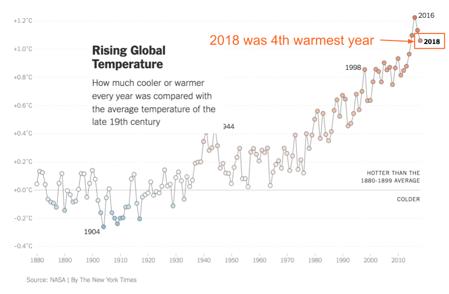
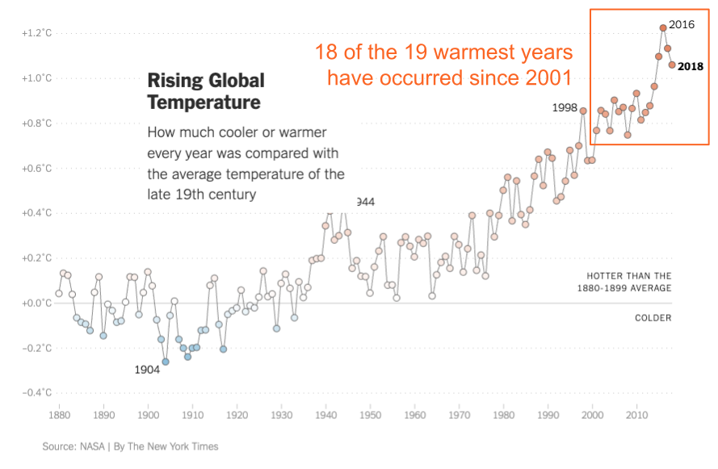
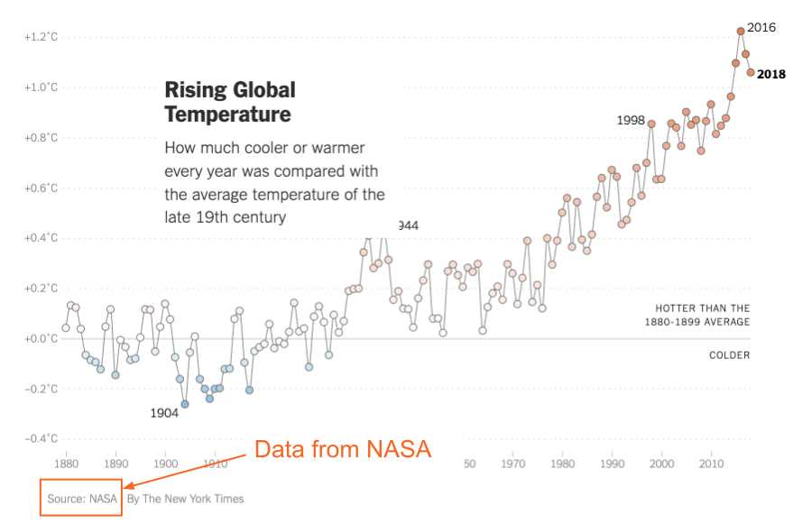
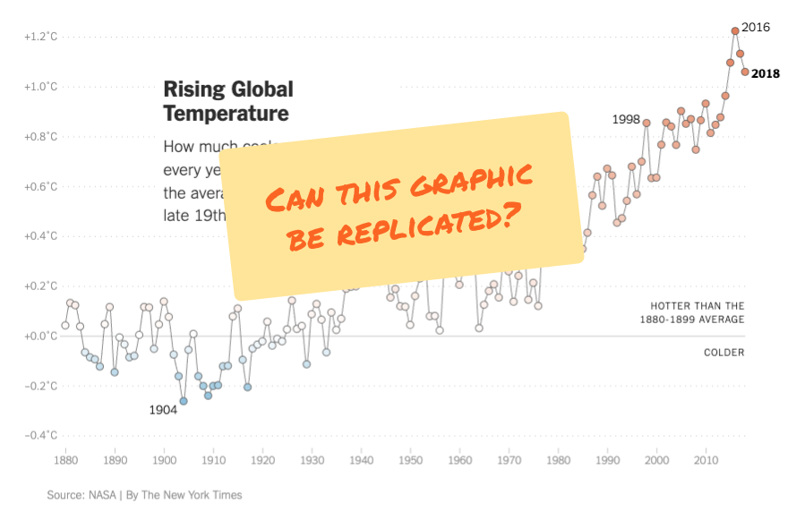
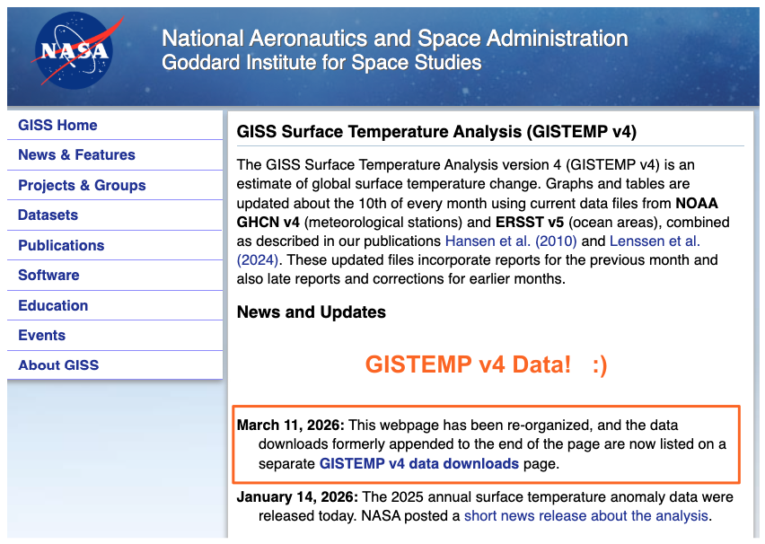
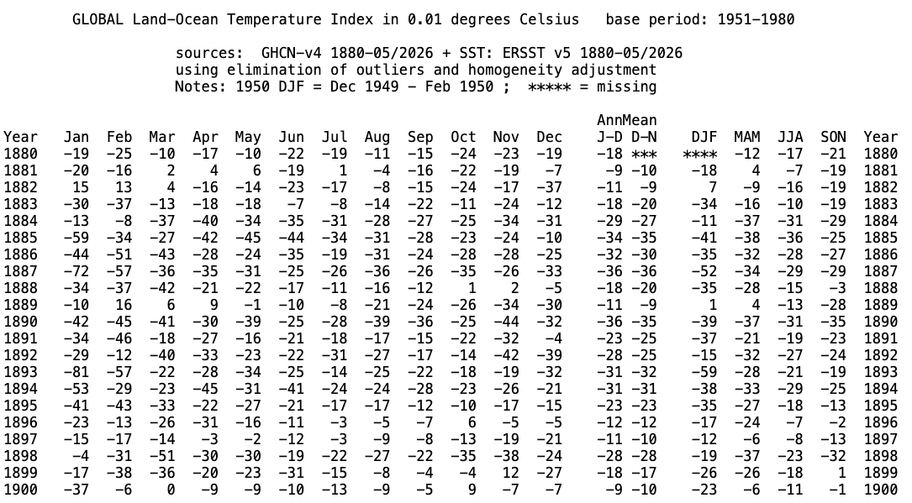
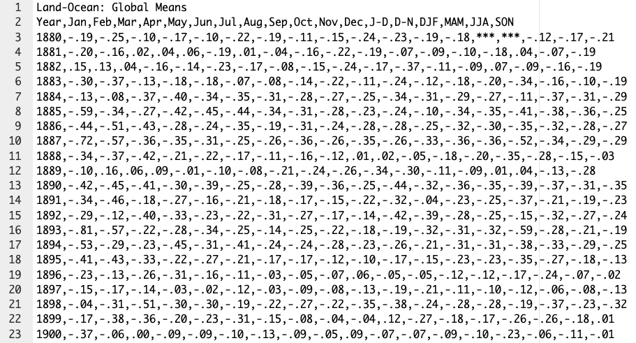
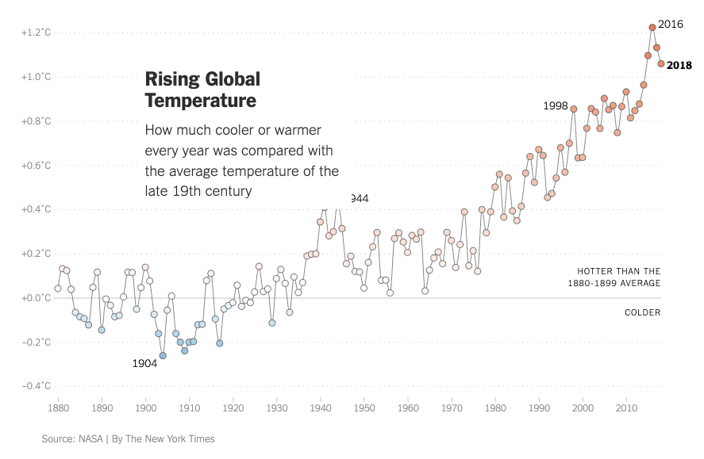
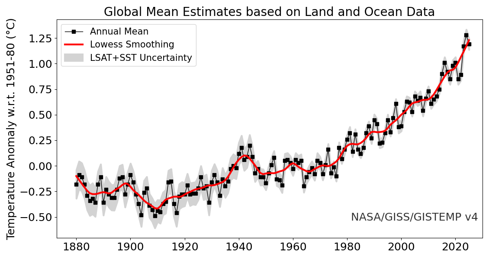

# Rising Global Temperature

## {background-image="images/nyt-2018-fourth-warmest-year.png" background-size="contain"}

## About NYT's article

\

::: {.nonincremental}
- **It's Official: 2018 Was the Fourth-Warmest Year on Record**

- by John Schwartz and Nadja Popovich

- Published on Feb 6, 2019

- <https://www.nytimes.com/interactive/2019/02/06/climate/fourth-hottest-year.html>
:::


## Authors [^1] [^2]

:::: {.columns}
::: {.column}


[^1]: <https://www.nytimes.com/by/john-schwartz>
:::

::: {.column}


[^2]: <https://www.nytimes.com/by/nadja-popovich>
:::
::::


## Article's claims

- "NASA scientists announced Wednesday that the Earth's average surface 
temperature in 2018 was the fourth highest in nearly 140 years of 
record-keeping and a continuation of an unmistakable warming trend."

- "The data means that the five warmest years in recorded history have been 
the last five, and that 18 of the 19 warmest years have occurred since 2001."

- "The publication of the NASA temperature data came in tandem with a similar 
announcement from the National Oceanic and Atmospheric Administration."

## Article's claims

{fig-align="center"}

## Article's claims

{fig-align="center"}

## Article's claims

{fig-align="center"}

## Question

{fig-align="center"}


## Main Considerations

- Can we find the raw data?

- Can we write code to graph a timeline?

- Can we customize the visual appearance of the graphic?


# Finding the Data

## NASA's Data

GISTEMP website

<https://data.giss.nasa.gov/gistemp/>

. . .

\

\

\

::: {.small}
Based on my experience, this step usually takes some time 
(e.g. searching through dozens of websites and links, inspecting 
databases, data sets, and files)
:::


## {background-image="images/gistemp-website-screenshot.png" background-size="contain"}


## GISTEMP Data

- The GISS Surface Temperature Analysis (GISTEMP v4) is an estimate of 
global surface temperature change.

- GISTEMP is one of the longest established surface temperature analyses 
with first estimates made in Hansen et al. (1981)


## 

{fig-align="center"}

## {background-image="images/gistemp-data-page-screenshot-1.png" background-size="contain"}

## {background-image="images/gistemp-data-page-screenshot-2.png" background-size="contain"}


# Understanding the Data

##

For nearly 45 years, a team of scientists at NASA’s GISS has been tracking these 
rising temperatures and producing records and analyses of the global temperature 
of Earth. Each month, scientists release a dataset.

- On land, thermometers affixed to tens of thousands of weather stations give 
us precise air temperature readings. 

- Ships and buoys floating in the ocean capture temperatures at the sea surface. 

- Calculating an average global temperature requires collecting all those datasets.

- <https://science.nasa.gov/earth/measuring_global_temperature/>


## {background-image="images/gistemp-locations-of-measurements.png" background-size="contain"}

##

- Monthly surface temperature anomaly data

- "Surface temperature anomalies" is a combination of: 
    + Land-Surface Air (LSA) temperature anomalies
    + Sea-Surface Water (SSW) temperature anomalies

- Also known as _Land-Ocean Temperature Index_ (L-OTI)

- Anomalies are deviations from the 1951-1980 means

- Keep in mind that a temperature anomaly is a departure or deviation 
from a long-term average, baseline "normal" temperature.

- Instead of measuring the absolute, raw temperature (e.g., 
"The temperature in Death Valley today is 45°C"), climate scientists measure 
how much warmer or colder a specific time and place is compared to its 
historic reference baseline.


## Temperature Anomalies

$$
\text{Temp Anomaly} = \text{Observed Temp} - \text{Baseline Average Temp}
$$

. . .

What the Numbers Mean:

- Positive Anomaly (+): The observed temperature was warmer than the 
historic baseline average.

- Negative Anomaly (-): The observed temperature was cooler than the 
historic baseline average.

- Zero Anomaly (0): The temperature was exactly equal to the long-term 
historical average.


## Why Using Anomalies?

- Why not just average absolute temperatures?

- Absolute temperatures are heavily distorted by local geography.

- e.g. If you have two weather stations---one at the bottom of a mountain 
and one at the peak---their absolute temperatures will vary wildly due to elevation.

- While absolute temperatures shift from mile to mile, temperature anomalies 
are highly correlated across vast distances.

- e.g. If a winter is unusually warm in Chicago, it is almost certainly 
unusually warm in Detroit, Milwaukee, and across the entire Midwest. 

- Because the anomaly signal is uniform across large regions, they accurately
reflect temperature trends even in data-sparse areas.


## txt file [^3] {.nostretch}

{width=80% fig-align="center"}

[^3]: https://data.giss.nasa.gov/gistemp/tabledata_v4/GLB.Ts+dSST.txt

## csv file [^4] {.nostretch}

{width=80% fig-align="center"}

[^4]: https://data.giss.nasa.gov/gistemp/tabledata_v4/GLB.Ts+dSST.csv


## {background-image="images/gistemp-timeline-screenshot.png" background-size="contain"}


# Graphs (timelines)

## {background-image="images/nyt-rising-global-temperature-timeline.png" background-size="contain"}

## {background-image="images/nasa-global-mean-estimates-timeline.png" background-size="contain"}


## NYT -vs- NASA

\

:::: {.columns}
::: {.column}
NYT


:::

::: {.column}
NASA


:::
::::


## Questions

\

Did the NYT actively manipulate the data to create climate panic?

\

Why did NYT change the baseline? Any thoughts?


```{r}
#| echo: false
countdown::countdown(3, bottom = 0)
```


# Project Organization


## 

Let's consider 4 different file structures

\

:::: columns
::: {.column .fragment}
```{.markdown filename="Scenario A (no raw data)" code-line-numbers="false"}
project/
  doc.qmd
```
:::

::: {.column}
:::
::::


## 

Let's consider 4 different file structures

\

:::::: columns
::: {.column}
```{.markdown filename="Scenario A (no raw data)" code-line-numbers="false"}
project/
  doc.qmd
```

\

\

```{.markdown filename="Scenario B" code-line-numbers="false"}
project/
  doc.qmd
  GLB.Ts+dSST.csv
```
:::

:::{.column}
:::
::::::


## 

Let's consider 4 different file structures

\

:::::: columns
::: {.column}
```{.markdown filename="Scenario A (no raw data)" code-line-numbers="false"}
project/
  doc.qmd
```

\

\

```{.markdown filename="Scenario B" code-line-numbers="false"}
project/
  doc.qmd
  GLB.Ts+dSST.csv
```
:::

::: {.column}
```{.markdown filename="Scenario C" code-line-numbers="false"}
project/
  doc.qmd
  data/
    GLB.Ts+dSST.csv
```
:::
::::::


## 

Let's consider 4 different file structures

\

:::::: columns
::: {.column}
```{.markdown filename="Scenario A (no raw data)" code-line-numbers="false"}
project/
  doc.qmd
```

\

\

```{.markdown filename="Scenario B" code-line-numbers="false"}
project/
  doc.qmd
  GLB.Ts+dSST.csv
```
:::

::: {.column}
```{.markdown filename="Scenario C" code-line-numbers="false"}
project/
  doc.qmd
  data/
    GLB.Ts+dSST.csv
```

\

```{.markdown filename="Scenario D" code-line-numbers="false"}
project/
  report/
    doc.qmd
  data/
    GLB.Ts+dSST.csv
```
:::
::::::

