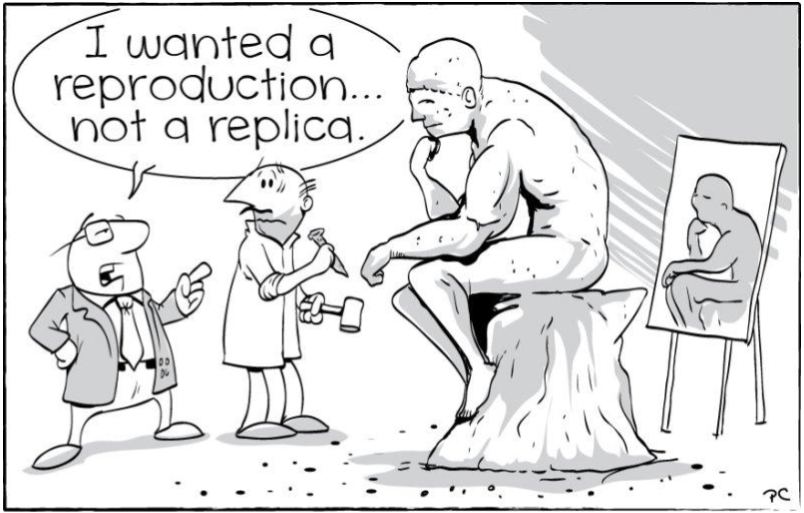
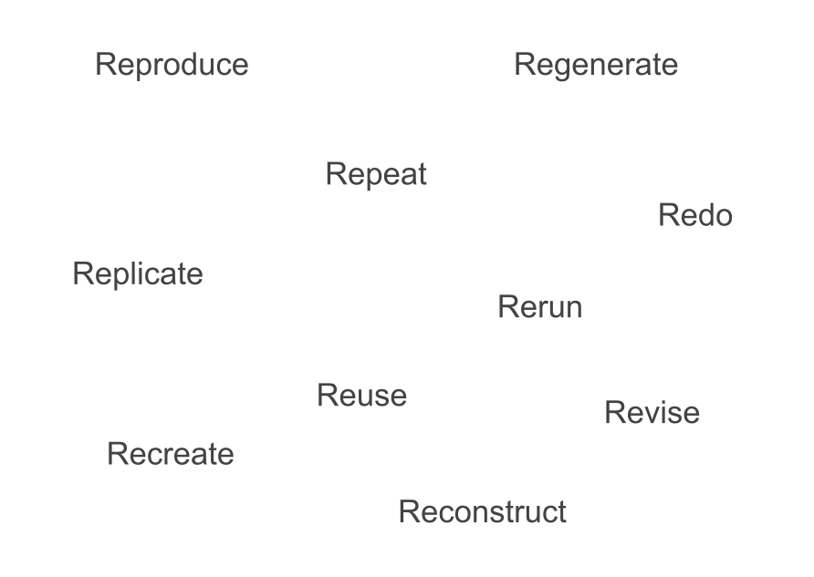

# Guide for Reproducible Research

## Reading

::: {.nonincremental}
- Chapter: **Guide for Reproducible Research**
- Book: The Turing Way
- Year: 2024
- <https://book.the-turing-way.org/reproducible-research>
:::


# Reproducibility

## {.nostretch}

{width=70% fig-align="center"}


## What is the right verb?

. . .

{width=70% fig-align="center"}


## {background-image="images/fill-in-the-blank.svg" background-size="contain"}


## Victoria Stodden's definitions

1. [Computational Reproducibility]{.bold-hilit}: Sharing exact code, 
software environments, and data to replicate the exact digital output.

2. [Empirical Reproducibility]{.bold-hilit}: Providing detailed logs of 
physical data collection, tools, settings, and methodology.

3. [Statistical Reproducibility]{.bold-hilit}: Accurately reporting all 
parameters, multi-test variations, and filter selections to prevent 
false-positive biases.


## Activity

::: {.callout-tip}
Before showing any definitions, project the words Reproducible, Replicable, 
Robust, and Generalisable on the screen. Have students type a one-word synonym 
for each in a live word cloud tool (like Mentimeter).
:::


## 2x2 Matrix

::: {.callout-tip}
Task: Project a blank 2x2 grid on the board. The X-axis is labeled "Data" 
(Same / Different) and the Y-axis is labeled "Analysis" (Same / Different). 

Have student pairs place the 4 core concepts in their correct boxes based on 
the text.
:::

- Same Data + Same Analysis = ?

- Different Data + Same Analysis = ?

- Same Data + Different Analysis = ?

- Different Data + Different Analysis = ?


## 2x2 Matrix

- Same Data + Same Analysis = Reproducible.

- Different Data + Same Analysis = Replicable.

- Same Data + Different Analysis = Robust.

- Different Data + Different Analysis = Generalisable.


## 2x2 Matrix

```
               [ SAME DATA ]            [ DIFFERENT DATA ]
          ┌───────────────────────┬───────────────────────┐
[ SAME    │     REPRODUCIBLE      │      REPLICABLE       │
 ANALYSIS]│ (Same steps & data)   │ (Qualitately similar) │
          ├───────────────────────┼───────────────────────┤
[ DIFF.   │        ROBUST         │     GENERALISABLE     │
 ANALYSIS]│ (Language agnostic)   │  (The Holy Grail)     │
          └───────────────────────┴───────────────────────┘
```


## Question

If you run a dataset through an R package and get an answer, 
then run the exact same data through a Python script and get a different answer, 
what did you just prove about the research?

::: {.notes}
The result is not robust. It proves the finding was a fluke of the specific 
software implementation, not a baseline truth.
:::


# Stodden's definitions

##

Victoria Stodden argues that treating "reproducibility" as a single broad 
concept hides the distinct failure points of a project. To solve this, 
she isolates three distinct layers of scientific integrity:

1) Computational Reproducibility: Sharing the precise code, software versions, 
hardware specs, and execution scripts.

2) Empirical Reproducibility: Providing the raw physical observations and 
a detailed ledger of the exact collection methodology.

3) Statistical Reproducibility: Documenting the deliberate choice of statistical 
tests, threshold filters (p-values), and model parameters to prevent data-dredging.


## Scenario 1

A student group writes a flawless Python script. 

They run a dataset through 50 different machine learning models with slightly 
tweaked thresholds. 

Model #47 yields a statistically significant, brilliant correlation (p < 0.01). 

They publish Model #47 along with their exact script, claiming an absolute 
breakthrough. 

They never mention models 1 through 46.

::: {.poll}
Since they provided the exact code and data to reproduce Model #47 perfectly, 
is this computationally reproducible?
:::

::: {.notes}
Yes, it is computationally reproducible. However, it completely violates 
Statistical Reproducibility. This is a classic case of "p-hacking" or data 
dredging. They hid the multiple testing problem, meaning the result is likely 
an accidental statistical fluke rather than a real scientific discovery.

The Fix: Pre-registering the study design and reporting the performance 
of all 50 tested models, not just the cherry-picked survivor.
:::


## Scenario 2

A research team writes a beautiful script to analyze air quality fluctuations 
across a city. 

The code runs without error and perfectly generates a set of maps. 

However, when a peer tries to collect their own air data using identical 
scripts in a neighboring town, the code crashes because the original team 
forgot to mention that their physical air sensors require a highly specific 
temperature calibration step before recording numbers.

::: {.poll}
Since they provided the exact code and data to reproduce their maps, 
is this computationally reproducible?
:::

::: {.notes}
Yes, it is computationally reproducible. However, it violates Empirical 
Reproducibility. While the math and code are perfectly shared, the analog 
connection to the physical world—how the data was physically harvested---is 
an unrecorded black box.

The Fix: Publishing an exhaustive metadata ledger detailing the exact 
sensor models, hardware calibration protocols, and physical collection constraints.
:::


## Scenario 3

A paper published in 2021 includes a download link to an R script and a 
clean CSV data table. 

When a student tries to run the script today, it immediately aborts with 
12 syntax errors because the modern R libraries installed on their laptop 
no longer support the deprecated commands used five years ago.

::: {.poll}
The data is there, and the code text is unchanged. 
Why is this project currently dead?
:::

::: {.notes}
This violates Computational Reproducibility. Merely sharing raw code text 
is not enough if the software ecosystem surrounding that code changes over time.

The Fix: Archiving the specific software environment using tools like 
Docker containers, Virtual Environments, or configuration lockfiles to freeze 
the software versions in time.
:::


# Advantages of Working Reproducibly

## Added Advantages

1) Provenance
2) Collaboration
3) Misinformation Avoidance
4) Efficient Writing
5) Fair Credit
6) Continuity

. . .

::: {.poll}
Which of these six benefits would save you the most physical stress 
the night before a final project deadline?
:::

```{r}
#| echo: false
countdown::countdown(2, bottom = 0)
```


## The Selfish Scientist Paradigm

Florian Markowetz famously wrote an article titled 
"Five Selfish Reasons to Work Reproducibly"[^1]

. . .

::: {.poll}
Based on the text, why is framing reproducibility as a "selfish benefit" 
actually more effective at changing scientist behaviors than framing it 
as a community benefit?
:::

```{r}
#| echo: false
countdown::countdown(2, bottom = 0)
```

::: {.notes}
Altruism wears off under high-pressure deadlines, but saving your future self time 
and preventing public embarrassment provides a permanent incentive.
:::

[^1]: https://scientificbsides.wordpress.com/2015/07/15/five-selfish-reasons-for-working-reproducibly/


## Retraction Scenario

You publish a paper using a manual Excel data-cleaning process. 

A year later, a peer points out an anomaly in your chart. 

Because you didn't save the automated tracking provenance, you can't prove 
it was an accidental typo rather than deliberate fraud. 

Your paper is retracted.


## Retraction Scenario (cont'd)

- How do you prove an innocent mistake when there is no paper trail?

- What are some of the costs of a retraction on a researcher's career?

- If you had an automated pipeline, how would this nightmare scenario end differently?

- Is an unrecorded Excel click actually "science"?


::: {.notes}
How do you prove an innocent mistake when there is no paper trail?
If you have no step-by-step code, why is it practically 
impossible to convince an ethics board that a data discrepancy was a 2:00 AM 
copy-paste error rather than intentional data manipulation?

What is the hidden cost of a retraction on a researcher's career?
Once a paper is retracted due to a lack of reproducibility, 
what happens to that researcher's future funding, job prospects, 
and public trust?

If you had an automated pipeline, how would this nightmare scenario end differently?
If a peer spotted an anomaly in a reproducible, script-based project, 
how quickly could you trace the issue, publish a correction, and 
save your reputation?

Is an unrecorded Excel click actually "science"?
If a critical step of your experiment happens inside your head or through 
unrecorded mouse clicks that cannot be audited, did you actually conduct
a verifiable scientific experiment, or did you just generate a lucky graphic?
:::


# Take Aways

##

> "A study can be reproducible and still be wrong."
>
> Roger Peng, 2014

. . .

\

> "Just because a result is reproducible does not make it right, 
> and just because it is not reproducible does not make it wrong."
>
> Nature

