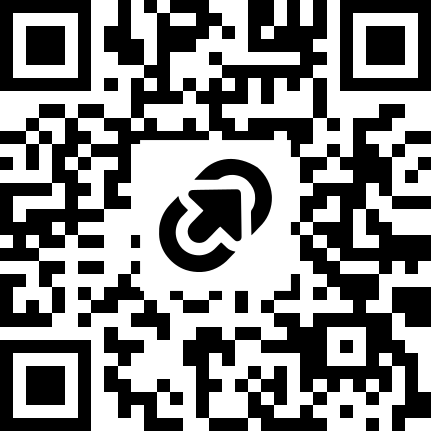

## We'll begin past 10

While we wait, 

# Open Science and Reproducibility

## Reading

::: {.nonincremental}
- Title: **Seven Easy Steps to Open Science (An annotated reading list)**
- Authors: Sophia Cruwell et al.
- Journal: Zeitschrift fur Psychologie, 227(4), 237-248
- Year: 2019
- <https://doi.org/10.1027/2151-2604/a000387>
:::


# Introduction

## Why Are We Here?

- Current scientific incentive structures are heavily **misaligned** with transparency.

- Standard research practices frequently reward *novel, positive* results over rigorous, 
verifiable workflows.

- **The Solution:** Open science is a concrete set of behaviors that protect scientific 
credibility.


# Overview

## Step 1: Open Science Core Concepts

::: {.callout-note}
### The Core Concept

Open science is the process of making both the **content** and the **process** of 
producing scientific evidence fully transparent and accessible.
:::

- **Reproducibility Standard:** Original data + original code = identical original results.
- **Replicability Standard:** New data + identical experimental procedures = same findings.
- **Targeting Human Bias:** Acts as a procedural defense wall against confirmation bias.
- **Shifting Metrics:** Replaces shallow journal impact factors with actual pipeline audits.

::: {.notes}
🌐 Step 1: Open Science (Understanding the Concept)

* The Baseline Definition: It is the explicit process of making both the content and the entire process of producing scientific evidence transparent and accessible to others [INDEX].
* The Reproducibility Standard: You must guarantee that an independent researcher can take your exact data and code, run the same analysis, and obtain identical results [INDEX].
* The Replicability Standard: Your documentation must be clear enough that repeating your exact procedures with new participants yields the same findings [INDEX].
* Targeting Human Bias: It serves as a necessary procedural defense wall against human cognitive biases, such as confirmation bias and post hoc self-deception [INDEX].
* Shifting Career Metrics: Adopting these behaviors helps shift institutional hiring, funding, and promotion models away from shallow journal impact factors toward transparent metrics [INDEX].
:::


## Step 2: Open Access (OA)

### 🟡 The Gold Route

- [Free for readers:]{.bold-hilit} anyone can read, download, print, and share the final published paper
- [Immediate Access:]{.bold-hilit} article is open right away on the day it is published
- [Open Licensing:]{.bold-hilit} Articles are usually published under open licenses
- [Author Choice:]{.bold-hilit} Authors can publish either in fully open-access journals or in hybrid journals
- [Article Processing Charge (APC):]{.bold-hilit} publishers often charge an author fee (APC)
    + APCs are typically paid by funds, grants
    + Some publishers offer fee waivers (e.g. researchers from low-income)


## Step 2: Open Access (OA)

### 🟢 The Green Route

- [Free for readers:]{.bold-hilit} anyone can read, download, print, and share the final published paper
- [Free for Authors:]{.bold-hilit} authors do not pay an Article Processing Charge (APC)
- [Self-archive:]{.bold-hilit} Authors have to archive/store their work themselves
    + You usually cannot upload the publisher’s final formatted PDF
- [Embargo Periods:]{.bold-hilit} Publishers often require a waiting period (e.g. 6-24 months) before
self-archive copy is made public


::: {.notes}
🔓 Step 2: Open Access (Disseminating Research)

* The Main Objective: Removing all systemic and economic barriers to accessing, distributing, and re-using published scientific findings online [INDEX].
* The Gold Route: Publishing your work in an exclusively open-access or hybrid journal where it is made instantly free to the public by the publisher [INDEX].
* The Green Route: Self-archiving your work for free by uploading your peer-reviewed manuscripts or preprints to public, stable repositories (e.g., PsyArXiv) [INDEX].
* The Citation Advantage: Open-access articles receive a significant boost in professional utility, tracking between a 36% and 600% increase in citations [INDEX].
* Enabling Meta-Research: Exposing plain text openly allows data scientists to use automated text- and data-mining tools to audit field-wide claims [INDEX].
:::


## Step 3: Open Data, Materials, & Code

\

### The F.A.I.R. Ingestion Pipeline

- [Findable:]{.bold-hilit} Permanent DOI assignment (e.g., via OSF)
- [Accessible:]{.bold-hilit} Unrestricted cloud repository locations
- [Interoperable:]{.bold-hilit} Non-proprietary formats (use .csv, not .xlsx)
- [Reusable:]{.bold-hilit} Comprehensive documentation and read-me file tracking

::: {.notes}
📊 Step 3: Open Data, Materials, and Code (Transparency Fundamentals)

- The Minimal Baseline: Moving away from "trusting" a scientist's written summary to instead making the raw data files behind the analysis completely public [INDEX].
- Sharing Materials: Providing every document, experimental task, presentation tool, and digital stimulus required to reconstruct the exact study timeline [INDEX].
- The FAIR Data Protocol: Ensuring that your shared assets are structured to be Findable, Accessible, Interoperable, and Reusable over long periods [INDEX].
- The Documentation Imperative: Writing detailed read-me files so that outside users (and your own future self) can understand your columns and file paths [INDEX].
- Anonymization & Exceptions: Safeguarding participant privacy through careful data scrubbing, or explicitly reporting clear ethical boundaries when data cannot be shared [INDEX].
:::


## Step 4: Reproducible Analyses

- [Lab Technique Rule:]{.bold-hilit} Computing best practices are as integral to robust research as 
fundamental laboratory methods.
- [The Raw Sanctuary:]{.bold-hilit} Save your raw data completely separately from manipulated or 
cleaned iterations.
- [Structural Folders:]{.bold-hilit} Maintain isolated directories per project, separating raw data, 
processed figures, and text scripts.
- [Record Everything:]{.bold-hilit} Code every step of your analytical data adjustments in open-source 
scripts (R or Python).
- [Stable Archiving:]{.bold-hilit} Deploy your finished code blocks to reputable, DOI-issuing hubs 
like Figshare, Dryad, or Zenodo.


::: {.notes}
💻 Step 4: Reproducible Analyses (Scientific Computing Skillsets)

* Computing as a Core Skill: Treating computing best practices as just as integral to high-quality science as fundamental laboratory techniques [INDEX].
* The Raw Data Sanctuary: Saving your raw, untouched data files completely separate from any cleaned, manipulated, or transformed versions [INDEX].
* Structural Project Folders: Dedicating a single isolated directory to each research project, with clear sub-directories for raw data, processed data, and text [INDEX].
* Recording Processing Steps: Tracking every single step of data cleaning and analysis by coding your pipeline in open-source languages (like R or Python) [INDEX].
* Stable DOI Archiving: Uploading your code scripts and research products to reputable, permanent, DOI-issuing repositories like Figshare, Dryad, or Zenodo [INDEX].
:::


## Step 5: Preregistration & Registered Reports

::: {.callout-warning}
### The Core Target Failure

Preregistration draws an unalterable boundary between planned **confirmatory** tests and unplanned **exploratory** data mining. It systematically blocks HARKing.
:::

- [Pre-Data Lock:]{.bold-hilit} Committing to hypotheses and statistical plans *before* gathering or viewing data files.
- [Registered Reports:]{.bold-hilit} Submitting your study design to a journal for peer-review **prior to data collection**.
- [In-Principle Acceptance:]{.bold-hilit} The journal guarantees publication based on design rigor, completely regardless of the final outcome.

::: {.notes}
⏱️ Step 5: Preregistration and Registered Reports (Constraining Flexibility)

* The Pre-Data Mandate: Committing to your hypotheses, study designs, and statistical analysis plans before you gather data or view the files [INDEX].
* Demarcating Exploration: Forcing a transparent, unalterable boundary between planned confirmatory testing and unplanned, post hoc exploratory data mining [INDEX].
* The Target Failure: Restricting a researcher's degrees of freedom to eliminate HARKing (Hypothesizing After the Results are Known) and cherry-picking [INDEX].
* The Registered Report Pivot: Submitting your study design to a journal for pre-data peer-review to secure an "in-principle acceptance" before execution [INDEX].
* The Stage 2 Audit: Guaranteeing publication based purely on the rigor of the design and adherence to the plan, completely regardless of whether the final results are positive [INDEX].
:::


## Step 6: Replication Research

- **Benchmark of Truth:** An effect *must* be repeatable to count as a genuine scientific 
discovery.
- **Direct Replications:** Intentionally duplicating all critical design blocks to verify 
the physical result.
- **Conceptual Replications:** Purposefully altering operational variables to test 
the generalizability of a theory.
- **The "Alternative Test" Shift:** Re-labeling conceptual replications as 
*alternative tests* to stop muddy conflation.
- **Systemic Stabilization:** Adjusts career environments that unhealthily 
reward novelty over long-term stability.


::: {.notes}
🔬 Step 6: Replication Research (Verifying Scientific Discoveries)

* [The Benchmark of Truth:]{.bold-hilit} Adopting the foundational scientific rule that an effect must be completely repeatable to count as a genuine scientific discovery [INDEX].
* [Direct Replications:]{.bold-hilit} Intentionally duplicating every necessary element of an original study to see if the physical result can be reproduced [INDEX].
* [Conceptual Replications:]{.bold-hilit} Purposefully changing operational components (like the measure or the sample) to evaluate the generalizability of the theory [INDEX].
* [The "Alternative Test" Label:]{.bold-hilit} Re-labeling messy conceptual replications as "alternative tests" to stop them from being conflated with close, direct replications [INDEX].
* [Systemic Stabilization:]{.bold-hilit} Embracing replication to fix structural market misalignments where fields reward novelty over long-term theory stability [INDEX].
:::


## Step 7: Teaching Open Science

- [The Educational Gap:]{.bold-hilit} A vast majority of students currently graduate from 
statistics courses unaware of the replication crisis.
- [The 1-Hour Footprint:]{.bold-hilit} Deploying compact, structured introductory modules 
radically alters how students view media claims.
- [The Behavioral Result:]{.bold-hilit} Students learn to trust unverified research less, 
but view computational fields as closer to hard sciences.
- [Syllabus Integration:]{.bold-hilit} Drastically cut instructor burden by leveraging 
pre-built infrastructure frameworks like FORRT or the Open Science MOOC.

::: {.notes}
🎓 Step 7: Teaching Open Science (Sustaining the Movement)

* The Educational Gap: Addressing the reality that a vast majority of students currently graduate from statistics courses having never heard of the replication crisis [INDEX].
* A 1-Hour Practical Footprint: Deploying structured 1-hour introductory modules to completely pivot how incoming researchers view media claims and data transparency [INDEX].
* The Dual Psychological Impact: Training students to trust unverified research less while simultaneously causing them to view their field as closer to the hard natural sciences [INDEX].
* Training Future Consumers: Realizing that open science pedagogy is vital even for students who leave research, creating critical public consumers of data [INDEX].
* Leveraging Existing Infrastructure: Utilizing free, collaborative open platforms like FORRT and the Open Science MOOC to drop pre-built resources straight into existing syllabi [INDEX].
:::


# Discussion Time

## Screens Off, Minds On

\

::: {.nonincremental}
- [Devices Away:]{.bold-hilit} Laptops & tablets closed, phones away.

- [No One Alone:]{.bold-hilit} Pair or team up (no solo seats).

- [Engage Fully:]{.bold-hilit} Be ready to speak, debate, and share ideas.
:::


## Activity 1

- Pair-up with one other student
- Choose your role

. . .

:::: {.columns}
::: {.column}
[Junior Graduate Student]{.hilit} 

Grad student wants to pre-register their next analysis pipeline and 
post the raw data publicly.
::: 

::: {.column .fragment}
[Senior Principal Investigator]{.mdlit}

PI wants to submit the paper immediately without pre-registration because a rival lab 
is working on the same topic and might publish first.
:::
::::

. . .

::: {.poll .nonincremental}
- The grad student will try to convince the PI to pre-register their work

- The PI will try to convince the grad student to publish ASAP
:::

```{r}
#| echo: false
countdown::countdown(3, top = 0)
```


## Activity 1 (cont'd)

:::: {.columns}
::: {.column}
[Junior Graduate Student]{.hilit} 

Grad student wants to pre-register their next analysis pipeline and 
post the raw data publicly.
::: 

::: {.column}
[Senior Principal Investigator]{.mdlit}

PI wants to submit the paper immediately without pre-registration because a rival lab 
is working on the same topic and might publish first.
:::
::::

\

_Show of hands:_ How many PIs were convinced to delay submission by 2 weeks for pre-registration?


## Activity 2

- Pair-up with one other student
- Choose your role: 

. . .

:::: {.columns}
::: {.column}
[OA Advocate]{.hilit} (advocate for Green/Gold Open Access)
:::

::: {.column .fragment}
[Paywall Advocate]{.mdlit} (traditional paywall publisher)
:::
::::

. . .

::: {.poll .nonincremental}
- The OA advocate will try to convince the Paywall advocate
to support/fund Open Access.

- The Paywall advocate will push back against OA.
:::

```{r}
#| echo: false
countdown::countdown(3, bottom = 0)
```


## Activity 2 (cont'd)

\

:::: {.columns}
::: {.column}
[OA Advocate]{.hilit} (advocate for Green/Gold Open Access)
:::

::: {.column}
[Paywall Advocate]{.mdlit} (traditional paywall publisher)
:::
::::

\

_Show of hands:_ How many OA advocates were convinced by Paywall advocates?


## Activity 3

. . .

::: {.nonincremental}
- Practice 1: Pre-registration
- Practice 2: Open Data & Materials
- Practice 3: Open Access Publishing
:::

. . .

::: {.poll}
A university with a severely limited research budget can only afford to mandate 
and support ONE of these three practices across all departments.

Debate and reach a unanimous group consensus on which ONE practice gives the highest 
return on investment for science, and which one MUST be eliminated first.
:::

```{r}
#| echo: false
countdown::countdown(3.5, top = 0)
```


## Activity 4

You are designing a hypohtetical "Meta-Research Bot" or AI agent
that automatically audits 10,000 published papers in some field to
evaluate their computational transparency.

. . .

::: {.poll}
What indicators would you look for in an OA paper?
:::

```{r}
#| echo: false
countdown::countdown(3, bottom = 0)
```


# Quiz-Poll Time

Open your laptops / phones

## Google Form

\

{fig-align="center"}

\

[tinyurl.com/86wje827](https://tinyurl.com/86wje827)


<!--

Card 1: The Misinterpretation Fear

"My data is too complex and contextualized. If I post it publicly, non-experts or bad-faith actors will misinterpret it and spread scientific misinformation."

Advocate Focus: Metadata standards, read-me files, clear licensing, and the value of public verification vs. proprietary opacity.

Card 2: The Equity & Commercialization Conflict

"If I make my discoveries or open-source software freely available immediately, my spin-off company will lose its patent/IP rights, and my university won't get commercialization revenue."

Advocate Focus: Dual-licensing models, delayed open access post-patent filing, and public funding ROI.

Card 3: The Career Penalty (Publish or Perish)

"Top high-impact journals in my field still charge high Article Processing Charges (APCs) for open access or don't value open practices. I need tenure, so I can't prioritize open science over impact factors."

Advocate Focus: Green Open Access (self-archiving), DORA (Declaration on Research Assessment), and shifting institutional promotion policies.

Card 4: The Privacy & Sensitive Data Wall

"I work with human subjects and sensitive clinical/indigenous data. Anonymization isn't foolproof, so making raw data open is unethical and violates IRB approval."

Advocate Focus: FAIR data principles (as open as possible, as closed as necessary), controlled access repositories, and synthetic datasets.

Card 5: The "Errors Will Destroy My Reputation" Anxiety

"If I share all my raw scripts, raw lab notes, and unedited protocol attempts, people will scrutinize every minor typo or mistake and ruin my professional reputation."

Advocate Focus: Normalizing scientific error, the difference between minor coding bugs and fraud, and building a culture of transparency over perfection.

Card 6: The Free-Rider / Parasite Claim

"My team spent 5 years and millions of dollars collecting this longitudinal dataset. It’s unfair for 'data parasites' to download it in 5 seconds and publish papers off our hard work without contributing."

Advocate Focus: Data citation metrics, co-authorship guidelines, data embargo periods, and maximizing dataset utility.

Card 7: The "Open Access = Low Quality" Stigma

"Open access journals are predatory or pay-to-play dumping grounds with weak peer review. Real, rigorous science belongs in established subscription journals."

Advocate Focus: Quality of diamond/gold OA repositories, transparent peer-review models, and distinguishing predatory publishers from legitimate OA.

Card 8: The Resource Disadvantage

"Open science assumes everyone has high-speed internet, cloud storage, software engineers, and dedicated data managers. For underfunded institutions, these requirements are an unfair burden."

Advocate Focus: Lightweight repository solutions, institutional library support, and advocacy for equitable infrastructure funding.

Card 9: The Null Result Disincentive

"Posting pre-registrations or open protocols for experiments that yield null or negative results is a waste of time—nobody publishes null results, and it just makes my grant track record look bad."

Advocate Focus: Registered Reports format, combating file-drawer effect, and preventing unnecessary scientific duplication.

Card 10: The Maintenance & Long-Term Persistence Problem

"Who keeps my open data, code dependencies, or open software alive 10 years from now when the grant runs out, URLs break, and software dependencies become obsolete?"

Advocate Focus: Digital Object Identifiers (DOIs), persistent repositories (e.g., Zenodo, OSF), and institutional data archiving mandates.

-->


<!--

## Activity 1

- Form groups of 3-4 students.
- Pretend your group is given $1,000 in "Academic Grant Money"
- I will show you a study context.


## Study Preregistration

You are going to conduct a study among developers tracking---during a week---their daily
[coffee consumption]{.mdlit} and [coding speed]{.hilit}.

_A few data rows shown below._

```{r}
set.seed(159)
n <- 100

days <- c("Mon", "Tue", "Wed", "Thu", "Fri")

dat = data.frame(
  developer = rep(LETTERS[1:20], each = n/20),
  day = rep(days, 20),
  coffee = runif(n, 0, 10),
  speed = runif(n, 30, 70)
)

head(dat, n = 10)
```

## Study Preregistration

Write down your [Null]{.mdlit} and [Alternative]{.hilit} hypotheses.
In other words, write down what kind of relationship you would expect to see in 
your study.

```{r}
head(dat, n = 10)
```

```{r}
#| echo: false
countdown::countdown(2, bottom = 0)
```

## Exploratory Analysis (part I)

## Exploratory Analysis (part I)

```{r}
library(ggplot2)

ggplot(dat, aes(coffee, speed)) +
  geom_point() +
  theme_bw() +
  labs(title = "Consumption Mon-Fri",
       subtitle = "Correlation 0.05", 
       x = "Coffee consumption",
       y = "Coding Speed")
```

::: {.notes}
Scatter plot showing that coffee consumption actually had zero effect on coding speed.
:::


## Exploratory Analysis (part II)

## Exploratory Analysis (part II)

```{r}
set.seed(159)
m <- 20
x <- runif(m, 0, 10)
y <- 10 * sqrt(x + rnorm(m, mean = 5, sd = 3))
tue = data.frame(coffee = x, speed = y)

ggplot(tue, aes(x = coffee, y = speed)) +
  geom_point() +
  theme_bw() +
  labs(title = "Consumption on Tuesday",
       subtitle = "Correlation 0.65", 
       x = "Coffee consumption",
       y = "Coding Speed")
```

## Exploratory Analysis (part II)

\

Developers who drank espresso specifically on Tuesdays coded 40% faster.


## Auction

- The prestigious [_Journal of Caffeinated Studies_]{.bold-hilit} is accepting submissions.
- But they __only__ publish statistically significant findings.
- You must "bid" your grant money to publish.

. . .

\

:::: {.columns}
::: {.column}
Stick to your original hypotheses
:::

::: {.column}
Decide to HARK[^1] on the "Tuesday Espresso" anomaly
:::
::::


[^1]: HARK: Hypothesizing After the Results are Known

```{r}
#| echo: false
countdown::countdown(2, bottom = 0)
```


## What if I told you that ...

The "Tuesday Espresso" spike is actually just a noise artifact. 

If you spent your money to publish it, you just committed a massive, 
irreproducible false-positive sin 🤭

::: { .notes}
Students experience the intense system pressure to choose flashy 
data-mining over pre-planned truth, instantly contextualizing why 
Step 5 Preregistration is so vital.
:::

-->

