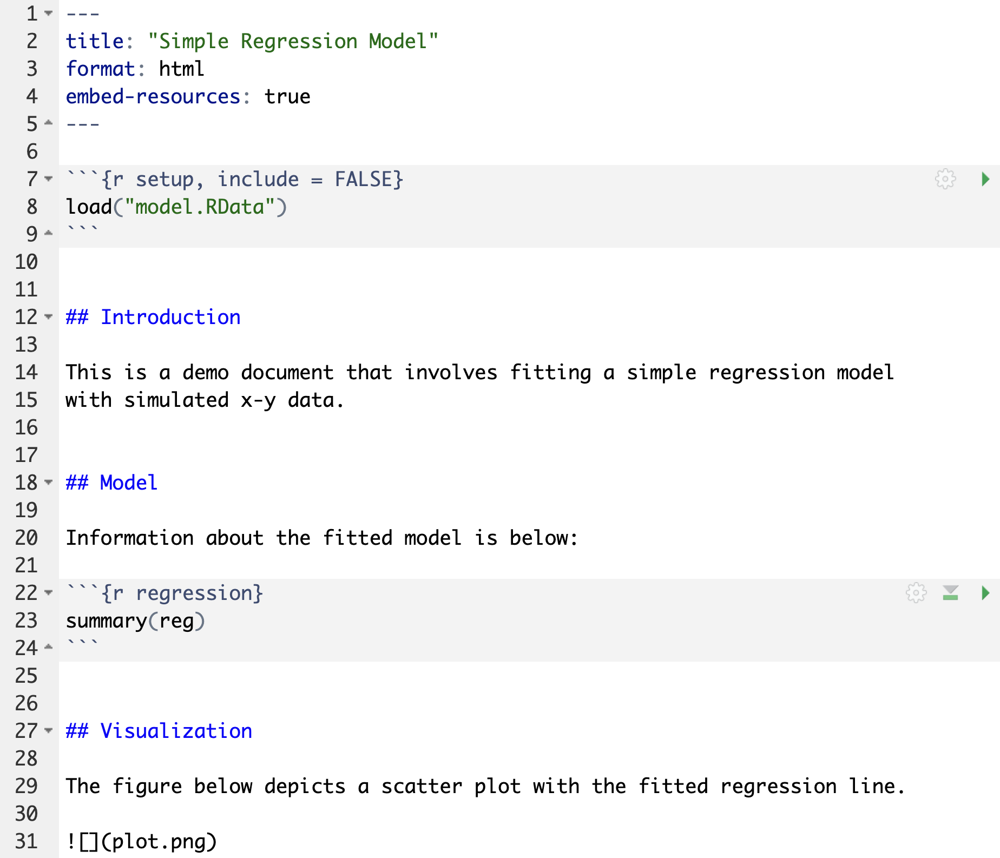
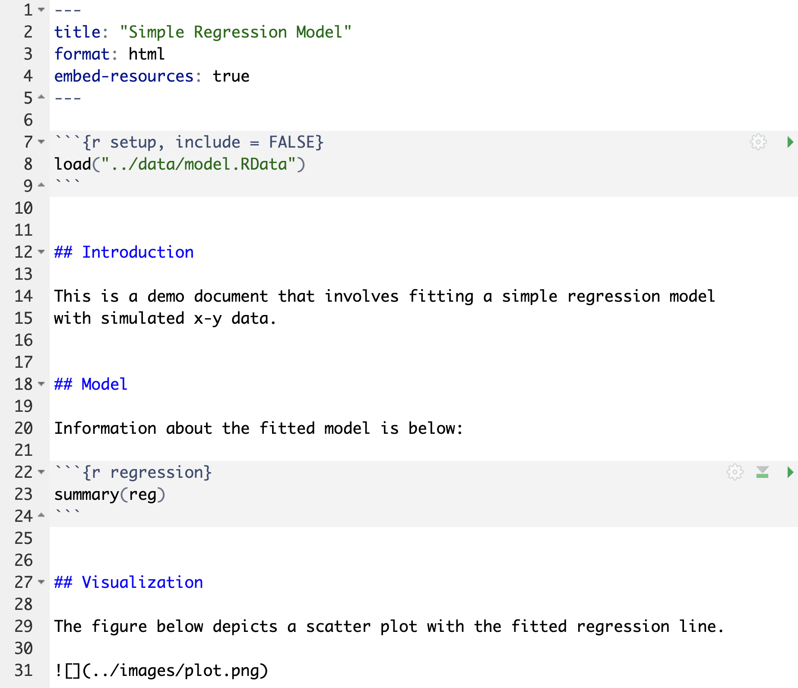
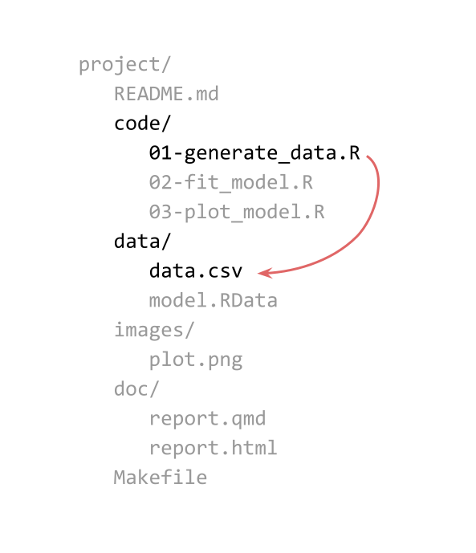
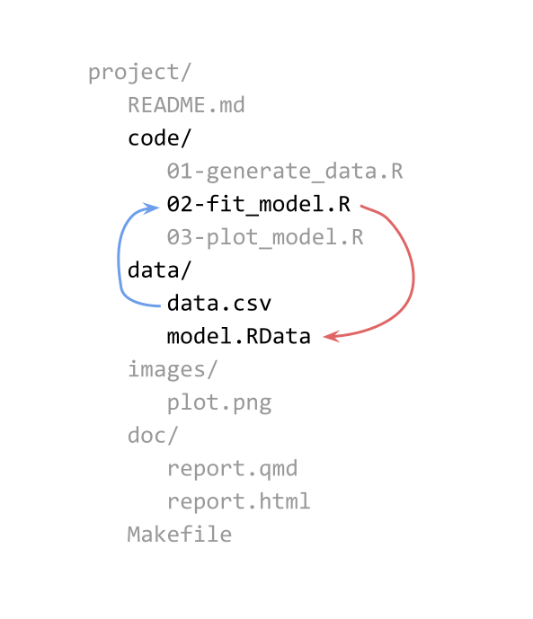
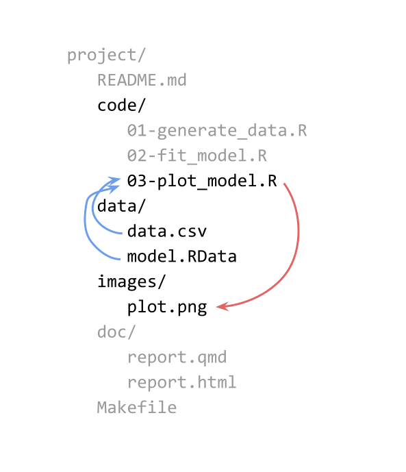
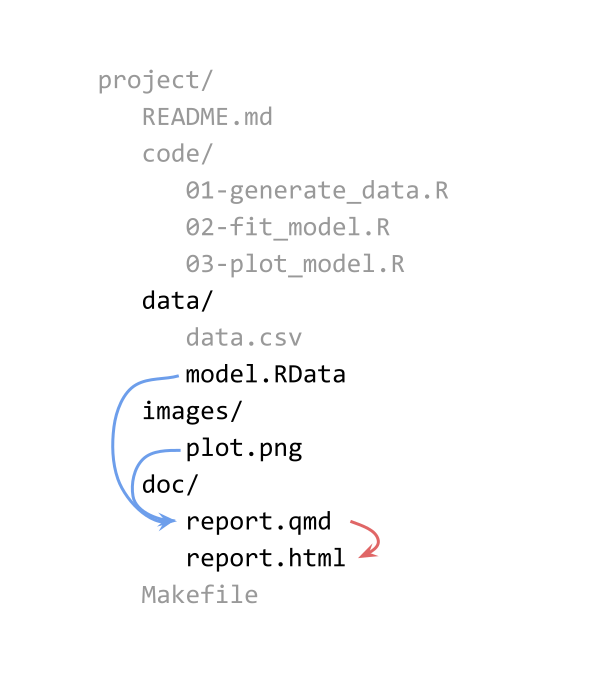

# Example: Simple Linear Regression

## Motivation

Let's consider a project that involves 3+1 major stages:

1) [Data:]{.bold-hilit} Generate x-y data

2) [Model:]{.bold-hilit} Fit simple linear regression model $\hat{y} = b_0 + b_1 x$

3) [Plot:]{.bold-hilit} Graph scatter plot with fitted regression line

4) Report that incorporates:
    + model (from stage 2) and 
    + plot (from stage 3)


## 1) Generate Data

. . .

```{r}
#| echo: true
#| output-location: fragment
set.seed(349587)
n = 100
x = runif(n, min = -3, max = 3)
y = x + rnorm(n, mean = 0, sd = 1)

dat = data.frame(x = x, y = y)
head(dat)
```


## 2) Fit Regression Model

. . .

```{r}
#| echo: true
#| output-location: fragment
reg = lm(y ~ x, data = dat)
reg
```


## 3) Plot Model

. . .

```{r}
#| echo: true
library(ggplot2)
reg_intercept = reg$coefficients[1]
reg_slope = reg$coefficients[2]

gg = ggplot(data = dat, aes(x = x, y = y)) +
  geom_point(shape = 20, alpha = 0.7) +
  geom_abline(intercept = reg_intercept, 
              slope = reg_slope,
              color = "#4D8FEB") +
  theme_bw() +
  labs(title = "Simple regression model")
```

## 3) Plot Model

```{r}
gg
```


# Files

## Code split into 3 R script files

:::: {.columns}
::: {.column}
::: {.small}
```{.markdown filename="01-generate_data.R" code-line-numbers="false"}
set.seed(349587)
n = 100
x = runif(n, min = -3, max = 3)
y = x + rnorm(n, mean = 0, sd = 1)

dat = data.frame(x = x, y = y)

write.csv(dat, file = "data.csv", 
  row.names = FALSE)
```
:::

\

::: {.small .fragment}
```{.markdown filename="02-fit_model.R" code-line-numbers="false"}
dat = read.csv(file = "data.csv")

reg = lm(y ~ x, data = dat)

save(reg, file = "model.RData")
```
:::
:::

::: {.column .fragment}
::: {.small}
```{.markdown filename="03-plot_model.R" code-line-numbers="false"}
dat = read.csv(file = "data/data.csv")
load(file = "model.RData")

reg_intercept = reg$coefficients[1]
reg_slope = reg$coefficients[2]

gg = ggplot(data = dat, aes(x = x, y = y)) +
  geom_point(shape = 20, alpha = 0.7) +
  geom_abline(intercept = reg_intercept, 
              slope = reg_slope,
              color = "#4D8FEB") +
  theme_bw() +
  labs(title = "Simple regression model")

ggsave(filename = "plot.png",
       plot = gg, width = 5, height = 5)
```
:::
:::
::::


## Report in qmd file




# Pipelines: Inputs, Scripts, and Outputs

## {background-image="images/regression-stages-1.svg" background-size="contain"}

## {background-image="images/regression-stages-2.svg" background-size="contain"}

## {background-image="images/regression-stages-3.svg" background-size="contain"}

## {background-image="images/regression-stages-4.svg" background-size="contain"}

## {background-image="images/regression-stages-5.svg" background-size="contain"}

## File Structure (Option A) {.nonstretch}

{fig-align="center"}


## Makefile {auto-animate="true"}

::: {.small .fragment}
```{.markdown filename="Makefile" code-line-numbers="false"}
.PHONY: all clean
all: data.csv model.RData plot.png report.html
```
:::


## Makefile {auto-animate="true"}

::: {.small}
```{.markdown filename="Makefile" code-line-numbers="false"}
.PHONY: all clean
all: data.csv model.RData plot.png report.html

data.csv: 01-generate_data.R
  Rscript 01-generate_data.R
```
:::


## Makefile {auto-animate="true"}

::: {.small}
```{.markdown filename="Makefile" code-line-numbers="false"}
.PHONY: all clean
all: data.csv model.RData plot.png report.html

data.csv: 01-generate_data.R
  Rscript 01-generate_data.R

model.RData: 02-fit_model.R data.csv
  Rscript 02-fit_model.R
```
:::


## Makefile {auto-animate="true"}

::: {.small}
```{.markdown filename="Makefile" code-line-numbers="false"}
.PHONY: all clean
all: data.csv model.RData plot.png report.html

data.csv: 01-generate_data.R
  Rscript 01-generate_data.R

model.RData: 02-fit_model.R data.csv
  Rscript 02-fit_model.R

plot.png: 03-plot_model.R model.RData
  Rscript 03-plot_model.R
```
:::


## Makefile {auto-animate="true"}

::: {.small}
```{.markdown filename="Makefile" code-line-numbers="false"}
.PHONY: all clean
all: data.csv model.RData plot.png report.html

data.csv: 01-generate_data.R
  Rscript 01-generate_data.R

model.RData: 02-fit_model.R data.csv
  Rscript 02-fit_model.R

plot.png: 03-plot_model.R model.RData
  Rscript 03-plot_model.R

report.html: report.qmd model.RData plot.png
  quarto render report.qmd
```
:::


## Makefile {auto-animate="true"}

::: {.small}
```{.markdown filename="Makefile" code-line-numbers="false"}
.PHONY: all clean
all: data.csv model.RData plot.png report.html

data.csv: 01-generate_data.R
  Rscript 01-generate_data.R

model.RData: 02-fit_model.R data.csv
  Rscript 02-fit_model.R

plot.png: 03-plot_model.R model.RData
  Rscript 03-plot_model.R

report.html: report.qmd model.RData plot.png
  quarto render report.qmd

clean:
  rm -f data.csv model.RData plot.png report.html
```
:::


# A Less Simple File Structure

## File Structure (Option B)

Let's consider an alternative file structure

## {background-image="images/regression-filestructure-bis-1.svg" background-size="contain"}

## {background-image="images/regression-filestructure-bis-2.svg" background-size="contain"}

## {background-image="images/regression-filestructure-bis-3.svg" background-size="contain"}

## {background-image="images/regression-filestructure-bis-4.svg" background-size="contain"}

## {background-image="images/regression-filestructure-bis-5.svg" background-size="contain"}


## {background-image="images/regression-filestructure-1.svg" background-size="contain"}

## {background-image="images/regression-filestructure-2.svg" background-size="contain"}

## {background-image="images/regression-filestructure-3.svg" background-size="contain"}

## {background-image="images/regression-filestructure-4.svg" background-size="contain"}

## {background-image="images/regression-filestructure-5.svg" background-size="contain"}


# Files Again

## Code split into 3 R script files

:::: {.columns}
::: {.column}
::: {.small}
```{.markdown filename="01-generate_data.R" code-line-numbers="false"}
set.seed(349587)
n = 100
x = runif(n, min = -3, max = 3)
y = x + rnorm(n, mean = 0, sd = 1)

dat = data.frame(x = x, y = y)

write.csv(dat, file = "../data/data.csv", 
  row.names = FALSE)
```
:::

\

::: {.small .fragment}
```{.markdown filename="02-fit_model.R" code-line-numbers="false"}
dat = read.csv(file = "../data/data.csv")

reg = lm(y ~ x, data = dat)

save(reg, file = "../data/model.RData")
```
:::
:::

::: {.column .fragment}
::: {.small}
```{.markdown filename="03-plot_model.R" code-line-numbers="false"}
dat = read.csv(file = "../data/data.csv")
load(file = "../data/model.RData")

reg_intercept = reg$coefficients[1]
reg_slope = reg$coefficients[2]

gg = ggplot(data = dat, aes(x = x, y = y)) +
  geom_point(shape = 20, alpha = 0.7) +
  geom_abline(intercept = reg_intercept, 
              slope = reg_slope,
              color = "#4D8FEB") +
  theme_bw() +
  labs(title = "Simple regression model")

ggsave(filename = "plot.png", 
       path = "../images",
       plot = gg, width = 5, height = 5)
```
:::
:::
::::

. . .

[Notice the file paths!]{.bold-hilit}


## Report in qmd file




# Makefile Revisited

## {auto-animate="true"}

:::: {.columns}
::: {.column width=30%}

:::

::: {.column width=70%}
Makefile rule

\

::: {.small .fragment}
```{.markdown code-line-numbers="false" }
data/data.csv: code/01-generate_data.R
  Rscript 01-generate_data.R
```

- ✅ correct target
- ✅ correct dependency
- ❌ incorrect command

\
:::

::: {.small .fragment}
```{.markdown code-line-numbers="false"}
data/data.csv: code/01-generate_data.R
  cd code && Rscript 01-generate_data.R
```

👍
:::

::: {.small .fragment}
```{.markdown code-line-numbers="false"}
# alternative command
data/data.csv: code/01-generate_data.R
  cd code; Rscript 01-generate_data.R
```
:::

:::
::::


## {auto-animate="true"}

:::: {.columns}
::: {.column width=30%}

:::

::: {.column width=70%}
Makefile rule

\

::: {.small .fragment}
```{.markdown code-line-numbers="false" }
data/model.RData: code/02-fit_model.R data/data.csv
  Rscript 02-fit_model.R
```

- ✅ correct target
- ✅ correct dependency
- ❌ incorrect command

\
:::

::: {.small .fragment}
```{.markdown code-line-numbers="false"}
data/model.RData: code/02-fit_model.R data/data.csv
  cd code && Rscript 02-fit_model.R
```

👍
:::

:::
::::


## {auto-animate="true"}

:::: {.columns}
::: {.column width=30%}

:::

::: {.column width=70%}
Makefile rule

\

::: {.small .fragment}
```{.markdown code-line-numbers="false" }
images/plot.png: code/03-plot_model.R data/data.csv data/model.RData
  Rscript 03-plot_model.R
```

- ✅ correct target
- ✅ correct dependency
- ❌ incorrect command

\
:::

::: {.small .fragment}
```{.markdown code-line-numbers="false"}
images/plot.png: code/03-plot_model.R data/data.csv data/model.RData
  cd code && Rscript 03-plot_model.R
```

👍
:::

:::
::::


## {auto-animate="true"}

:::: {.columns}
::: {.column width=30%}

:::

::: {.column width=70%}
Makefile rule

\

::: {.small .fragment}
```{.markdown code-line-numbers="false" }
doc/report.html: doc/report.qmd data/model.RData images/plot.png
  cd doc && quarto render report.qmd
```

- ✅ correct target
- ✅ correct dependency
- ✅ incorrect command
:::

:::
::::

