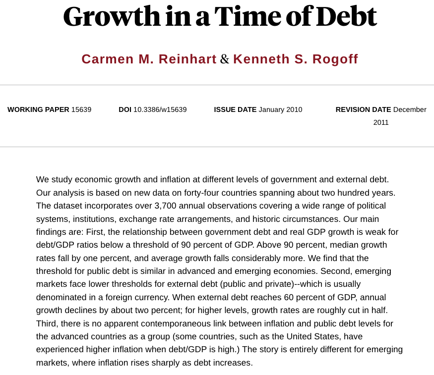

# The Global Austerity Excel Error

## Reading

::: {.nonincremental}
- Title: **The Reinhart-Rogoff Error - or how not to Excel at economics**
- Authors: Jonathan Borwein and David H. Bailey
- Journal: The Conversation
- Year: 2013
- <https://theconversation.com/the-reinhart-rogoff-error-or-how-not-to-excel-at-economics-13646>
:::


## Supporting Materials

Growth in a Time of Debt (C. Reinhart, K. Rogoff, 2010)

<https://www.nber.org/papers/w15639>

\

Does high public debt consistently stifle economic growth? 
A critique of Reinhart and Rogoff (T. Herndon, M. Ash, R. Pollin, 2014)

<https://peri.umass.edu/wp-content/uploads/joomla/images/WP322.pdf>

doi: <https://doi.org/10.1093/cje/bet075>


# The Story

## Overview {.nostretch}

{fig-align="center"}

In 2010, Harvard economists Carmen Reinhart and Kenneth Rogoff (R&R) published 
an influential paper claiming that 
[countries with public debt over 90% of GDP experience negative economic growth.]{.hilit}


## Overview 

:::: {.columns}
::: {.column width=60%}

:::

::: {.column width=40%}
This study was widely cited by politicians to justify harsh post-recession 
austerity cuts.
:::
::::


## Replication Attempt

Years later, graduate student Thomas Herndon tried to replicate the study 
of Reinhart & Rogoff for a class project and failed.

. . .

He found various problems:

- Selective exclusion of available data
- Coding errors
- Inappropriate weighting of summary statistics

. . .

\

His conclusion: Over 1946–2009, countries with public debt/GDP ratios above 
90% averaged 2.2% real annual GDP growth, not −0.1% as published


## One of the issues

Thomas Herndon discovered that R&R had accidentally missed five major countries 
when dragging down their `AVERAGE()` formula row.

Correcting this basic clerical error completely reversed their main conclusion.

## {background-image="images/excel-formulas-1.svg" background-size="contain"}

## {background-image="images/excel-formulas-2.svg" background-size="contain"}

## {background-image="images/excel-formulas-3.svg" background-size="contain"}

## {background-image="images/excel-formulas-4.svg" background-size="contain"}

## {background-image="images/excel-formulas-5.svg" background-size="contain"}

## {background-image="images/excel-formulas-6.svg" background-size="contain"}


# Discussion

## Prompt

- Imagine you are Thomas Herndon. 
- You have downloaded the spreadsheet.
- Your averages don't match the famous paper. 
- Your peers tell you that you must have made a mistake because 
two famous Harvard professors wrote the original code. 

. . .

::: {.poll}
How do you approach your advisor with your findings?
:::

```{r}
#| echo: false
countdown::countdown(2, bottom = 0)
```


## Activity

We're going to divide the classroom into groups

\

:::: {.columns}
::: {.column .fragment}
[Group A (left-hand side)]{.mdlit}

- "The Pragmatists"
- Excel is intuitive.
- Banning it slows down scientific output.
:::

::: {.column .fragment}
[Group B (right-hand side)]{.hilit}

- "The Purists"
- Excel is fundamentally unscientific.
- Its use should be avoided/minimized.
:::
::::


## Brainstorm

Huddle with your immediate neighbors to write down 
your three strongest arguments based on the Reinhart-Rogoff reading.

:::: {.columns}
::: {.column}
[Group A (left-hand side)]{.mdlit}

Find 3 concrete reasons why forcing every field biologist, medical doctor, 
or social scientist to write Python/R scripts before looking at data actually 
harms scientific progress.
:::

::: {.column .fragment}
[Group B (right-hand side)]{.hilit}

Find 3 specific limitations of Excel that make it 
completely incompatible with reproducibility.
:::
::::

```{r}
#| echo: false
countdown::countdown(5, bottom = 0)
```

. . .

\

Time's up: Please share your thoughts.

<!--
Group A:
- It requires zero coding barriers,
- It's very visual,
- It allows non-technical field experts to explore data rapidly. 

Group B:
- It cannot be version-controlled line-by-line,
- It hides algorithmic logic.
- It breeds silent, catastrophic clerical errors.
--->


## Debate: Group A

Excel is used by almost every major business, government agency, and 
field biologist on Earth. If we completely ban it in favor of demanding 
everyone learn command-line Git and Python/R/etc script automation are 
we just being technical elitists? 

::: {.poll}
Won't this drastically slow down scientific discovery?
:::

```{r}
#| echo: false
countdown::countdown(2, bottom = 0)
```


## Debate: Group B

Reinhart and Rogoff were Harvard economists, not amateurs, and they missed an 
entire block of countries because they dragged a visual box slightly too short. 

::: {.poll}
How can we call an invisible, un-trackable mouse click 'science'?
:::

```{r}
#| echo: false
countdown::countdown(2, bottom = 0)
```


## Debate: Role Reversal

- Group A, you are now the Purists. 
- Group B, you are now the Pragmatists. 
- You must now instantly pivot and attack the very argument you were defending 
thirty seconds ago.
- Go!

```{r}
#| echo: false
countdown::countdown(5, bottom = 0)
```


## Some Notes

Defending Excell:

- [Accessibility:]{.bold-hilit} Not every researcher has a computer science background. 
Excel allows people to discover trends quickly without fighting syntax errors.

- [Visual Intuition:]{.bold-hilit} It lets you physically see the raw matrix of numbers, 
which helps catch gross data anomalies faster than scanning lines of code.

- [Collaboration:]{.bold-hilit} Almost every person on Earth can open an Excel sheet; 
passing a script requires setting up specialized software environments.


## Some Notes

Attacking Excell:

- [Silent Reformatting:]{.bold-hilit} Excel silently converts from one data type 
to another, which corrupts content in spreadsheets.

- [Hidden Logic:]{.bold-hilit} The actual mathematical code is buried beneath 
individual cells. You have to click every box to see if the formula is correct.

- [No Audit Trail:]{.bold-hilit} You cannot use `git diff` on an Excel spreadsheet 
to see exactly which cell a collaborator changed between Tuesday and Thursday.


## Question

Excel is an unparalleled tool for Exploratory Data Analysis (EDA):
when you just need to scratchpad ideas, sketch a quick chart, and 
understand your data. 

However, Excel is completely unacceptable for the Production Pipeline:
the final, published scientific analysis. 

The lesson of the Reinhart-Rogoff failure isn't that spreadsheets are inherently 
evil; it's that interactive GUI manipulation lacks a provenance trail.

. . .

\

::: {.poll}
How can a team use flexible exploratory tools while still guaranteeing 
absolute script-based reproducibility before publication?
:::

```{r}
#| echo: false
countdown::countdown(2, bottom = 0)
```


## Question

Pretend your small group is the newly appointed _Data Integrity Board_ for 
a university research lab:

- Your lab includes older scientists who hate coding and 
- Younger students who are in a rush.

. . .

You need to write exactly two non-negotiable rules for how data must be processed 
before a paper can be submitted to a journal.

::: {.poll}
What are your two rules, and how do you convince the stubborn team members 
to follow them?
:::

```{r}
#| echo: false
countdown::countdown(3, bottom = 0)
```

<!--
Rule 1: Every final published figure, table, or statistical metric must be generated 
by a text-based code script (R, Python, or Julia) that runs from top to bottom without 
human intervention.

The Bound: No manual copy-pasting, visual cell dragging, or mouse-click transformations 
are permitted in the final production stage [INDEX]. If data needs to be cleaned, it must 
be cleaned via code lines.


Rule 2: Before a manuscript is submitted to a journal, a second researcher within the 
lab—who did not write the original code—must take the raw data and the script, clone it 
onto their own machine, and run it.

The Bound: If the second researcher cannot generate the exact same numbers and figures 
within 15 minutes, the paper is blocked from submission.
-->


## Wrap Up

With the tools, ideas and concepts that we've covered so far, please debate
how would you use them to address the issues with the Excell horror story.

::: {.notes}
Use this moment to introduce how a reproducible pipeline bridges this gap. 

Show them that they can accept an Excel sheet from a collaborator, but their 
very first step must be an automated, recorded script (e.g., using Python's 
`pandas.read_excel()` or R's `readxl::read_excel()`).
:::


# Quiz-Poll Time

## Google Form

\

**INSERT QR code!!!**

\

**INSERT <url> link to google form!!!**


## Quiz

The core issue that invalidated the famous 2010 Harvard economic paper on national 
debt limits was rooted in a basic spreadsheet error. What exactly went wrong?

A) A hacker maliciously altered the underlying CSV data file after it was 
uploaded to a public repository.

B) The authors used an outdated version of Microsoft Excel that had a 
known floating-point calculation bug.

C) A user interface error where dragging down an AVERAGE formula box accidentally 
skipped 5 major countries in the calculation.

D) The data was correct, but the authors forgot to commit their changes 
to Git before submitting the paper.


## Poll

Be completely honest: What is your primary, personal tool for handling raw 
data right now in your research or coursework?

A) Pure Microsoft Excel / Google Sheets (No coding involved).
B) A hybrid approach (I look/clean in Excel, then move to Python/R for plots).
C) Scripting only (I load raw text/CSVs straight into RStudio, Jupyter, or VS Code).
D) "Sneakernet" manual tracking (Folders full of copies like `data_v2_final.csv`).


## Poll

Rate your level of agreement with this statement: 

"Banning spreadsheets completely from academic research would destroy 
scientific productivity."

::: {.nonincremental}
1) Strongly Disagree (Code or nothing)
2) Disagree
3) Neutral
4) Agree
5) Strongly Agree (Spreadsheets are essential)
:::


## Poll

In exactly one word, what is the single biggest threat to data integrity 
when a researcher relies purely on Excel for their final published paper?


## Takeaways

- Spreadsheets reduce complex pipelines to invisible clicks that are entirely 
forgotten once executed.

- Workflows should be explicitly coded (via Python, R, or Makefiles) 
rather than clicked, so every mathematical transformation is fully readable 
and logged.


