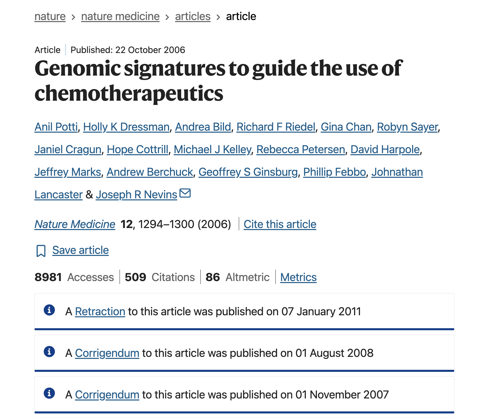
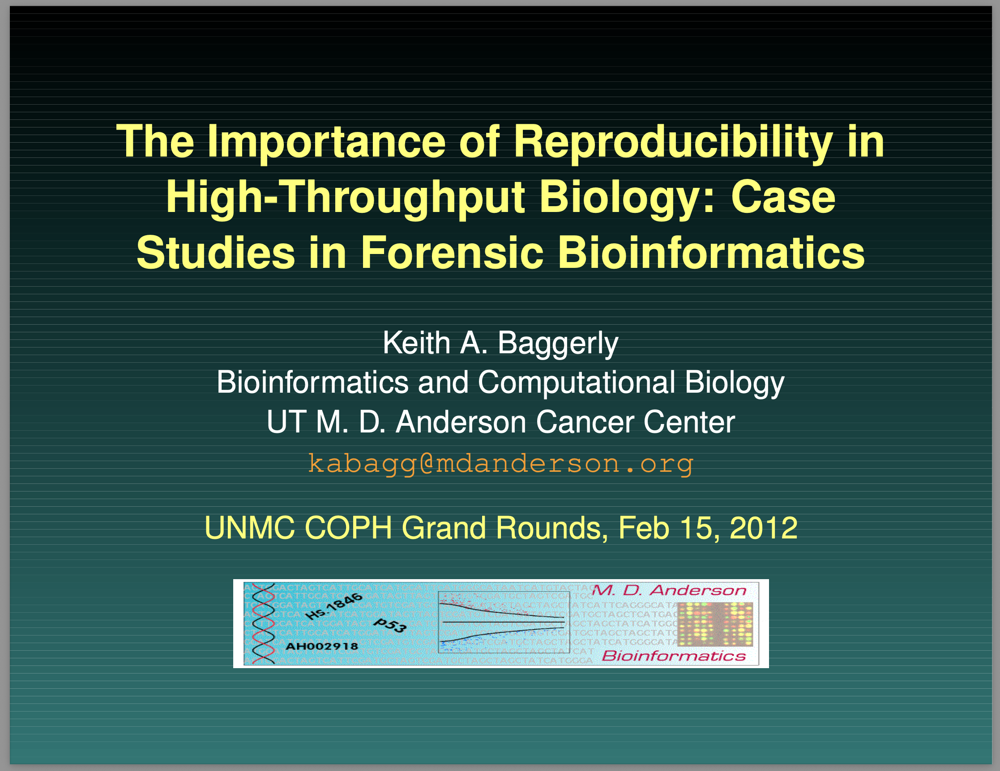
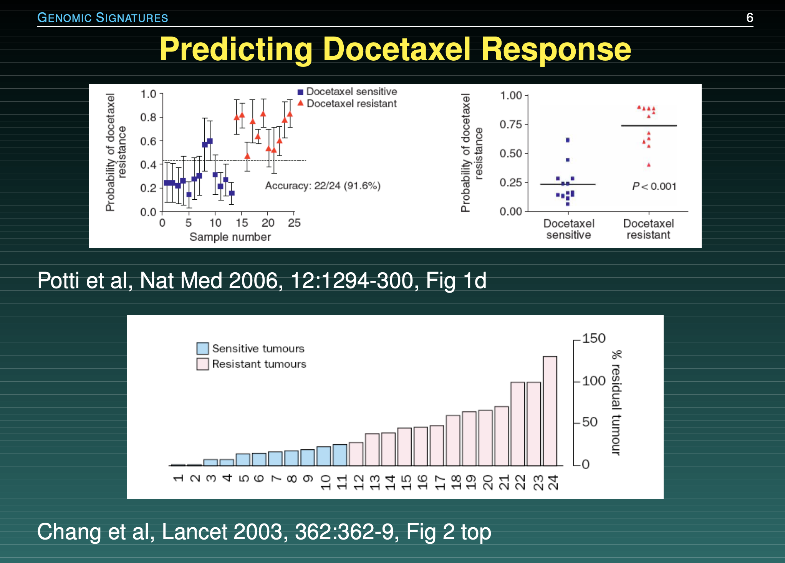
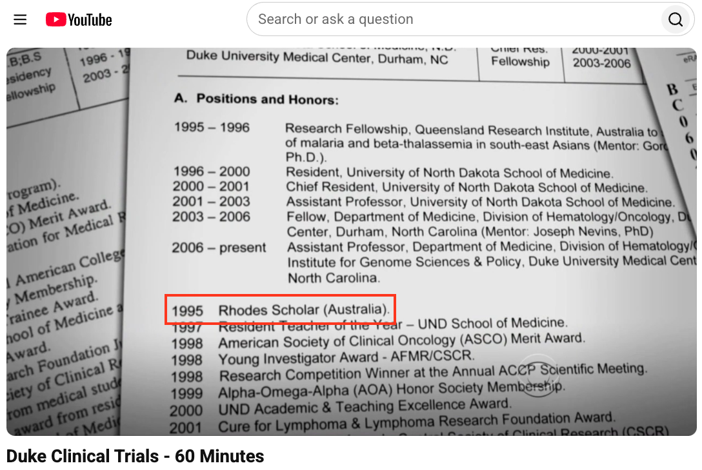

# The Duke University Cancer Trials Disaster

## Reading

::: {.nonincremental}
- Title: **Forensic Bioinformatics: Investigating Reproducibility of Results**
- Authors: Teresa Melcher
- Journal: Science Editor
- Year: 2011
- <https://www.csescienceeditor.org/article/forensic-bioinformatics-investigating-reproducibility-of-results/>
:::


## Supporting Materials

Duke Clinical Trials - 60 Minutes (short video, 13:25 minutes)

<https://www.youtube.com/watch?v=W5sZTNPMQRM>

\

The Importance of Reproducible Research in High-Throughput Biology

<https://openworks.mdanderson.org/igct_workshops/5/>

doi: <https://doi.org/10.52519/00193>


# The Story

## Overview

Researchers at Duke University claimed they had built a genomic model that 
could perfectly match a cancer patient's tumor to the ideal chemotherapy drug.

Clinical trials began, and patients were actively treated based on these 
computational predictions.


## Overview 

:::: {.columns}
::: {.column width=60%}

:::

::: {.column width=40%}
::: {.small}
Quote from abstract: _"We developed gene expression signatures that predict sensitivity to individual chemotherapeutic drugs"_

\

In other words: they could predict whether patients would respond to treatment.

\

This paper generated a lot of exciment and hope among cancer researchers.
:::
:::
::::


## Replication Attempt

{fig-align="center"}

Kevin Coombes and Keith Baggerly---biostatisticians at UT MD Anderson Cancer 
Center around 2007---tried to replicate the results and uncovered several 
data management errors.


## Baggerly's Slides[^1] {.nostretch}

{fig-align="center" width="55%"}

[^1]: <https://openworks.mdanderson.org/igct_workshops/5/>


## One of the issues

Due to poor documentation, columns in spreadsheets had accidentally shifted 
by one space, matching the wrong drugs to the wrong patients, and data markers 
were scrambled. 

. . .

Keith Baggerly discovered that the Duke team's software expected one data file with a 
"header" row and another without, but they accidentally supplied headers with both.

\

:::: {.columns}
::: {.column width=10%}
:::

::: {.column width=40%}
[Potti et al's gene list]{.hilit}

```
"1881_at"
"31321_at"
"31725_s_at"
"32307_r_at"
...
```
:::

::: {.column width=40%}
[Baggerly & Coombes' gene list]{.mdlit}

```
"1882_at"
"31322_at"
"31726_s_at"
"32308_r_at"
...
```
:::

::: {.column width=10%}
:::

::::


## Another of the issues

Baggerly's audit revealed that for certain chemotherapy drugs, the Duke team 
accidentally swapped the "sensitive" and "resistant" data labels.

{fig-align="center" width="55%"}


## {background-image="images/sensitive-vs-resistant-swap.png" background-size="contain"}


## Timeline

::: {.small}
- Nov-Dec 2006: 
    + First questions of Baggerly & Coombes to Potti & Nevins
    + Baggerly & Coombes' first report describing errors.
- Jan-May 2007
    + Baggerly & Coombes urge Nevins to review the data.
    + Potti and Nevins make changes, but errors are still there.
    + Potti & Nevins want to bring the issue to a close.
- Jun-Sep 2009
    + Baggerly & Coombes learned clinical trials had been conducted (in 2007, 2008)
    + Baggerly & Coombes submit critique paper to the _Annals of Applied Statistics_
- Sep-Oct 2009, Jan 2010
    + Story covered in _The Cancer Letter_
- July-Oct 2010
    + Duke resuspends trials, first paper retraction, Duke terminates trials.
:::


## The straw that broke the camel's back

What finally broke the case was the story in _The Cancer Letter_ exposing that the 
lead scientist lied on his CV about being a Rhodes Scholar.

{fig-align="center" width="50%"}


# Discussion Time

## Index Cards Activity

- This activity is designed for students in 10-12? rows
- Each row will receive a set of 4 blank index cards
- In addition, the first student in a row will receive an index card with the raw data
- To be clear: only the first student will see the raw data
- You will have to perform some processing steps (by-hand) to be
recorded on the blank index cards
- There will a time-limit for each processing step

<!--
Raw Data for index card:

==============================================
Patient | Score | Date       | Treatment
-------------------------------------------
PT-042  | 0.89  | 12-05-2024 | Cisplatin
PT-118  | 0.12  | 08-11-2024 | Paclitaxel
PT-091  | 0.64  | 01-02-2025 | Doxorubicin
PT-003  | 0.45  | 15-04-2025 | Erlotinib
==============================================


Expected Output:

============================================================
[ REPRODUCIBLE OUTPUT - AUTOMATED SCRIPT VIEW ]
============================================================
PT-042, 0.9, 05/12/2024, cisplatin
PT-118, 0.1, 11/08/2024, paclitaxel
PT-091, 0.6, 02/01/2025, doxorubicin
PT-003, 0.5, 04/15/2025, erlotinib
============================================================
-->


## Index Cards Activity

Instructions for blank index card #1:

\

In your index card-1 write down the raw data applying the following:

1. THE DATE CONVERSION: Convert the dates from `DD-MM-YYYY` to 
the American standard `MM/DD/YYYY` format.

```{r}
#| echo: false
countdown::countdown(1.5, bottom = 0)
```

## Index Cards Activity

Instructions for blank index card #2:

\

In your index card-2 write down the data of card-1 by applying the following:

2. THE HEADER SHIFT: Drop the top row (`"Patient", "Score", ...`) completely 
and shift all data cells up by one row to fill the void.

```{r}
#| echo: false
countdown::countdown(1.5, bottom = 0)
```

## Index Cards Activity

Instructions for blank index card #3:

\

In your index card-3 write down the data of card-2 by applying the following:

3. THE ROUNDING DECIMALS: Round all decimal values in 2nd column
to exactly one decimal place.

```{r}
#| echo: false
countdown::countdown(1.5, bottom = 0)
```

## Index Cards Activity

Instructions for blank index card #4:

\

In your index card-4 write down the data of card-3 by applying the following:

4. LOWER-CASE: Convert the values in the last column to lower-case.

```{r}
#| echo: false
countdown::countdown(1.5, bottom = 0)
```

## Index Cards Activity

\

Let's examine the cards!


## Activity B

We're going to divide the classroom into groups

. . .

:::: {.columns}
::: {.column}
[Team A: Clinical Trials Directorate]{.mdlit}

- You have a promising cancer model. 
- Patient lives are on the line, and funding is tight. 
- You trust your internal scientists.
- You do not want "outsiders" slowing down your cure with bureaucratic audits.
:::

::: {.column .fragment}
[Team B: The Forensic Biostatisticians]{.hilit}

- You tried to recreate their charts from the published text and failed. 
- You suspect catastrophic data scrambling.
- You are asking the authors to share their raw scripts and data.
:::
::::


## Brainstorm

\

Huddle with your immediate neighbors to:

:::: {.columns}
::: {.column}
[Team A]{.mdlit}

Find 3 arguments to justify keeping your code proprietary or private. 
:::

::: {.column}
[Team B]{.hilit}

Formulate 3 arguments on why public peer-review is empty without code 
verification.
:::
::::

```{r}
#| echo: false
countdown::countdown(5, bottom = 0)
```

. . .

\

Time's up: Please share your thoughts.

<!--
Group A:
- intellectual property, 
- protecting patient privacy laws, 
- peer-reviewed status of the original paper, 
- preventing academic rivals from "scooping" your data.

Group B:
What are the specific scientific and ethical dangers of 
treating data processing pipelines as a "black box"?
-->


## Debate

Academic journals should legally ban the publication of any computational 
paper that does not provide a fully reproducible public script repository.

```{r}
#| echo: false
countdown::countdown(2, bottom = 0)
```


## Question

:::: {.columns}
::: {.column width="48%"}
Baggerly recommends that all future clinical research papers must require 5 things:

::: {.nonincremental}
1) Data
2) Provenance
3) Code
4) Non-scriptable descriptions
5) Planned designs
:::
:::

::: {.column width="4%"}
:::

::: {.column width="48%"}
Imagine you had to choose just two of Baggerly's requirements to make legally mandatory.

Labs that fail to provide them, they lose their funding.

::: {.poll}
Which two would you mandate?
:::
:::
::::

```{r}
#| echo: false
countdown::countdown(3, bottom = 0)
```


# Quiz-Poll Time

## Google Form

\

**INSERT QR code!!!**

\

**INSERT <url> link to google form!!!**


## Quiz

When Baggerly and Coombes investigated the Duke cancer trial datasets, 
they discovered that patients were being matched to the completely wrong 
chemotherapy drugs. What caused this catastrophic shift?

::: {.nonincremental}
A) The lab computers were running on different operating systems (Mac vs. Linux)
which scrambled file paths.

B) An unrecorded manual copy-paste action caused data columns to shift 
by one space, scrambling row connections.

C) The researchers used a random number generator that lacked a static 
pseudorandom seed.

D) The data files were too large for the computer's RAM, causing silent, 
truncated data loss.
:::


## Poll

Rate your level of agreement with this statement: 

"Academic journals should legally ban the publication of any computational 
paper that does not provide a fully reproducible public script repository."

::: {.nonincremental}
1) Strongly Disagree (Code or nothing)
2) Disagree
3) Neutral
4) Agree
5) Strongly Agree (Spreadsheets are essential)
:::


## Poll

If I uncovered a fatal data error in my lab director's paper, I would: 

::: {.nonincremental}
A) Report it publicly immediately.
B) Quietly find a new lab.
C) Stay silent to protect my graduation timeline.
:::


## Poll

In one word, what is the most critical asset a researcher protects when 
they use automated version control instead of manual tracking?


# Final Words

##

The Duke Cancer Scandal represents the ultimate breakdown of computational 
transparency. 

The issue wasn't that the scientists made a mistake---everyone makes mistakes. 

The disaster happened because their workflow was an unrecorded, manual black box 
that could not be audited until it was too late. 

This is why platforms like GitHub are not optional luxuries for your career. 

By forcing yourself to push raw, unedited script pipelines upstream, you allow 
code forensics to catch bugs at your workstation---long before they become 
a scandal or a tragedy.


## Key Takeaways

- Forensic Data Management: Data labels must be explicitly linked and automated; 
minor copy-paste adjustments can become a matter of life and death.

- Unbroken Provenance: Transparency requires providing full, raw code and original 
configuration parameters alongside your final paper.


