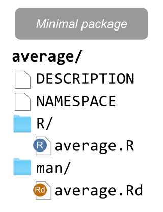
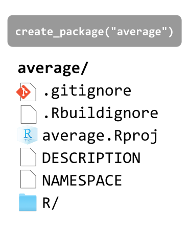
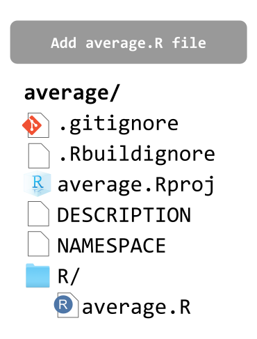
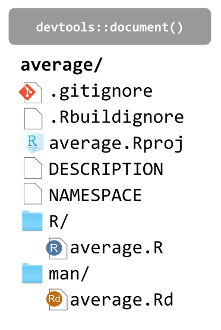
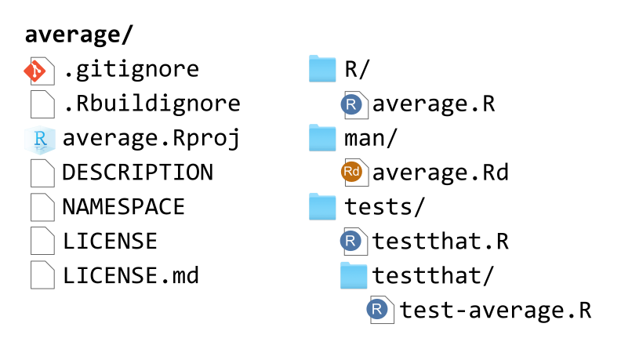
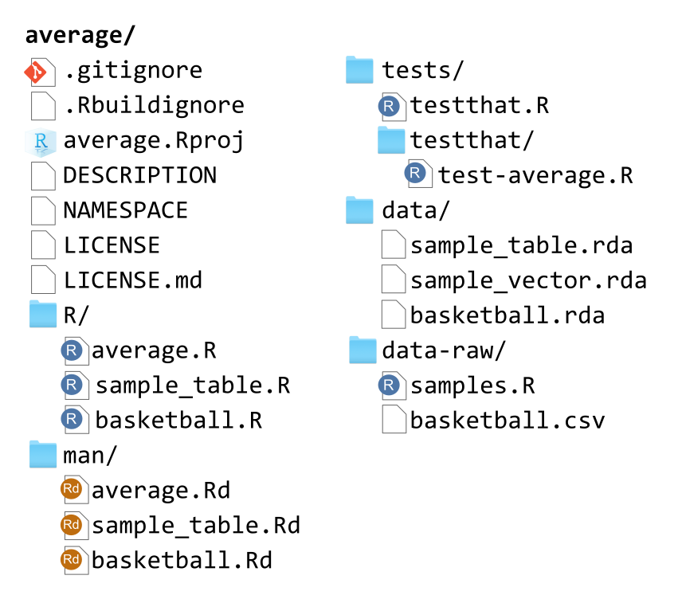
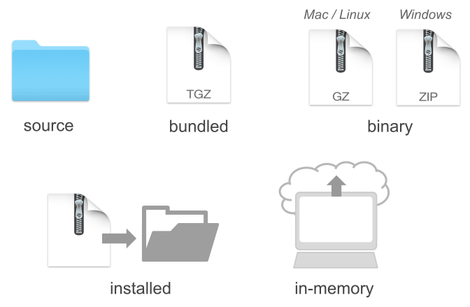
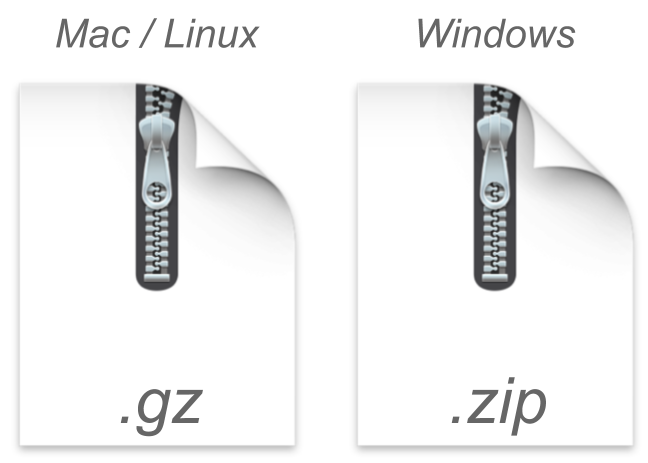
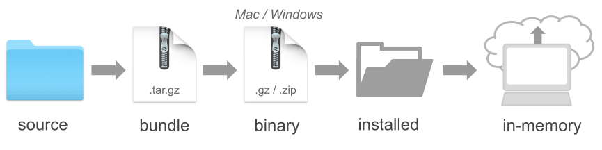

## About

In this slides I show you how to create a fairly simple R package 
with common contents such as: 

:::: {columns}
::: {.column width=10%}
:::

::: {.column width=45%}
- functions, 
- documentation, 
- tests,
- data
:::

::: {.column width=45%}
- vignettes, 
- license,
- README
- _ETC_
:::
::::

. . .

I will also describe the anatomy of an R package, its mandatory
ingredients, some optional components, and my opinionated recipe
to build packages.


# Example: package `"average"`

## Example

```{r average_hidden}
#| echo: false
average <- function(x, na.rm = FALSE) {
  if (na.rm) {
    x <- x[!is.na(x)]
  }
  avg <- sum(x) / length(x)
  return(avg)
}
```

- Our package consists of one function: `average()`
- `average()` computes the average (i.e. mean) of a numeric vector

. . .

```{r}
#| echo: true
#| output-location: fragment
average(1:5)
```

. . .

```{r}
#| echo: true
#| output-location: fragment
average(c(1, 2, NA, 4, 5))
```

. . .

```{r}
#| echo: true
#| output-location: fragment
average(c(1, 2, NA, 4, 5), na.rm = TRUE)
```


## Function `average()`

```{r average_function}
#| echo: true
average <- function(x, na.rm = FALSE) {
  # decide whether to remove missing values
  if (na.rm) {
    x <- x[!is.na(x)]
  }
  # compute average
  avg <- sum(x) / length(x)
  return(avg)
}
```


## 

We'll go through the creation of the package `"average"` so 
that you can:

. . .

__1)__ (Install and) load it:

```r
library(average)
```

. . .

__2)__ Use its function:

```r
average(1:10)
```

. . .

__3)__ See its documentation

```r
?average
```

. . .

__4)__ Share it with others


# Minimal Version

## {.nostretch}

Every R package must have at least the following components

{fig-align="center" width=30%}

::: {.small}
Without any of these, you won't be able to create a valid package.
:::


## {.nostretch}

:::: {columns}
::: {.column width=40%}

:::

::: {.column width=60%}
- [DESCRIPTION]{.bold-hilit} (text file)
<br> Package metadata.
- [NAMESPACE]{.bold-hilit} (text file)
<br> Which functions are available to users.
- [R/]{.bold-hilit} directory with R script files.
<br> Files with functions.
- [man/]{.bold-hilit} directory with Rd files.
<br> Files with documentation of functions.
:::
::::


## `DESCRIPTION` file

```{.markdown code-line-numbers="false"}
Package: average
Type: Package
Title: Computes average of numeric vector
Version: 0.1.0
Author: Gaston Sanchez
Maintainer: Gaston Sanchez <gaston@email.com>
Description: Toy package used for demo purposes.
License: MIT
Encoding: UTF-8
LazyData: true
```

\

`DESCRIPTION` is a text file---with no file extension---that follows 
a special type of format known as [Debian Control File]{.hilit}.[^1]

[^1]: <https://www.debian.org/doc/debian-policy/ch-controlfields.html>


## `DESCRIPTION` file


You need to specify seven mandatory fields:

::: {.nonincremental}
- Package
- Title
- Description
- Author
- Maintainer
- Version
- License
:::

::: {.small}
<https://cran.r-project.org/doc/manuals/r-release/R-exts.html#The-DESCRIPTION-file>
:::


## `NAMESPACE` file

In addition to `DESCRIPTION`, an R package also requires 
another mandatory text file called `NAMESPACE`. 

- It controls how your package interacts with the rest of the R ecosystem
- [Exports:]{.bold-hilit} It explicitly declares which functions, datasets, 
methods, and classes are public.
- [Imports:]{.bold-hilit} It specifies which functions or full packages your 
code relies on internally
- Let `devtools::document()` take care of `NAMESPACE` 
(i.e. don't edit by hand)


## R file `average.R` {auto-animate="true"}

::: {.small}
```{.r filename="average.R" code-line-numbers="false"}
average <- function(x, na.rm = FALSE) {
  # decide whether to remove missing values
  if (na.rm) {
    x <- x[!is.na(x)]
  }
  # compute average
  avg <- sum(x) / length(x)
  return(avg)
}
```
:::


## R file `average.R` with Roxygen comments {auto-animate="true"}

::: {.small}
```{.r filename="average.R" code-line-numbers="false"}
#' @title Average
average <- function(x, na.rm = FALSE) {
  # decide whether to remove missing values
  if (na.rm) {
    x <- x[!is.na(x)]
  }
  # compute average
  avg <- sum(x) / length(x)
  return(avg)
}
```
:::


## R file `average.R` with Roxygen comments {auto-animate="true"}

::: {.small}
```{.r filename="average.R" code-line-numbers="false"}
#' @title Average
#' @description Computes the average (i.e. mean)
average <- function(x, na.rm = FALSE) {
  # decide whether to remove missing values
  if (na.rm) {
    x <- x[!is.na(x)]
  }
  # compute average
  avg <- sum(x) / length(x)
  return(avg)
}
```
:::


## R file `average.R` with Roxygen comments {auto-animate="true"}

::: {.small}
```{.r filename="average.R" code-line-numbers="false"}
#' @title Average
#' @description Computes the average (i.e. mean)
#' @param x input vector
#' @param na.rm whether to remove missing values
average <- function(x, na.rm = FALSE) {
  # decide whether to remove missing values
  if (na.rm) {
    x <- x[!is.na(x)]
  }
  # compute average
  avg <- sum(x) / length(x)
  return(avg)
}
```
:::


## R file `average.R` with Roxygen comments {auto-animate="true"}

::: {.small}
```{.r filename="average.R" code-line-numbers="false"}
#' @title Average
#' @description Computes the average (i.e. mean)
#' @param x input vector
#' @param na.rm whether to remove missing values
#' @return computed mean
average <- function(x, na.rm = FALSE) {
  # decide whether to remove missing values
  if (na.rm) {
    x <- x[!is.na(x)]
  }
  # compute average
  avg <- sum(x) / length(x)
  return(avg)
}
```
:::


## R file `average.R` with Roxygen comments {auto-animate="true"}

::: {.small}
```{.r filename="average.R" code-line-numbers="false"}
#' @title Average
#' @description Computes the average (i.e. mean)
#' @param x input vector
#' @param na.rm whether to remove missing values
#' @return computed mean
#' @export
average <- function(x, na.rm = FALSE) {
  # decide whether to remove missing values
  if (na.rm) {
    x <- x[!is.na(x)]
  }
  # compute average
  avg <- sum(x) / length(x)
  return(avg)
}
```
:::


## R file `average.R` with Roxygen comments {auto-animate="true"}

::: {.small}
```{.r filename="average.R" code-line-numbers="false"}
#' @title Average
#' @description Computes the average (i.e. mean)
#' @param x input vector
#' @param na.rm whether to remove missing values
#' @return computed mean
#' @export
#' @examples
#' vec <- 1:5
#' average(vec)
#'
#' vec_na <- c(1, 2, NA, 4, 5)
#' average(vec_na)
#' average(vec_na, na.rm = TRUE)
average <- function(x, na.rm = FALSE) {
  . . .
}
```
:::

::: {.small}
_Note: code of function `average()` hidden for clarity purposes_
:::


## R file `average.R` with Roxygen comments {auto-animate="true"}

::: {.small}
```{.r filename="average.R" code-line-numbers="false"}
#' @title Average
#' @description Computes the average (i.e. mean)
#' @param x input vector
#' @param na.rm whether to remove missing values
#' @return computed mean
#' @export
#' @examples
#' vec <- 1:5
#' average(vec)
#'
#' vec_na <- c(1, 2, NA, 4, 5)
#' average(vec_na)
#' average(vec_na, na.rm = TRUE)
```
:::

- The roxygen comments will be used to create the `Rd` (R Documentation) files
of the `man/` directory.

- Let `devtools::document()` take care of `Rd` files.


## Minimal file structure

You can create the minimal file structure of an R package by hand, e.g.

```{.markdown filename="Terminal" code-line-numbers="false" }
mkdir average
cd average
touch DESCRIPTION NAMESPACE
mkdir R man
```

. . .

However, we recommend that you use functions from packages 
`"devtools"` and `"usethis"` to create and take care of the files
and directories in an R package. 


# Packaging with `"devtools"` and `"usethis"`

## About

I will describe one way to create some of the common elements of an R package,
and also a development workflow to iterate through the packaging process.

Keep in mind that there are various ways to create an R package, and that
you are not required to use `"devtools"` and friends.

But as you'll see, these supporting packages are extremely helpful, and
will take care of many of the important details, and "pain points" of
packaging your code.


## Step 1) `create_package()`

- Instead of creating the file structure of an R package by hand, we'll
use `create_package()`

- You have to invoke this function on R's console, by passing the 
file path (location and name) of the package you want to create

. . .

```r
# use a valid file path to your package
usethis::create_package("path/to/average")
```

- BTW: You only run this function once!


## Step 1) `create_package()` {.nostretch}

:::: {columns}
::: {.column width=40%}

:::

::: {.column width=60%}
- [.gitignore]{.bold-hilit} (text file)
<br> List which files Git needs to ignore.
- [.Rbuildignore]{.bold-hilit} (text file)
<br> List which files R needs to ignore.
- [average.Rproj]{.bold-hilit} (text file)
<br> RStudio project file.
- [DESCRIPTION]{.bold-hilit} (text file)
<br> Package metadata.
- [NAMESPACE]{.bold-hilit} (text file)
<br> Which functions are available to users.
- [R/]{.bold-hilit} directory for R script files.
:::
::::


## `DESCRIPTION` file

When running `create_package()`, this is what `DESCRIPTION` will look like:

::: {.small}
```{.markdown code-line-numbers="false"}
Package: average
Title: What the Package Does (One Line, Title Case)
Version: 0.0.0.9000
Authors@R: 
    person("First", "Last", , "first.last@example.com", role = c("aut", "cre"))
Description: What the package does (one paragraph).
License: `use_mit_license()`, `use_gpl3_license()` or friends to pick a
    license
Encoding: UTF-8
Roxygen: list(markdown = TRUE)
RoxygenNote: 7.3.2
```

You will need to edit the fields:

- Title
- Authors@R
- Description
- License (optionally you can run `use_xyz_license()`)
:::


## Step 1.1) Add R file `average.R` {.nostretch}

:::: {columns}
::: {.column width=40%}

:::

::: {.column width=60%}
\

Inside `R/`, we'll store the R file
`average.R` contaning the Roxygen comments
and the code of our function `average()`

\

::: {.fragment}
Notice that there is no `man/` directory yet.
We'll let `devtools::document()` to take care
of it and its contents.
:::
:::
::::


## Step 1.2) Using functions from other packages

Sometimes you may need to use functions from other packages in your own package.

This requires declaring the other packages we need (i.e. our dependencies).

For example, if your package depends on functions from `"dplyr"` (or any other 
package) you need to run the following in R's console: `usethis::use_package("dplyr")`

\

You will see some output like this

```{.r code-line-numbers="false"}
usethis::use_package("dplyr")
✔ Adding dplyr to Imports field in DESCRIPTION.
☐ Refer to functions with `dplyr::fun()`
```


## Step 2) `devtools::document()` {.nostretch}

- The next step involves generating the `Rd` (R Documentation) files.
- These are the files that go inside the directory `man/`.
- This can be done by calling `devtools::document()` in the R console.

. . .

\

You will see some output like this

```{.r code-line-numbers="false"}
devtools::document()
ℹ Updating average documentation
ℹ Loading average
Writing NAMESPACE
Writing average.Rd
```


## Step 2) `devtools::document()` {.nostretch}

:::: {columns}
::: {.column width=38%}

:::

::: {.column width=60%}
\

Calling `devtools::document()`---in the R console---does the
following:

\

1) This will create the `man/` directory.
2) It will create the file `average.Rd`
<br> (from the Roxygen comments).
3) It will also update `NAMESPACE`
:::
::::


## Step 2.1) Run `usethis::use_mit_license()`

[Every R package needs a license.]{.bold-hilit}

\

It's recommended to choose a license by running---on R's console---one 
of the `"usethis"` functions such as `use_mit_license()` or friends.

\

These functions not only update the content of `DESCRIPTION`
but they also add a `LICENSE` file with the 
actual content of the chosen license.

\

Likewise, these functions put a copy of the full license in 
`LICENSE.md` (mainly for GitHub purposes) and add this file to `.Rbuildignore`


## Step 2.2) Run `usethis::use_git()`

To make the `average/` directory a Git repository, you can run the
function `usethis::use_git()`.

You will see some output like this

```{.r code-line-numbers="false"}
use_git()
✔ Initialising Git repo.
✔ Adding ".Rhistory", ".RData", ".httr-oauth", ".DS_Store", and
  ".quarto" to '.gitignore'.
```


# Tests

## Step 3) Add `tests/` with `use_testthat()`

- It's best practice to include tests for your functions.
- In R, tests can be written with functions from the package `"testthat"`
- The starting point involves adding a `tests/` directory by running 
`usethis::use_testthat()`

. . .

You will see some output like this

::: {.small}
```{.r code-line-numbers="false"}
usethis::use_testthat()
✔ Setting active project to
  "/Users/gaston/average".
✔ Adding testthat to Suggests field in DESCRIPTION.
✔ Adding "3" to Config/testthat/edition.
✔ Creating tests/testthat/.
✔ Writing tests/testthat.R.
☐ Call usethis::use_test() to initialize a basic test file and open it for editing.
```
:::

. . .

Then follow the suggestion and run `usethis::use_test("average")`


## Step 3.1) Unit Tests

After running `usethis::use_test("average")`, you need to edit the 
corresponding file `test-average.R` stored inside `tests/testthat/`.

```{.r filename="test-average.R" code-line-numbers="false"}
test_that("average works as expected", {
  vec <- c(1, 2, 3, 4, 5)
  vec_na <- c(1, 2, NA, 4, 5)
  expect_equal(average(vec), 3)
  expect_equal(average(vec_na), NA_real_)
})
```

. . .

```{.r code-line-numbers="false"}
test_that("average removes missing values", {
  vec_na <- c(1, 2, NA, 4, 5)
  expect_equal(average(vec_na, na.rm = TRUE), 3)
})
```

. . .

```{.r code-line-numbers="false"}
test_that("average fails with character vector", {
  expect_error(average(letters[1:4]))
})
```


## File structure so far {.nostretch}

{fig-align="center" width="80%"}


# Adding Data to a Package

## Data

- Sometimes you may want to include data in a package.
- Examples: 
    + `mpg` data in package `"ggplot2"`
    + `storms` data in package `"dplyr"`
    + `penguins` data in package `"stat20data"`
- BTW: some packages exist solely for the purpose of distributing data
    + e.g. `"babynames"`, `"stat20data"`
- If you want to store R objects and make them available to the user, 
put them in a directory `data/`
- More info about data at: <https://r-pkgs.org/data.html>


## Storing R objects in `data/`

- The most common location for package data is `data/`.
- We recommend that each file in this directory be an `.rda` file created by 
`save()` containing a single R object, with the same name as the file. 
- The easiest way to achieve this is with `usethis::use_data()`.

. . .

```{.r code-line-numbers="false"}
set.seed(159)
sample_vector <- sample(100)
usethis::use_data(sample_vector)
```

. . .

\

```{.r code-line-numbers="false"}
sample_table <- data.frame(
  x = seq(-5, 5, length.out = 20), 
  y = 20:1)
usethis::use_data(sample_table)
```


## Storing R objects in `data/`

```{.r code-line-numbers="false"}
set.seed(159)
sample_vector <- sample(100)
usethis::use_data(sample_vector)
```

- The snippet above creates `data/sample_vector.rda`
- It adds `LazyData: true` in your `DESCRIPTION` file.
- This means that they won't occupy any memory until you use them.
- This makes the object `sample_vector` available to users[^2] as:
    + `average::sample_vector`
    + `sample_vector` after loading package `library(average)`

[^2]: Assuming the package "average" has been created.


## Documenting datasets

- Objects in `data/` must be documented.
- Documenting data is like documenting a function with a few minor differences.
- You document the name of the dataset and save it in `R/`, e.g.

. . .

::: {.small}
```{.r filename="sample_table.R" code-line-numbers="false"}
#' Sample Table
#'
#' A simple data frame with simulated random values
#'
#' @format ## `sample_table`
#' A data frame with 20 rows and 2 columns:
#' \describe{
#'   \item{x}{First column}
#'   \item{y}{Second column}
#' }
#' @source <https://source-url-if-applicable>
"sample_table"
```
:::


## Documenting datasets: roxygen comments

There are two roxygen tags that are especially important for documenting datasets:

- `@format` gives an overview of the dataset. 
    + For data frames, you should include a definition list that describes 
    each variable. 
    + It's usually a good idea to describe variables' units here.

- `@source` provides details of where you got the data, often a URL.

- Never `@export` a data set.


## Storing Raw Data

In addition to storing "clean" data in `data/`, you may want to store 
the script containing the code that generated the data.

In our example, it would be nice to store the code that generates
`sample_table` and `sample_vector`

::: {.small}
```{.r code-line-numbers="false"}
sample_table <- data.frame(
  x = seq(-5, 5, length.out = 20), 
  y = 20:1)
usethis::use_data(sample_table)

set.seed(159)
sample_vector <- sample(100)
usethis::use_data(sample_vector)
```
:::

This is possible via `usethis::use_data_raw()`


## Storing Raw Data

- `usethis::use_data_raw()` creates a directory `data-raw/`
- This directory should be listed in `.Rbuildignore`
- The good news is that `usethis::use_data_raw()` does this for you.
- Running this command will give you an output like this:

. . .

::: {.small}
```{.r code-line-numbers="false"}
usethis::use_data_raw("samples")
✔ Creating data-raw/.
✔ Adding "^data-raw$" to .Rbuildignore.
✔ Writing data-raw/samples.R.
☐ Modify data-raw/samples.R.
☐ Finish writing the data preparation script in data-raw/samples.R.
☐ Use `usethis::use_data()` to add prepared data to package.
```
:::

- This will create a `samples.R` file inside `data-raw/`.
- Here, we can store the commands that generate the sample objects.


## Storing Raw Data in CSV files

- Another common situation for storing data is when you have a dataset,
(e.g. data in a CSV file), that you want to include in your package.

- For instance, say we have some data about basketball players in a CSV file
`basketball.csv`.

- We need to store `basketball.csv` inside `data-raw/`, and then
update the code of the R file `samples.R`


## Storing Raw Data in CSV files

Assuming `basketball.csv` is stored in `data-raw/`, we edit
`samples.R` as follows:

. . .

::: {.small}
```{.r filename="samples.R" code-line-numbers="false"}
sample_table <- data.frame(
  x = seq(-5, 5, length.out = 20), 
  y = 20:1)
usethis::use_data(sample_table)

set.seed(159)
sample_vector <- sample(100)
usethis::use_data(sample_vector)

basketball <- read.csv("basketball.csv")
usethis::use_data(basketball)
```
:::

`usethis::use_data(basketball)` will create `basketball.rda` inside
`data/`, and also the corresponding `basketball.R` inside `R/`
that needs to be edited (to include its documentation with Roxygen comments).


## File structure so far {.nostretch}

{fig-align="center" width="60%"}


# README file

## Adding a README file

- Since we are interested in sharing our package with others, we usually
do this with GitHub.

- As you know, a common practice is to include a `README` file.

- While this can be done by-hand, we recommend that you use 
`usethis::use_readme_rmd()`

- `use_readme_rmd()` initializes a basic, executable `README.Rmd` ready for you to edit:

. . .

::: {.small}
```{.r code-line-numbers="false"}
usethis::use_readme_rmd()
#> ✔ Writing 'README.Rmd'.
#> ✔ Adding "^README\\.Rmd$" to '.Rbuildignore'.
#> ☐ Update 'README.Rmd' to include installation instructions.
#> ✔ Writing '.git/hooks/pre-commit'.
```
:::


## Adding a README file

- `use_readme_rmd()` initializes a basic, executable `README.Rmd` ready for you to edit:

- It also adds some lines to `.Rbuildignore`,

- `README.Rmd` already has sections that prompt you to:
    + Describe the purpose of the package.
    + Provide installation instructions. 
    + If a GitHub remote is detected when `use_readme_rmd()` is called, 
    this section is pre-filled with instructions on how to install from GitHub.
    + Show a bit of usage.

- More info at: <https://r-pkgs.org/whole-game.html#use_readme_rmd>


# Package States

## Building An R Package

Now that we have most of the common elements of an R package,
let's talk about how the package-building process.

I will show the way I like to create my packages. 

This means that you may find other useRs following different 
building strategies.


## Package States

The creation process of an R package can be done in several ways.
Depending on the _modus operandi_ that you choose to follow, it is
possible for a package to exist in five different states:

- Source
- Bundled
- Binary
- Installed
- In-memory


## Package States

{fig-align="center"}


## Source Package {.nostretch}

{fig-align="center" width="15%"}

- The starting point is always a [source package]{.bold-hilit}. 
- This is basically the directory containing the subdirectories and files
that form your package. 
- I like to think of this state as a package in a raw stage. 
- From a source package, you can transition to other states.


## Source Package {.nostretch}

{fig-align="center" width="12%"}

- The next immediate state (although not mandatory) is a 
[bundled package]{.bold-hilit}. 
- This involves wrapping the source package into a single
compressed file.
- The compressed file has the extension `.tar.gz`
    + A `.tar`, short for _Tape ARchive_ or _tarball_, is a standard
    format in the Unix/Linux environment.
    + A `.gz` file is simply the type of compression.


## Binary Package {.nostretch}

{fig-align="center" width="20%"}

- A [package in binary form]{.bold-hilit} is another type of state for a package.
- This is another type of compressed file that is platform specific.
- This depends on the operating system you are working with:
    + Mac/Linux 
    + Windows


## Installed Package {.nostretch}

{fig-align="center" width="20%"}

- An [installed package]{.bold-hilit} is a decompressed binary file that has
been unwarpped into an actual package library.
- Typically, it will located in the directory where other package
libraries are stored.


## In-memory Package {.nostretch}

{fig-align="center" width="20%"}

- Lastly, in order to use an installed package you need to load it into
memory. 
- This is done with the `library()` function.


## {.nostretch}

During the development of a package, you always start at the
source level, and eventually make your way to an installed version.

{fig-align="center" width="80%"}

In theory, the building process would consist of the following flow:

[source -> bundle -> binary -> installed —> in-memory]{.bold-hilit}

In practice, however, you can take some detours and shortcuts
from source to installed.


# Packaging Flow

## Packaging Flow

A typical packaging workflow involves the following steps:

- Create Documentation
- Check Documentation
- Run Tests
- Build Bundle
- Install Package
- Check Package

## Packaging Flow

A typical packaging workflow involves the following steps:

- Create Documentation: &nbsp;&nbsp; `devtools::document()`
- Check Documentation: &nbsp;&nbsp; `devtools::check_man()`
- Run Tests: &nbsp;&nbsp; `devtools::test()`
- Build Bundle: &nbsp;&nbsp; `devtools::build()`
- Install Package: &nbsp;&nbsp; `devtools::install()`
- Check Package: &nbsp;&nbsp; `devtools::check()`


## Create Documentation

When you change the roxygen comments of your 
functions, you will need to (re)generate the corresponding manual documentation. 

\

This can be done with the function `devtools::document()` which 
generates the so-called `.Rd` (R documentation) files, located in the `man/` 
directory.


## Check Documentation

An optional, but strongly recommended, step after new 
documentation has been generated, is to check that it is correct. 

\

This step becomes mandatory if you plan to share your package via CRAN. 

\

To check that the `.Rd` files are okay, use the function  
`devtools::check_man()` which inspects that the content and syntax of
the `.Rd` files are correct. 


## Run Tests

If your package contains unit-tests (strongly suggested),
included in the directory `tests/`, you can use the function 
`devtools::test()` to run such tests.


## Build Bundle

If you just simply want to convert a package source into a 
single bundled file, you use the function `devtools::build()` 

\

This function will create, by default, the `.tar.gz` file that in turn can be 
installed on any platform.

\

`build()` does not generate or check any documentation. It also does not run 
any tests.


## Install

To install the package you can use `devtools::install()` 

\

This function can install a source, bundle or a binary package. 

\

After the installation is done, you should be able to load the package with 
`library()` in order to use its functions, and inspect its manual documentation.


## Check

Optionally, you can carry out an integral check of the package
with the function `devtools::check()`

\

This checking process is a comprehensive one, and it will verify pretty much 
every single detail.

\

This step also becomes mandatory if you plan to share your package via CRAN. 


## Optional devtools file

Unless you are constantly creating packages, you will very likely forget what 
functions to use for a specific purpose. One small hack that I tend to use is 
to include an auxiliary `.R` file in the source package, which I typically name 
as `devtools-flow.R` (or something like that) with the following content:

```{.r filename="devtools-flow.R" code-line-numbers="false"}
# Devtools workflow
devtools::document()   # generate documentation
devtools::check_man()  # check documentation
devtools::test()       # run tests (if any)
devtools::build()      # build bundle
devtools::install()    # install package
devtools::check()      # comprehensive check (optional)
```


## Optional devtools file

- You can think of `devtools-flow.R` as a cheat-sheet. 
- This file should be included in `.Rbuildignore`.
- Add a new line with the name of the file to `.Rbuildignore`, and remember to 
anchor it with `^` and `$`. 
- Here's what your `.Rbuildignore` file may look like:

. . .

```{.markdown filename=".Rbuildignore" code-line-numbers="false"}
^average\.Rproj$
^\.Rproj\.user$
^\.positai$
^\.claude$
^data-raw$
^devtools-flow.R$
```
