# Intro

## About

Many scientific data are inherently visual, and the ability to create
and communicate using images is central to prepraring presentations and
publications.

In data science, images are not just decorative; they represent critical 
research outputs (plots, charts, diagnostic data) and must be handled 
with strict reproducibility and governance rules.


# General Image Types

## Two Main Kinds of Image Formats

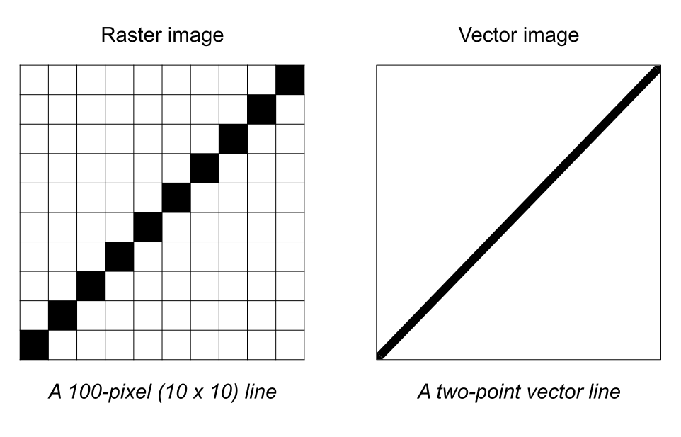{fig-align="center"}


## Raster Format

\

:::: {.columns}
::: {.column}
{fig-align="center" width="60%"}
:::

::: {.column}
Raster-based

- Also pixel-based or raster art.
- Made of a uniform grid of colored pixels.
- They have a fixed resolution, so they distort when resized.
- Scaling them up introduces pixelation and blurriness.
:::
::::


## Vector Format

\

:::: {.columns}
::: {.column}
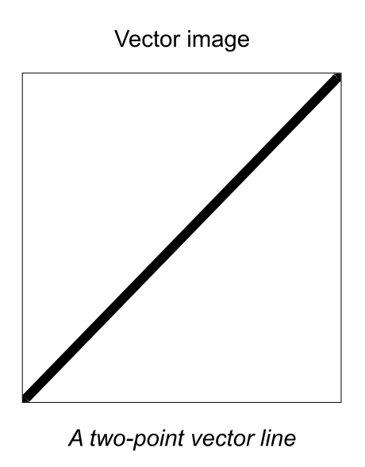{fig-align="center" width="60%"}
:::

::: {.column .fragment}
Vector-based

- Defined by mathematical formulas (lines, curves, points).
- Made of independent editable lines, curves, and sahpes.
- They are infinitely scalable without losing quality.
- They remain sharp when resized.
:::
::::


# Demo (in R)

##

::: {.small}
```{r scatterplot}
#| echo: true
#| output-location: fragment
#| fig-align: center
#| fig-width: 8
#| fig-height: 8
set.seed(159)
x <- rnorm(5000)
y <- rnorm(5000)

plot(x, y, pch = 16, col = rgb(0, 0, 1, 0.3))
```
:::


## 

:::: {.columns}
::: {.column}
```r
# PNG format
# dimensions in pixels
png("scatter_plot_png.png", 
    width = 800, height = 700)
plot(x, y, pch = 16, 
     col = rgb(0, 0, 1, 0.3), 
     main = "PNG")
dev.off()
```

\

::: {.fragment}
```r
# JPEG format
# dimensions in pixels
jpeg("scatter_plot_jpeg.jpeg", 
    width = 800, height = 700, 
    quality = 50)
plot(x, y, pch = 16, 
     col = rgb(0, 0, 1, 0.3), 
     main = "JPEG")
dev.off()
```
:::
:::

::: {.column .fragment}
```r
# PDF format
# dimensions in inches
pdf("scatter_plot_pdf.pdf", 
    width = 8, height = 7)
plot(x, y, pch = 16, 
     col = rgb(0, 0, 1, 0.3), 
     main = "PDF")
dev.off()
```

\

::: {.fragment}
```r
# SVG format
# dimensions in inches
svglite("scatter_plot_svg.svg", 
    width = 8, height = 7)
plot(x, y, pch = 16, 
     col = rgb(0, 0, 1, 0.3), 
     main = "SVG")
dev.off()
```
:::
:::
::::


## Zooming-In Comparison

:::: {.columns}
::: {.column}
JPEG

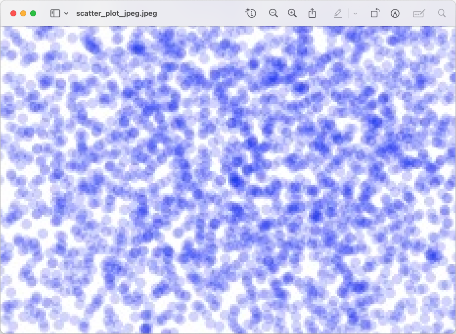
:::

::: {.column}
PDF

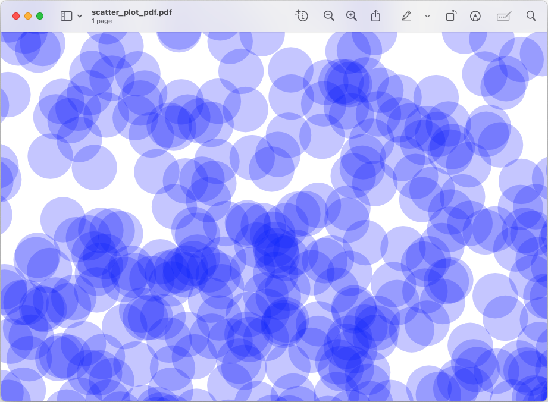
:::
::::


## Two Main Kinds of Image Formats

\

:::: {.columns}
::: {.column .fragment}
Raster-based

- Image consists of an array (grid) of pixels with
information such as color for each pixel.
- Distorted when resized.
- File examples: PNG, JPEG, TIFF, BMP, WebP.
- Will produce much smaller files if the image is very complex.
:::

::: {.column .fragment}
Vector-based

- Image is described by a set of mathematical shapes
- No distortion when resized
- File examples: PDF, SVG.
- Better for images that need to be viewed at a variety of scales.
:::
::::

. . .

::: {.small}
It's easy to convert a vector format to a raster version, while the reverse
is very difficult if not impossible.
:::


# Plotting Graphics

## Plotting Graphics Pipeline

When you execute a plotting command on screen, your code starts an abstract 
mathematical pipeline that hands data down to your operating system's 
window manager and physical graphics card.

Whether you are using Python, R, or MATLAB, the computer follows the exact 
same hidden architecture to turn numbers into glowing pixels. 
Here is the step-by-step journey of a plot from code to monitor.


## Step 1) Object Creation

When you type a command like `plot(x, y)` or `plt.scatter(x, y)`, the 
software environment initializes an abstract memory object.

- What happens: 
    + The language allocates RAM to store the visual properties of your plot. 
    + It creates an internal tree structure containing the coordinates, 
    line styles, font colors, and axis bounds.
    
- The State: 
    + At this point, nothing is drawn. 
    + The plot exists purely as abstract structure in your environment's memory.


## Step 2) The High-Level Engine & Backend Selection

The software now looks for an instructions manual on how to translate the 
abstract memory tree into a visual layout. 

It uses a Backend Architecture to make this link.

- In Python (Matplotlib): It looks at your active backend configuration 
(e.g., TkAgg, QtAgg, or WebAgg).

- In R: It looks for an open graphical display device (e.g., windows on Windows, 
quartz on macOS, or X11 on Linux).

- In MATLAB: It checks the Graphics rendering hardware setting (OpenGL or Painters).


## Step 3) Geometry & Vector Path Generation

The selected engine processes the numbers into basic geometric shape vectors.
Think of this step as the "sketch" step.

- What happens: The backend converts your data coordinates into screen-relative 
coordinate points. It determines exactly how many centimeters or pixels wide the 
bounding box should be, calculates the positions of axis ticks, and converts 
your data path into a series of explicit path instructions 
(e.g., "Move pen to coordinate A, draw line to coordinate B").

- Calculations: Vector calculations for text fonts are processed here to determine 
exact character spacing.


## Step 4) Canvas Initialization & Window Handshake

Before anything can be visible, the software needs a container on your desktop.

- The Handshake: The graphics backend talks directly to your operating system's 
native User Interface (UI) toolkit (like Win32 on Windows, Cocoa on Mac, o
r GTK/X11 on Linux).

- The Result: The operating system opens an empty window frame on your desktop, 
reserves that physical screen space, and gives the graphics backend a dedicated 
memory canvas area (a "framebuffer") to draw on.


## Step 5) Rasterization & Hardware Acceleration

This is where vector math transforms into actual pixels. The graphics engine 
translates smooth vector paths into a grid of colored dots. Think of this step
as the "coloring" step.

- The GPU's Role: Modern backends pass the vector paths directly to your 
computer's GPU using open standards like OpenGL or DirectX.

- The Math: The graphics card instantly computes every single pixel intersect, 
applies anti-aliasing (blending edge pixels to make diagonal lines look smooth 
instead of jagged), and fills the framebuffer with raw color data (RGB values).


## Step 6: The Compositor & Monitor Refresh 

The final raw color grid sits in your RAM or VRAM waiting to be displayed.
Think of this as the "Display" step.

- What happens: The Operating System's Window Compositor (like Desktop Window 
Manager on Windows or Quartz Compositor on Mac) grabs your plot window's pixel 
data, mixes it with your open browser window, wallpaper, and mouse pointer, 
and builds the unified view of your entire desktop screen.

- The Output: The display hardware pushes those numbers out to your physical 
monitor, matching its refresh rate (e.g., 60Hz or 140Hz), turning on the 
physical LEDs or liquid crystals on your glass screen.


## {background-image="images/image-screen-rendering-pipeline.svg" background-size="contain"}

::: {.notes}
* The Hardware Trap: Emphasize that unlike saving to a file, on-screen 
visualization is tightly bound to local computer hardware, local font libraries, 
and operating system graphic layers.

* The Brain Stage (Step 1): Explain that executing a plot command initially 
does not draw anything. It simply builds an abstract tree structure inside 
your system's random-access memory (RAM) to track data shapes, coordinates, 
and styling.

* The Backend Manual (Step 2): Note that Python and R use different backend 
devices (like Matplotlib's QtAgg or R's native windows() / quartz()) to serve 
as the translator between the code language and the computer's user interface.

* The OS Handshake (Step 4): Highlight that the graphics engine must explicitly 
ask the host operating system (Windows, macOS, or Linux) to open a desktop 
window container. If you run this script on a headless cloud server lacking 
a graphical user interface, the code will crash at this exact step.

* GPU Transformation (Step 5): Point out that modern screens use the graphics 
card (via OpenGL or DirectX) to instantly calculate pixel math and apply 
anti-aliasing. This software-hardware handshake ensures smooth, non-jagged 
lines when you look at the screen.

* The Live Vector Viewport: Explain that many screen devices create a live 
viewport window. When a student resizes or expands the window on their monitor, 
the software instantly re-triggers Step 3 to re-calculate the vector geometry, 
keeping the chart sharp at any window scale.

* The Reproducibility Warning: Conclude with the core takeaway: because screen 
rendering depends entirely on local system configurations, a plot that looks 
perfectly aligned on an instructor's high-DPI Mac might appear clipped, 
overlapping, or distorted on a student's Windows machine.
:::


## {background-image="images/image-file-saving-pipeline.svg" background-size="contain"}

::: {.notes}
* Bypassing the Hardware: Note that this entire pipeline completely ignores the 
graphics card (GPU) and physical monitor. It runs entirely inside system memory 
and flows straight to storage.

* The OS Handshake (Step 1): Explain that the moment the export command runs, 
the operating system creates a file placeholder on the hard drive. 
It locks this file so no other software can corrupt it while R or Python 
is writing data.

* Resolution Independence (Step 3): Emphasize that the layout engine does not care 
how big or small your current monitor is. It scales all text, line widths, and 
data points strictly according to the width, height, and DPI parameters defined 
in your script.

* The Vector Path (Step 4, Left): Highlight that vector formats like PDF or SVG 
skip pixels entirely. They store your plot as a text file filled with geometric 
recipes (e.g., "draw line from coordinate A to B") and link to system fonts.

* The Raster Path (Step 4, Right): Explain that raster formats like PNG or JPEG 
collapse those geometric recipes down into a rigid matrix of colored pixels, 
immediately running compression algorithms to shrink the file payload.

* The Missing File Trap (Step 6): Warn students that forgetting to close the 
device connection (like omitting dev.off() in R) leaves the file permanently 
locked in Step 5. The file will show up on their computer as an unopenable, 
broken 0-byte file.

* The Headless Science Takeaway: Tie this back to computational reproducibility. 
Because this process is entirely software-driven and hardware-independent, it allows automated pipelines to generate perfect figures on headless cloud servers without a user interface.
:::


# Compression in Raster Images

## Compression Types

\

- Raster image files tend to go through a compression process.
- Why? Because uncompressed raw images are massive and consume too much 
storage space, network bandwidth, and memory.
- For example: without compression, a standard smartphone photo would be around 
36 megabytes (MB) instead of 2 MB, making it impossible to email, slow to load 
on a website, and quick to fill up a hard drive.
- There are 2 main types of compression
    + [Lossless]{.mdlit}
    + [Lossy]{.hilit}


## Lossless Compression (Perfect Quality)

- Lossless compression works by finding repetitive patterns in the image data 
and rewriting them more efficiently

- Imagine a row of 100 solid blue pixels. Instead of saving "blue, blue, blue..." 
100 times, a lossless algorithm rewritten as "100 blue pixels"

- File Size Reduction: Modest (usually 20% to 50% smaller)

- Best Used For:
    + Graphics with text, sharp edges, and solid colors.
    + Logos, icons, and digital illustrations.
    + Master files and archives where quality cannot be compromised.

- Common Formats: PNG, GIFF, TIFF


## Lossy Compression (Maximum Space Savings)

- The human eye is highly sensitive to changes in brightness, but less sensitive 
to subtle changes in color shading. 

- Lossy compression exploits this by permanently deleting data that the human eye 
is not very good at noticing.

- File size reduction can be substantial (e.g. 80% to 90% smaller than the original)

- Best Used For:
    + Photographs with complex textures and millions of colors.
    + Website images to ensure web pages load quickly.
    + Social media sharing and email attachments.
    
- Common Formats: JPEG, WebP (lossy mode), and AVIF


## Raster Formats and Compression

:::: {.columns}
::: {.column width=33%}
[Uncompressed]{.bold-hilit}

- Literal pixel map
- Zero math changes data
- Files are massive
- Examples:
    + BMP
    + RAW
    + Uncompressed TIFF
:::

::: {.column width=33% .fragment}
[Lossless Compressed]{.bold-hilit}

- Mathematical shorthand
- Shrinks file size
- 100% data identical
- Safe to edit and save multiple times
- Examples:
    + PNG
    + Compressed TIFF
:::

::: {.column width=33% .fragment}
[Lossy Compressed]{.bold-hilit}

- Discards data
- Drastically shrinks size
- Permanently deletes data
- Quality drops every time you edit and save
- Examples:
    + JPEG
    + WebP
    + AVIF
:::
::::


## Be Careful with JPEG

- [Loss of Data:]{.bold-hilit} Saving a scientific image as a JPEG to save space 
permanently alters pixel values, which can invalidate digital image analysis 
(like counting cells).

- [Loss of Text/Labels:]{.bold-hilit} Rasterizing a plot turns text into pixels. 
If a publisher needs to shrink the chart, the font becomes unreadable. 
Vector formats keep text as editable, scalable fonts.

- Only use JPEG at the very final step for the publication or slide deck.


## File Formats and Usage

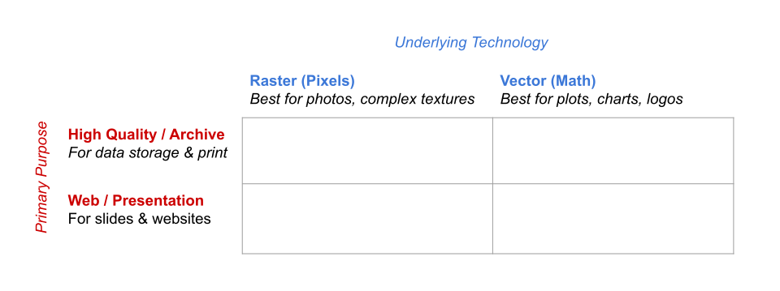{fig-align="center"}

## File Formats and Usage

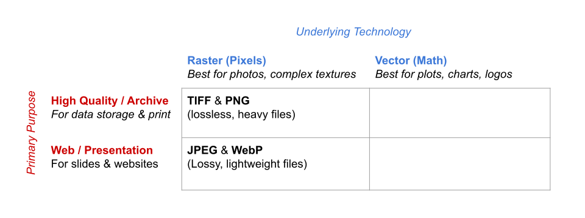{fig-align="center"}

## File Formats and Usage

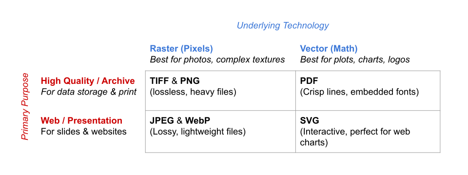{fig-align="center"}


## Rules of Thumb

1) If it is a photo (microscopy, fieldwork)
    + Capture in TIFF or PNG (lossless raster) to preserver data.
    + Never use JPEG in the middle of your workflow.

2) If it is a plot/graph (R, Python, Matlab)
    + Export as PDF or SVG (vector)
    + Users can zoom in-out without pixelating
    + Text remains searchable

3) If it is for the final presentation/website
    + Convert copies to WebP or JPEG (lossy raster)
    + Slides and website load instantly


# Resolution and Dimensions

## Image Resolution and Dimensions

At some point you will have to deal with the question of resolution and size.

. . .

\

Definitions:

- [Pixel dimension:]{.bold-hilit} the number of pixels along the X and Y axes of the image.
- [Physical size:]{.bold-hilit} the size that the image appears on a printed page (e.g. 
in inches, or centimeters, or millimiters)
- [Resolution:]{.bold-hilit} the size of each pixel, expressed as the number of pixels person
unit of physical dimesion, usually called _dots per inch (DPI)_ or 
_pixels per inch (PPI)_
- [Formula:]{.bold-hilit} _pixel dimension_ = _physical size_ x _resolution_


## Resolution and Dimensions

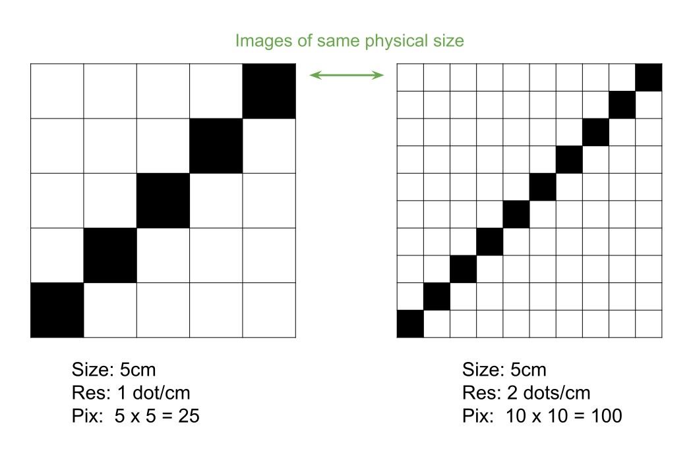{fig-align="center"}


## Resolution and Dimensions {.nostretch}

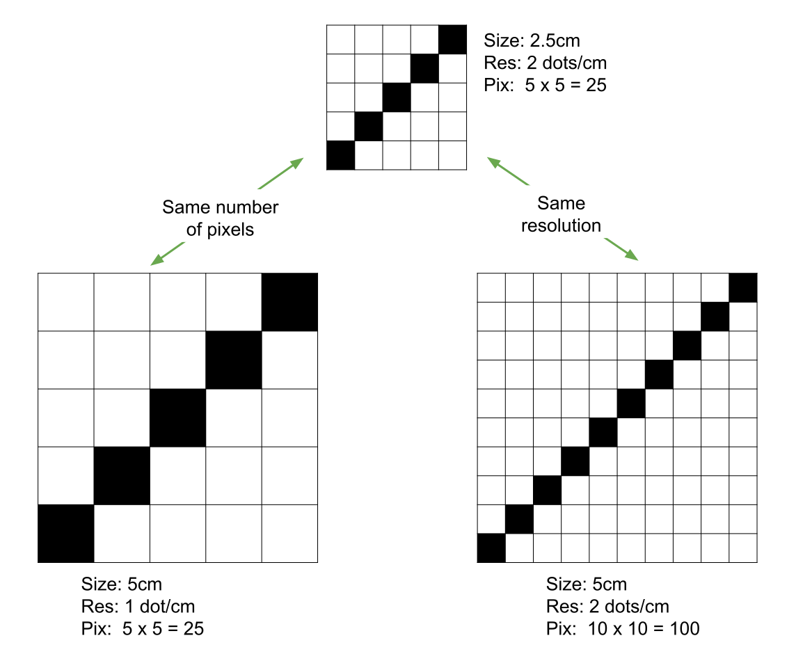{fig-align="center" width="65%"}


## Image Dimensions: Raster -vs- Vector Sizing

:::: {.columns}
::: {.column}
Raster

- Sized by fixed pixels (800 x 600 px)
- Stored as a rigid 2D grid matrix of color bytes
- Enlarging the image forces pixels to stretch
:::

::: {.column}
Vector

- Sized by physical canvas units (8 x 6 in, cm)
- Stored as a canvas container mapping bounding coordinates
- Scaling recalculates the underlying mathematical equations
:::
::::


## Image resizing issues

It is not informative to ask someone for an image _"at 300 DPI"_ 
without specifying the associated physical measurements.

- At 300 DPI, the image could be 100 pixels wide, 30,000 pixels tall
or any other dimension.

- Yet many journals commonly make such requests! 🤦🏻‍♂️


## Recommendations

- Reproducible Figures 
    + There should be scripts for every generated figure
    + Avoid/Minimize manual edits with graphic design software
     (Illustrator, Photoshop, AI tools)
- Image Compression and Data Integrity
    + Understand difference (pros and cons) between Lossless vs. Lossy compressions


## Recommendations

- File Organizing practices
    + Separate code from images and figures
    + Have dedicated folders `figs/` or `output/`
    + You may need to export images in both vector and raster formats


## Recommendations

- Storage and Version Control of Binaries
    + Git is great for handling text files (like .R or .py scripts)
    + But it struggles with large images (binary files)
    + Every small change to an image forces Git to save a completely new copy, 
    bloating the repository.
    + For large image files: Use `.gitignore` to keep auto-generated figures out of the 
    main repository.


## Recommendations

- Programmatic Generation of Images
    + Take advantage of Quarto or Jupyter Notebooks that automatically handle 
    figure rendering, caching, and paths


# Image Colors

## About Colors

In addition to deciding whether an image should be pixel or vector 
(or perhaps both), we also need to consider the document's 
[color model]{.bold-hilit}.

The color model determines what the primary colors are and what happens
when they are mixed.

- Additive Color Models: e.g. RGB, HSV, HCL
- Subtractive Color Models: e.g. CYMK


## Color Models and Color Spaces

- A color model is the mathematical representation
- It can be represented geometrically: the color Space
- I like to think of the color space as its "volume"


## RGB Model

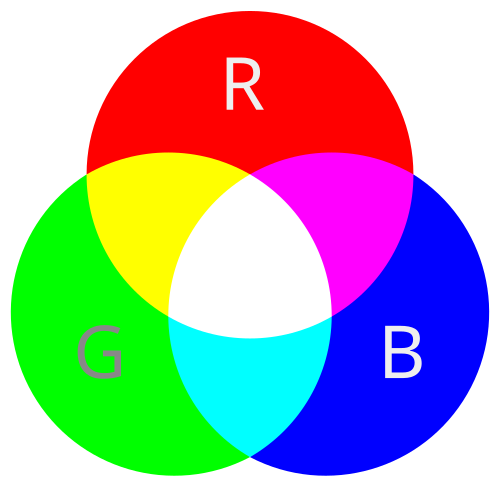{fig-align="center"}


## RGM Model

Any color you see on a monitor can be described by a series of 3 values 
(in the following order)

- A <span style="color:red;">red</span> value
- A <span style="color:green;">green</span> value
- A <span style="color:blue;">blue</span> value


## RGB Decimal Notation

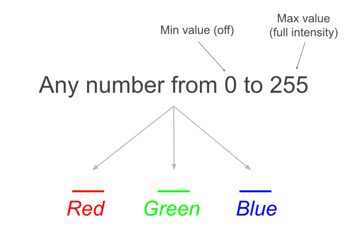{fig-align="center"}

## {background-image="images/rgb-unk-color.svg" background-size="contain"}

## {background-image="images/rgb-yellow-color.svg" background-size="contain"}

## {background-image="images/rgb-magenta-color.svg" background-size="contain"}

## {background-image="images/rgb-cyan-color.svg" background-size="contain"}

## {background-image="images/rgb-white-color.svg" background-size="contain"}

## {background-image="images/rgb-black-color.svg" background-size="contain"}

## {background-image="images/rgb-gray-color.svg" background-size="contain"}

## {background-image="images/rgb-reference-colors.svg" background-size="contain"}


# RGB Notations

## Why 0 to 255?

- Why do RGB values range from 0 to 255?
- Because of computational reasons
- There are 256 numbers from 0 to 255
- $256 = 2^8$ (a byte = 8 bits)

. . .

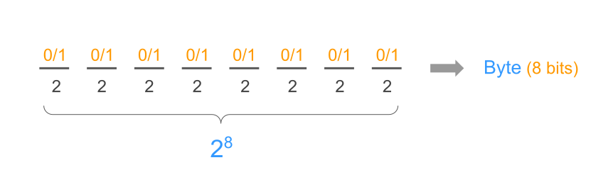


## RGB model and its (cubic) geometric space

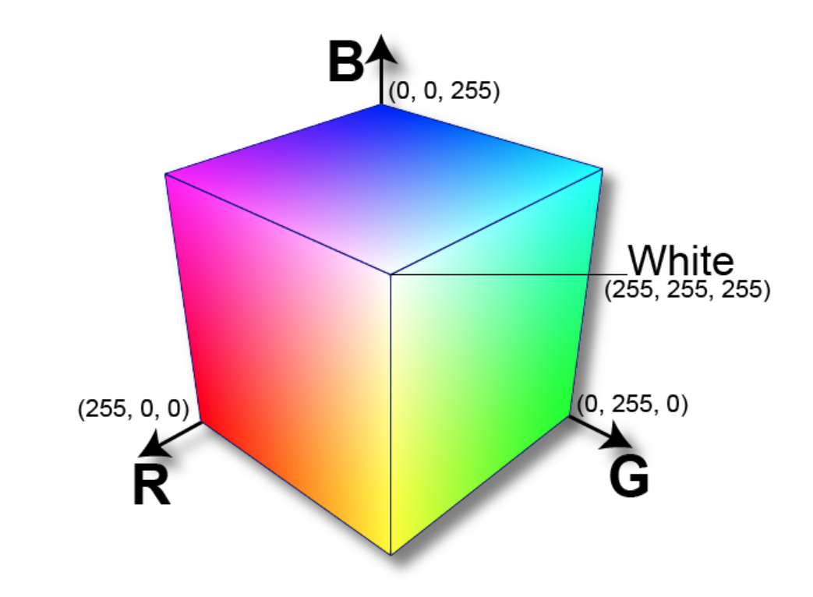{fig-align="center"}

::: {.small}
<https://www.infinityinsight.com/product.php?id=91>
:::


## About RGB

- The RGB model provides a full description of color.
- It is a hardware-centric model.
- The RGB model has an interesting mathematical space (or volume) 
in the shape of a cube.
- However, it does not provide a natural/intuitive way to think about color.


## RGB Decimal Notation

In terms of computer memory, to specify a color in RGB decimal notation, 
you need to reserve a total of 9 "positions"

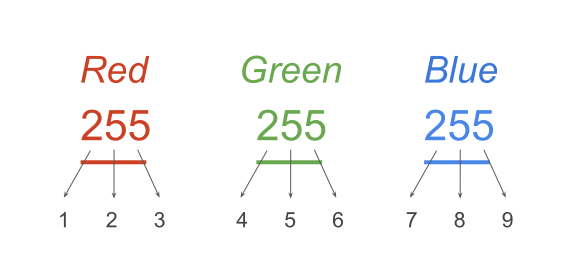{fig-align="center"}


## Hexadecimal Notation

To be more memory-efficient, a color can also be specified as a string 
beginning with a hash symbol `#` and followed by six hexadecimal digits:

- `#FF0000` (red)
- `#00FF00` (green)
- `#0000FF` (blue)

. . .

Hexadecimal digits reminder:
 
- The digits 0-9 represent values zero to nine.
- The letters A-F (a-f) represent values ten to fifteen.


## Hexadecimal Notation

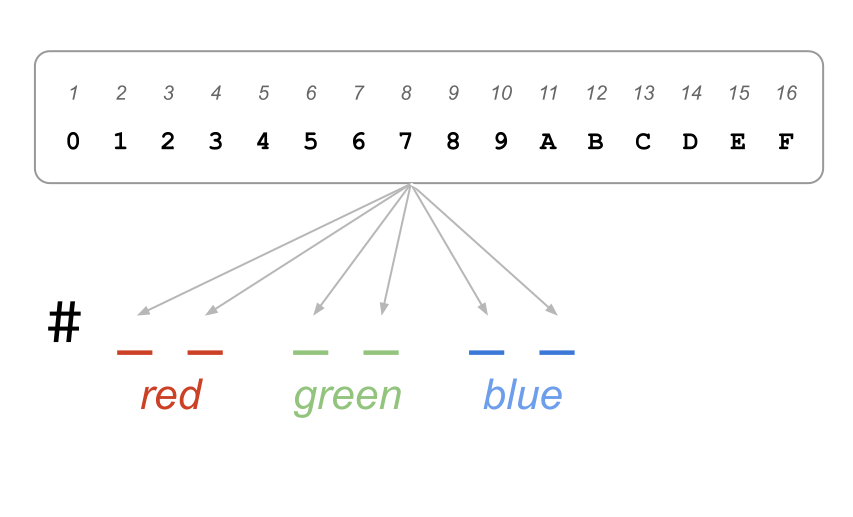{fig-align="center"}

## Hexadecimal Notation

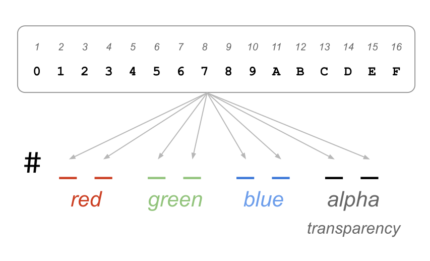{fig-align="center"}


## {background-image="images/rgb-reference-hexadecimal.svg" background-size="contain"}


